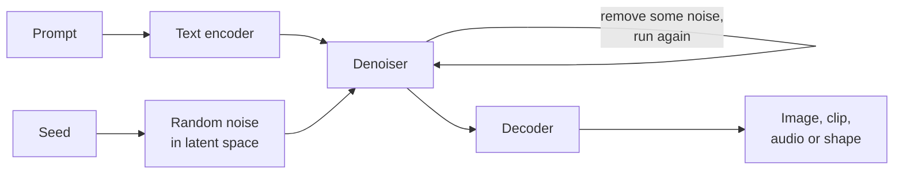
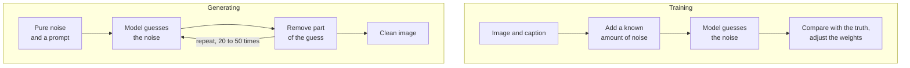

# Part 1: How Generative Media Models Actually Work

2026-09-19 · Chris Neale

## About this part

This is the first of seven parts in the generative media module, which covers models that make images, video, music and 3D objects. The aims of the course, the layout every part follows and suggested reading routes are in [Course introduction](file/0a139f54-ef01). The format here is the one described there: **In plain terms** opens each numbered section, deep dives are optional, and a glossary closes the part. Reading time is about 45 minutes.

You do not need the language models module to read this one. Where an idea was built there, such as attention, this part says so and links to it.

### What part 1 gives you

Part 1 builds one mental model: a generative media model starts from random noise and removes it a little at a time, steered by your prompt, working on a small compressed version of the thing it is making, which is expanded into pixels, sound or geometry at the end. That one design, diffusion, is behind most image, video and 3D generators and many audio ones. A second design, which writes media one token at a time as a language model writes text, is present in every medium too, and section 7 sets the two side by side.

Pictures are the running example throughout, because a picture is the easiest of these things to reason about. Parts 2 to 5 take images, video, music and 3D in turn and say what changes in each. Parts 6 and 7 cover shaping a model and prompting one.

## 1. The whole thing in one sentence

**In plain terms.** A model that makes pictures starts with a picture of pure static, like an untuned television. It then cleans that static up in a few dozen small steps, and at each step your prompt nudges what the picture is turning into. Models that make video, sound and 3D shapes do the same thing with a clip, a recording or an object. **Who should read it:** everyone. This section is short and frames everything that follows.

A diffusion model is a function that takes a noisy sample, a noise level and a text prompt, and returns its best guess at the noise in that sample. For an image model the sample is a picture. For the others it is a clip, a stretch of audio or a shape. Generation is that function called in a loop: guess the noise, remove some of it, call again. Everything else in this part is detail inside that sentence.

As code, the entire runtime looks like this:

```python
text = encode_text(prompt)
latent = random_noise(seed)           # a small grid of pure noise
for t in schedule:                    # 20 to 50 steps, from all noise to none
    noise_guess = model(latent, t, text)
    latent = remove_some(latent, noise_guess, t)
image = decode(latent)                # expand the small grid into pixels
```

Three things are worth noticing before we open up `model`.

- **The model is a pure function.** Its weights are fixed at training time, exactly as a language model's are. Nothing you type changes them, and it remembers nothing between one output and the next.
- **The whole thing is worked on at once.** There is no left to right and no top to bottom, and in video and music no start to finish. Every step touches every part of the output, which starts vague everywhere and sharpens everywhere together.
- **Chance enters once, at the start.** The starting noise comes from a random number generator with a seed. With most samplers, the same seed, prompt, settings and model give the same result.

The pipeline has five stages:



The prompt becomes a set of vectors. A seed becomes a small grid of noise. The denoiser, which is the large neural network, is run a few dozen times, and each run leaves the grid a little cleaner. A decoder then expands the grid into pixels, or into frames, sound or geometry. Sections 2 to 6 take these stages in turn. Section 7 describes the other design, and section 8 draws out what both imply.

## 2. Media as numbers

**In plain terms.** To a computer a picture is a very long list of numbers, three for every dot on the screen. A video is that list many times over, a recording is tens of thousands of numbers for every second, and a 3D object is a list of points and the triangles that join them. All of them are far too large to produce one number at a time, which is why these models work on the whole thing at once. **Who should read it:** non-technical readers can go straight to the list under "What this explains" and skip the rest.

An image is a grid of pixels, and each pixel is three numbers: how much red, green and blue. A picture 1,024 pixels on each side is 1,024 x 1,024 x 3 numbers, a little over three million of them. The other media are larger, and each has a shape of its own.

| Medium | What it is, as numbers | Roughly how many |
| --- | --- | --- |
| Image | A grid of pixels, three numbers each | 3 million for 1,024 pixels square |
| Video | A stack of images, 24 or so for every second | 330 million for five seconds at 1,280 by 720 |
| Audio | The air pressure at the microphone, measured 44,100 times a second, once for each ear | 16 million for a three-minute song |
| 3D object | Points in space, the triangles that join them, and images wrapped over the surface | Anything from thousands to many millions, with no fixed layout |

### Why not predict the next number

A language model works because text comes in a modest number of discrete pieces with a natural order. [Part 1 of the language models module](file/590c1ae1-8bf3) builds everything on that. Raw media offers neither.

- **There are too many.** Three million values, produced one at a time, would mean three million passes through the network for one picture, and a hundred times that for a few seconds of video.
- **There is often no order.** The top-left pixel is not the "start" of a photograph, and a 3D object has no first triangle. Anything produced early would have to be right before the rest had been decided. Sound and video do have an order, which is time, and section 7 shows that this matters.
- **The values are continuous.** A token is one of a fixed list. A pixel value or a sound sample is a quantity, and a nearly right quantity is fine, which is a different kind of problem from choosing the right word.

Diffusion sidesteps all three. It treats the whole sample as one object and improves all of it together, over a small number of passes.

### What this explains

- **Size drives cost.** Doubling the width and height of an image means four times as many numbers, and the work grows at least as fast. Every extra second of video or audio adds in the same way. A large output is slow and expensive for the same reason a long prompt is.
- **Models have home sizes.** A model is trained on samples of particular sizes and shapes: certain resolutions, certain clip lengths. Ask an older image model for a much larger or wider picture than it was trained on and it tends to repeat itself: two heads, a second horizon, a doubled subject. Ask a video model for a clip far longer than its training clips and it drifts or loops. Newer models cope with a wider range, but each still has one.
- **The output is flat.** The result is the finished thing and nothing more. An image has no layers, no separate objects and no editable text. A song arrives as one mixed recording and not as separate instruments. A 3D object arrives as one fused surface with no moving parts. Anything that looks like structure is only an appearance of it.
- **Bigger usually means a second stage.** Very large outputs are normally made by generating at the home size and then enlarging with a separate model: an upscaler for images, a frame interpolator for smoother video. Generating directly at the final size is slow and drifts away from what the model was trained on.

## 3. Learning to remove noise

**In plain terms.** The model is trained on a simple game. Take a real picture, add a known amount of static to it, and ask the model to say what static was added. After billions of rounds it becomes very good at telling picture from noise. To make a new picture, you hand it pure static and let it play the game over and over. **Who should read it:** everyone should read "From training to generating" and "Coarse first, fine last". The rest is mechanics.

### The training game

Take an image from the training set, with its caption. For other media, take a clip, a recording or a shape, with its description. Pick a noise level at random, from "barely touched" to "nothing but static". Add that much random noise to the image. Show the model the noisy image, the noise level and the caption, and ask it to predict the noise that was added. Compare its guess with the truth, and adjust every weight slightly to reduce the error.

That is the whole of training, repeated billions of times. As with a language model, the labels are free: the noise was added by the training code, so the right answer is always known. No person marks anything.

The task changes character with the noise level, and one network learns all of it.

- **At high noise** almost nothing of the picture survives. To guess the noise, the model has to guess what picture could plausibly be underneath, and the caption is most of what it has to go on. This is where it learns composition: what goes where.
- **At low noise** the picture is nearly all there. The task becomes local: clean up this edge, this patch of skin, this strand of hair. This is where it learns texture and detail.

### From training to generating

Generation runs the game backwards. Start with pure noise, which is the highest noise level. Ask the model what noise it sees. Remove part of that guess, which leaves a slightly less noisy grid. Tell the model the new, lower noise level and ask again. After a few dozen rounds no noise is left, and what remains is a picture that was never in the training set.



### Why many small steps

It is fair to ask why the model cannot remove all the noise in one go. From pure static, many different pictures are equally plausible for "a dog in a park". The best single guess that is least wrong on average is the average of all of them, and the average of many sharp pictures is a grey blur.

Small steps avoid this. Each step commits a little: a dark mass here, a horizon there. That commitment narrows what the next step has to consider, in the same way that each token a language model emits narrows what can follow. By the later steps there is only one picture left to be consistent with, and the guesses become sharp.

### Coarse first, fine last

Because of the way the task changes with noise level, a picture forms in a fixed order. The first few steps settle the layout and the main masses of light and colour. The middle steps settle shapes and objects. The last steps add texture and fine detail.

The same order holds in every medium. In a video, the early steps settle what is in the shot and how it moves, and the late steps settle surfaces. In music, they settle tempo, structure and the broad arrangement first, and the character of each sound last. In 3D, the overall shape comes before the surface detail.

This has practical uses.

- **A preview after a few steps tells you the composition.** If the layout is wrong at step 8 of 30, it will still be wrong at step 30. Tools that show a live preview let you abandon bad attempts early.
- **Late changes cannot move things.** Anything that intervenes in the final steps can only restyle or sharpen what is already there.
- **Starting part way is a technique.** If you begin from a real image with some noise added, instead of from pure noise, the model keeps the layout of that image and reinvents the detail. This is image-to-image, and part 6 builds on it. Its counterparts are video-to-video and audio-to-audio.

### What it is trained on

Image models came first because the data was there. The first generation of open image models learned from several billion images scraped from the public web, each paired with whatever text sat beside it, usually the alt text written for accessibility or search engines. One widely used public collection held about 5.85 billion such pairs.

Alt text is a poor description of a picture. It is short, often wrong, and often a product name or a string of keywords. Models trained on it learned to respond to keywords, because keywords were what they saw.

Later models are trained on captions written by another AI model, which looks at each image and describes it in full sentences: the subject, the setting, the lighting, where things are. One influential 2023 report found that this change alone produced a large improvement in how well a model follows a detailed prompt. It is the main reason newer models can be prompted in ordinary prose, and part 7 returns to it.

The other media have far less described data to learn from, and this shapes each of them. Video with accurate descriptions is scarcer than images. Music is plentiful, and almost all of it is owned by someone, which part 4 shows has consequences. Good 3D models number in the millions at most, against billions of images, and part 5 explains how that field works around it.

### Deep dive (optional): noise, velocity and flow

The original recipe, published in 2020, defined a thousand noise levels and trained the network to predict the added noise at each. Mathematically this is equivalent to learning, for any noisy image, the direction in which images become more probable. Generation follows that direction downhill from noise to data.

Two refinements are worth knowing by name. Some models predict a blend of noise and image called velocity, which behaves better at the extremes of the noise range. More recent models use a formulation called flow matching, or rectified flow, in which training teaches the network to travel from a noise sample to an image along as straight a path as possible. Straighter paths can be followed accurately in fewer steps, which is one reason recent models need fewer steps than early ones.

All of these are the same family. The network always answers a version of the same question: given this partly noisy grid, which way is the clean picture? If someone tells you a model "is not diffusion, it is flow matching", the pipeline in section 1 still describes it.

## 4. Working in a compressed space

**In plain terms.** Cleaning up three million numbers dozens of times would be far too slow. So the model works on a miniature of the picture, about fifty times smaller, and a separate component blows the finished miniature up to full size. This trick is what made it possible to run image models on an ordinary gaming graphics card. Video, audio and 3D models use the same trick, and need it more. **Who should read it:** non-technical readers need only "What this explains".

Running a large network over every pixel, dozens of times per image, is expensive. The 2022 design called latent diffusion removed most of that cost, and almost every current model, in every medium, uses it.

### Two models, trained separately

First, train an autoencoder. It has two halves. The encoder squeezes an image into a much smaller grid of numbers. The decoder expands that grid back into an image. The pair is trained on one goal: what comes out should look like what went in. The small grid in the middle is called the latent, and the space of all such grids is the latent space.

In the first widely used open model, an image of 512 x 512 pixels became a latent of 64 x 64 positions with 4 numbers at each. That is 786,432 numbers reduced to 16,384, a factor of 48. Each position in the latent stands for an 8 x 8 block of pixels.

Second, train the diffusion model entirely inside that latent space. It never sees a pixel. Training images are encoded to latents, noise is added to the latents, and the network learns to remove noise from latents. At generation time the loop in section 1 runs on the small grid, and the decoder is called once at the end.

The compression works because most of what is in a photograph is predictable fine texture. The autoencoder learns to store "grass here" and "skin here" compactly and to reinvent the blades and pores on the way out. The diffusion model is left with the part that matters: what the picture is of.

### The same trick in other media

Each medium has its own autoencoder, and the saving is larger the more redundant the medium is.

| Medium | What the autoencoder does | Typical saving |
| --- | --- | --- |
| Image | Shrinks width and height by 8 each way | About 50 times |
| Video | Shrinks width and height by 8 or 16 each way, and merges every 4 frames into one | Several hundred times, since neighbouring frames are nearly identical |
| Audio | Turns each second of 44,100 samples into a few dozen frames of numbers | Around a hundred times |
| 3D | Turns a surface into a sparse grid of cells, each holding a short list of numbers that describes the surface passing through it | Depends on the object. Empty space costs nothing |

In every case the diffusion model works only on the small version, and a decoder produces the frames, the waveform or the mesh at the end.

This saving is what put image generation on consumer hardware. Stable Diffusion, released with open weights in August 2022, was a latent diffusion model small enough to run on a gaming graphics card, and the ecosystem described in part 6 grew from that.

### What this explains

- **Small things go wrong first.** Each latent position covers a block of pixels, so anything only a few pixels across is below the resolution the model actually thinks in. The decoder has to invent it. A face filling the frame is fine. The same face in the back of a crowd is often mangled. The counterparts elsewhere are small text, fast flickering detail in video, the crisp top end of cymbals and consonants in audio, and thin structures such as wires and railings in 3D.
- **The decoder has a look of its own.** Colour, contrast and fine sharpness are partly set by the decoder and not by the main model. This is why tools for open models let you swap the decoder, usually labelled VAE, and why the wrong one gives washed-out or oddly tinted images.
- **Newer models keep more per position.** Later designs store 16 numbers at each latent position in place of 4. The compression is milder, and fine detail, small faces and lettering all improved as a result.
- **"Latent" tools work on the miniature.** Features described as latent upscaling, latent blending or latent noise operate on the small grid before decoding. They are fast for the same reason the model is.

### Deep dive (optional): inside the denoiser

The denoiser is the large network, and it comes in two designs.

The first generation used a U-Net: a convolutional network that shrinks the latent grid through several stages, processes it at low resolution, and expands it again, with shortcuts carrying detail from each shrinking stage to the matching expanding stage. Attention layers are inserted at several points, both for the image to attend to itself and for it to attend to the prompt. The first Stable Diffusion models had a U-Net of about 860 million parameters, and the larger SDXL about 2.6 billion.

Newer models replace the U-Net with a diffusion transformer. The latent grid is cut into small patches, typically 2 x 2 positions, and each patch becomes a token. From there on the network is the same transformer block that [the language models module](file/590c1ae1-8bf3) describes: attention moves information between tokens, and feed-forward layers process each one. A 1,024 pixel image becomes a 128 x 128 latent and then 4,096 patch tokens. Open models of this kind have between about 2 and 12 billion parameters.

Two consequences follow. Attention cost grows with the square of the number of tokens, so resolution is expensive for the same reason long context is. And the scaling behaviour of transformers carries over: these models improve predictably with more parameters, data and compute, which is why the field moved to them.

The noise level is fed in as an extra input that shifts and scales the activations inside every block, so that one set of weights can behave differently at each stage of the process.

## 5. How the prompt steers

**In plain terms.** The model does not read your prompt itself. A separate reading component turns the prompt into numbers, and the picture-making part consults those numbers at every step. How good that reader is decides how you have to write. Some read like a search engine and respond to keywords. Others read sentences. A control called guidance sets how hard the prompt pushes. **Who should read it:** everyone should read "Which reader a model has" and "Guidance". They explain most of part 7.

### The text encoder

The prompt is handled by a text encoder, a separate model that is trained first and then frozen. It turns the prompt into a sequence of vectors, one per token of the prompt. The denoiser never sees your words, only those vectors.

Inside the denoiser, the image consults the text through cross-attention. This is the attention mechanism from [part 1 of the language models module](file/590c1ae1-8bf3), with one change: the queries come from positions in the image, and the keys and values come from the tokens of the prompt. Each region of the picture asks, in effect, "which words are about me?", and pulls in information from those words. A region that is becoming a dog attends to "dog" and to "golden". A region that is becoming sky attends to "sunset".

### Which reader a model has

The choice of text encoder decides what kind of prompt a model understands, and models differ widely.

| Encoder | How it was trained | Reads well | Reads badly |
| --- | --- | --- | --- |
| CLIP | To match images with their web captions | Subjects, styles, named things, short phrases | Word order, counting, negation, anything past 77 tokens |
| T5 and similar | On text alone, to understand sentences | Longer descriptions, relationships, spelling for lettering | Visual style names it never saw paired with pictures |
| A full language model | As a general LLM | Long instructions, layout described in prose, structured prompts | Little, but it is large and slow |

CLIP was the encoder of the first generation. It was trained to tell which caption goes with which image, and for that task a caption is close to a bag of keywords. "A red cube on a blue sphere" and "a blue cube on a red sphere" look almost the same to it. It also has a hard limit of 77 tokens: anything beyond that is cut off or handled by workarounds in the tool.

Later models add or substitute an encoder that understands sentences. Many use two or three encoders together, taking style and subject from one and structure from another.

This is the root of part 7. A list of comma-separated tags suits a model with a CLIP encoder that was trained on keyword captions. Full descriptive sentences suit a model with a language-model encoder that was trained on long written captions. Using the wrong style is not fatal, but it wastes the prompt.

### More than text

Nothing in this arrangement requires the steering signal to be words. Anything that can be turned into vectors can be fed to the denoiser the same way: a reference image, a starting frame, a melody, a depth map, a pose. Image-to-video models are steered mainly by their first frame. Music models take lyrics as well as a style description. Image-to-3D models take a picture and no words at all. Part 6 is largely about the non-text signals, and they are usually stronger than the text.

### Guidance

A model trained this way follows the prompt only loosely. The fix, used by most models, is classifier-free guidance.

At each step the denoiser is run twice: once with your prompt, and once with an empty prompt. The difference between the two guesses is the direction in which the prompt is pulling. The sampler then moves in that direction, exaggerated by a factor called the guidance scale, often labelled CFG.

- **Too low**, around 1 to 3 for a first-generation model, and the prompt is a suggestion. Images are varied and natural but may ignore half of what you asked for.
- **Moderate**, around 5 to 8 for those models, is the usual working range.
- **Too high**, and the image becomes harsh: oversaturated colour, heavy contrast, a burnt, overcooked look, and less variety between seeds.

The right range differs by model, and newer models generally want lower values than older ones. Treat the figures above as an illustration and use the range the model's publisher recommends.

### Negative prompts

Guidance explains a feature that otherwise seems odd. In the second run, the empty prompt can be replaced by a prompt of your own. The sampler then pushes towards your main prompt and away from that one. This is a negative prompt: a description of what you do not want.

Two things follow. A negative prompt works only in a model that runs guidance this way. Several fast or distilled models skip the second run to halve the cost, and in those the negative prompt box does nothing, even if the tool still shows one. And writing "no cars" in the main prompt does not work in any keyword-style model, because the encoder sees the word "cars" and the model adds them. What you do not want goes in the negative prompt or is left unsaid.

### Deep dive (optional): the guidance sum

The guided guess is the unconditioned guess plus the scale times the difference:

```python
guess = guess_empty + scale * (guess_prompt - guess_empty)
```

At a scale of 1 this is just the prompted guess. Above 1 it extrapolates beyond it, into images that are more typical of the prompt than any real image would be, which is where the overcooked look comes from.

To make this possible, the caption is dropped at random for a fraction of training examples, commonly about one in ten, so that a single network learns both to denoise with a prompt and to denoise with none. Guidance doubles the compute per step. Some models are later distilled to bake a fixed level of guidance into a single run, which restores the speed and loses the negative prompt.

## 6. Samplers, steps and seeds

**In plain terms.** Three settings control the cleaning-up process. The number of steps is how many rounds of cleaning are done. The sampler is the recipe for how much to clean in each round. The seed picks the starting static, and so picks which of the countless possible pictures you get. Fixing the seed while you change the prompt is the single most useful habit in this part. **Who should read it:** non-technical readers need only "The seed".

The network only ever guesses noise. Everything about how that guess is used lives in ordinary code outside it, called the sampler or scheduler. This is the image counterpart of the sampler in a language model: no learning, just arithmetic, and a great deal of influence on the result.

### Steps and samplers

Mathematically, generation means following a path from noise to image, where the network supplies the direction at each point. A sampler is a method for following that path in a limited number of steps. Better methods stay closer to the true path with fewer steps.

Tools for open models offer a long list of samplers with names such as Euler, DDIM, DPM++ and UniPC. The differences that matter in practice are few.

- **Most good samplers converge on the same picture.** Given the same seed and enough steps, they arrive at nearly the same image. They differ in how few steps they need to get there, typically 20 to 30.
- **"Ancestral" samplers do not converge.** Those with an "a" or "ancestral" in the name add fresh noise at every step. The picture keeps changing as you add steps, and results are harder to reproduce.
- **More steps stop helping.** Beyond the point of convergence, extra steps cost time and change nothing useful. Fifty steps is rarely better than thirty.
- **Few-step models are a different product.** Models labelled Turbo, Lightning or LCM have been distilled to produce an image in one to eight steps. They are several times faster, which makes live previews and interactive tools possible. They usually give up some variety and fine detail, and most ignore negative prompts.

### The seed

The starting noise is the only random input, and the seed determines it. Change the seed and you get a different picture for the same prompt. Keep the seed and you get the same one.

The early steps settle composition, and they are driven largely by the starting noise. So the seed mostly decides layout: where the subject stands, which way it faces, where the light falls. The prompt decides what the things are.

That gives two working modes.

- **To explore, vary the seed.** Generate a batch with different seeds and one prompt. You are sampling different pictures from the same description.
- **To refine, fix the seed.** Keep the seed and change one thing in the prompt. Now the difference between two images is caused by your change and not by chance. Without this, prompt tuning is guesswork, because you cannot tell a better prompt from a luckier draw.

Reproducing an image exactly needs everything to match: model and version, seed, prompt, negative prompt, sampler, steps, guidance and size. Even then, different hardware or software versions can produce small differences. Tools for open models write these settings into the image file's metadata, which is worth keeping.

### The settings at a glance

| Setting | What it changes | Typical range | Symptom when wrong |
| --- | --- | --- | --- |
| Steps | How many rounds of noise removal | 20 to 30, or 1 to 8 for few-step models | Too few: blotchy, unfinished. Too many: wasted time |
| Sampler | How the path from noise to image is followed | Whatever the publisher recommends | Wrong family for the model: mushy or noisy output |
| Guidance scale | How hard the prompt pushes | Varies by model, often 3 to 8 | Too low: prompt ignored. Too high: harsh and burnt |
| Seed | Which starting noise, and so which composition | Any number | None. But an unrecorded seed cannot be reproduced |
| Size or length | Width and height in pixels, or seconds of video or audio | The model's home sizes | Too large, wide or long: repeated subjects, drift and loops. Too small: mush |

Hosted services hide most of these and choose for you. They are still there. When a service offers "variations", it is changing the seed. When it offers "stylise" or "prompt strength", it is some form of guidance.

## 7. The other design: tokens

**In plain terms.** There is a second way to build these models, and it is the one from the language models module. Chop the picture, clip or recording into a sequence of small coded pieces, and train a language model to write the sequence one piece at a time. It is slower, it is better at long-range structure and at following instructions, and in music it is ahead. Most of what you will use is one design or the other, or a mixture. **Who should read it:** everyone should read the table. It explains why products in the same field behave so differently.

### How it works

Section 2 said that raw media cannot be produced one number at a time. The way round this is to stop working with raw numbers. A codec, which is an autoencoder with a twist, compresses the media as section 4 described and then snaps each piece of the compressed version to the nearest entry in a fixed list of a few thousand. A picture becomes a few thousand tokens. A second of audio becomes fifty or so.

From there on, the model is a language model in every respect that [part 1 of the language models module](file/590c1ae1-8bf3) describes. It predicts the next token, one is sampled, and the loop repeats. A decoder turns the finished sequence back into pixels or sound. Often the same transformer handles text tokens and media tokens in one sequence, so the prompt and the output share a context.

### The trade

| | Diffusion | Tokens |
| --- | --- | --- |
| Produces | The whole output at once, rough to fine | One piece at a time, in order |
| Passes through the network | A fixed few dozen, whatever the content | One for every token, so thousands |
| Strongest at | Fidelity, texture, fine detail | Long-range structure, following instructions, exact text |
| Weakest at | Holding a plan over a long span | Speed, and revising anything already written |
| Editing the middle | Natural: mask a region and redo it | Awkward: everything after it must be regenerated |
| Where chance enters | Once, in the starting noise | At every token |
| Runs on your own hardware | Commonly | Rarely. The models are large |
| Feels like | A renderer with settings | A chatbot that returns media |

### Where each leads

- **Images.** Diffusion dominates, and it is nearly all of what you can download. Several multimodal assistants released since 2025 appear to generate images token by token, or to combine tokens with a diffusion stage, though their makers have published little detail. At least one large open model works this way. They read prompts very well, letter text accurately and can edit a picture in conversation, because the image sits in the same context as the words.
- **Video.** Diffusion, almost without exception. A few seconds of video is already an enormous number of tokens.
- **Music.** Here the token design is strongest. Audio has a natural order and songs have structure over minutes, which is what language models are good at. The best-known song services do not publish their designs and are widely reported to work this way. Most open music models that can be run locally are diffusion. Part 4 sets them side by side.
- **3D.** Diffusion for the shape. Token models have a niche in producing the tidy, low-polygon meshes an artist would make, one triangle at a time.

### Hybrids

The two are increasingly combined, and the usual division of labour follows the table: a token model plans, and a diffusion model renders. A language model sketches the structure of a song and a diffusion model fills in the sound. A language model lays out a picture and a diffusion stage paints it. Expect the boundary to keep blurring. The properties in the table stay useful, because they tell you which half of a system is responsible for what you are seeing.

The rest of this module concentrates on diffusion, because that is the design you can download, adapt and run, and because its settings are the ones exposed in tools. The prompting advice in part 7 covers both.

## 8. What falls out of this design

**In plain terms.** The model has never seen a hand, heard a chord or handled an object. It has seen billions of arrangements of numbers. It reproduces what such arrangements usually look and sound like, which is why a result can be beautiful overall and wrong in the small places where exactness matters. It also remembers nothing: every output is a fresh draw. **Who should read it:** everyone. This section needs no technical background and is the most useful one in conversations.

Five properties follow directly from sections 1 to 7, and they hold in every medium. Parts 2 to 5 give each medium's own version.

### It models appearance, not things

The model holds no scene, no skeleton and no geometry. It has learned what images look like, to the point where light, reflection and perspective are usually convincing. But "usually looks right" is the only standard it was trained to.

This is why hands were the famous failure in images, and part 2 goes through that and its relatives. Every medium has its own. A video model has learned what motion looks like and not the physics that produces it, so a glass can refill itself and a walker's legs can swap. A music model has learned what songs sound like and not harmony, so it cannot reliably be told a key or a chord sequence. A 3D model has learned what objects look like from outside and nothing of how they are built. Larger models and better data make each failure rarer. The cause does not go away, and it shows up wherever exactness matters and appearance is forgiving.

### Every output is a fresh draw

The model keeps no state between outputs. Asking for "the same character, now sitting down" gives a new person who matches the same words. Consistency across images, shots or tracks is not something the basic machine does at all.

The techniques that supply it are the subject of part 6: reference images, image-to-image, inpainting, and small add-on models called LoRAs that teach a model one face, product or style. When a hosted assistant appears to edit a picture in conversation, it is using these techniques behind the scenes, or it is the token design from section 7.

### You get the training data's defaults

An underspecified prompt is filled in with whatever was most common in training, in any medium. A song with no stated genre comes back as glossy mid-tempo pop. A video with no stated camera comes back as a slow push-in. "A CEO", "a nurse" or "a beautiful house" comes back as the web's most frequent picture of each, with all the skew that implies. The same goes for aesthetics: many models have a house look, often glossy and centred, that comes from the images their makers chose to fine-tune on.

Two practical points follow. If the defaults matter, as they do for anything depicting people, specify what you want and review a batch, not a single image. And named styles work because names were in the captions. That is a legal and ethical question as well as a technical one, and part 6 covers it.

### It can memorise, rarely

A model of a few gigabytes cannot store billions of images, and it does not. But an image that appeared many times in the training set, such as a famous painting, a stock photograph or a widely reposted portrait, can be learned almost exactly. Researchers who deliberately went looking, by generating many millions of images from the captions of the most duplicated training pictures, recovered over a thousand near copies across the models they tested, from photographs of individual people to company logos.

Set against the number of attempts this is rare, and removing duplicates from training data makes it rarer. It is not zero. For commercial use, a reverse image search on a final image is cheap insurance. Music is the medium where this matters most, since melodies are short, widely duplicated and fiercely protected, and part 4 returns to it.

### Two machines compared

| Property | Language model | Diffusion media model |
| --- | --- | --- |
| Works on | Discrete tokens from a fixed vocabulary | A grid of continuous numbers, for a picture, clip, recording or shape |
| Produces output | One token at a time, in order | The whole thing at once, from rough to fine |
| The loop | One pass per output token | One pass per step, 20 to 50 steps whatever the content |
| Where chance enters | At every token, in the sampler | Once, in the starting noise |
| Same input twice | Different output, unless temperature is 0 | The same output, if the seed is the same |
| Cost grows with | Length of prompt and output | Size or length of the output, and number of steps |
| Reads your prompt | Itself | Through a separate, frozen text encoder |
| Can revise earlier output | No: earlier tokens are fixed | Yes, until the last step: nothing is fixed until the end |

### The whiteboard version

A text encoder turns the prompt into vectors. A seed makes a small grid of random noise. A large network looks at the grid, the noise level and the prompt vectors and guesses the noise, some of that guess is removed, and this repeats a few dozen times, settling layout first and detail last. A decoder expands the finished grid into pixels, frames, sound or geometry. The other design turns media into tokens and writes them one at a time, like a language model: slower, better at long structure, and ahead in music. In both, the weights never change while you use it, nothing carries over to the next output, and what you get is the most plausible-looking thing that matches your words, not a thing that is guaranteed correct.

## Say it two ways

Each idea below has a version for engineers and a version for everyone else. The non-technical versions are simplified but not wrong, so an engineer in the room will not wince.

| Idea | Technical version | Non-technical version |
| --- | --- | --- |
| What a diffusion model is | A network trained to predict the noise in a corrupted sample, applied iteratively from pure noise under text conditioning | It starts from static and cleans it up in small steps, steered by your description, until a picture, a clip or a recording is left |
| Latent space | The compressed representation produced by a separately trained autoencoder, tens to hundreds of times smaller than the raw media, in which diffusion runs | The model works on a miniature of the thing it is making and blows it up at the end. That is why it is fast enough to use |
| Text encoder | A frozen model that maps the prompt to a sequence of vectors the denoiser reads through cross-attention | A separate reader turns your words into numbers for the picture-maker. How good the reader is decides how you have to write |
| Guidance scale | The factor by which the difference between prompted and unprompted noise predictions is extrapolated | How hard the prompt pushes. Too little and it is ignored, too much and the picture looks overcooked |
| Steps and sampler | The number of solver iterations and the numerical method used to follow the path from noise to image | How many rounds of cleaning up, and the recipe for each round. Past about thirty rounds you are wasting time |
| Seed | The value initialising the random generator that produces the starting latent noise | The starting static. Same seed, same picture. New seed, new picture from the same description |
| The token design | A codec quantises the media into discrete tokens, and a transformer generates them autoregressively | The other way to build these: write the picture or the song one small piece at a time, as a chatbot writes a sentence. Slower, and better at long structure |

The habit from the language models module applies here too: lead with the consequence. "Keep the seed fixed while you change the prompt, or you cannot tell what your change did" is more use to a designer than any account of noise.

## Misconceptions to correct

Three claims come up constantly, about every medium. Each contains something true, which is why flat contradiction fails. Agree with the true part first, then add what it leaves out.

### "It stitches together pieces of existing work"

**True:** everything the model can do was learned from existing pictures, films and recordings, and something that appeared many times in training can be reproduced almost exactly.

**Misleading:** there is no library inside the model to cut from. The first widely used open model was a file of a few gigabytes trained on roughly two billion images, which is about two bytes per image. What it holds is statistical knowledge of what images look like. A generated image starts from noise, and no part of it is copied from anywhere. The same is true of a clip or a song.

**What to say:** "It learned from existing work the way an illustrator learns from looking, and it does not keep copies. It can come too close to something famous, so for commercial work we check the final result against what is out there. Whether the training itself was fair is a separate legal question, and that one is not settled."

### "It understands my prompt like a chatbot does"

**True:** the newest models read prompts through a language model, and some hosted assistants rewrite your prompt with one before generating.

**Misleading:** in most models the prompt is read once by a frozen encoder that cannot ask questions, follow a conversation or handle negation. Older ones read keywords, not sentences. "No people" adds people.

**What to say:** "Think of it as a brief handed to someone who cannot ask questions. Describe what should be in the picture, not what should not, and find out whether this model prefers keywords or sentences."

### "Higher settings mean better results"

**True:** too few steps give an unfinished image, and too little guidance lets the model ignore the prompt.

**Misleading:** both settings have a working range, not a quality dial. Past about thirty steps nothing improves. High guidance produces harsh, oversaturated images with less variety. Larger sizes than the model was trained for produce repeated subjects.

**What to say:** "Use the publisher's recommended settings and leave them alone. If the picture is wrong, change the prompt or the seed. The settings are rarely the problem."


## Glossary

Every technical term used in this part, in plain language and in alphabetical order.

| Term | Meaning |
| --- | --- |
| Ancestral sampler | A sampler that adds fresh noise at every step, so that the image keeps changing as steps are added |
| Autoencoder | A pair of networks, an encoder and a decoder, trained to compress an image into a small grid and rebuild it |
| Autoregressive media model | A model that produces an image, clip or recording as a sequence of tokens, one at a time, as a language model produces text |
| Classifier-free guidance (CFG) | Running the denoiser with and without the prompt at each step and exaggerating the difference, to make the image follow the prompt |
| CLIP | A text and image encoder trained to match pictures with their web captions. The reader in first-generation image models |
| Codec | An autoencoder whose compressed output is snapped to a fixed list of values, turning media into tokens |
| Cross-attention | Attention in which positions in the image look up information from the tokens of the prompt |
| Decoder (VAE) | The component that expands the finished latent into pixels. Affects colour and fine sharpness |
| Denoiser | The large network that, given a noisy latent, a noise level and the prompt, guesses the noise |
| Diffusion model | A model that generates by starting from noise and removing it in steps |
| Diffusion transformer | A denoiser built from transformer blocks, working on patches of the latent as tokens |
| Distilled model | A faster model trained to imitate a slower one. In image models, usually one that needs far fewer steps |
| Flow matching (rectified flow) | A recent way of training diffusion-family models to follow straighter paths from noise to image, needing fewer steps |
| Guidance scale | The setting for how strongly the prompt steers the image |
| Home size | The image sizes, clip lengths and shapes a model was trained on, and works best at |
| Image-to-image | Starting generation from an existing image with noise added, to keep its layout. Covered in part 6 |
| Latent | The small grid of numbers that stands for an image inside the model |
| Latent diffusion | Running the diffusion process on latents and not on pixels. The design behind Stable Diffusion and most current models |
| Latent space | The space of all possible latents |
| LoRA | A small add-on file that teaches a model a new subject or style. Covered in part 6 |
| Memorisation | A model reproducing a training image almost exactly, usually one that appeared many times in the training data |
| Negative prompt | A description of what you do not want, used in place of the empty prompt during guidance |
| Noise level (timestep) | How much noise is in the latent at a given step, from all to none. Given to the denoiser as an input |
| Noise schedule | The sequence of noise levels the sampler steps through |
| Pixel | One dot of an image, stored as three numbers for red, green and blue |
| Provenance | A record of how and where something was made, attached as metadata. Covered in part 6 |
| Sampler (scheduler) | The code that uses the denoiser's guesses to move from noise to image in a set number of steps |
| Seed | The number that fixes the starting noise, and so which image a prompt produces |
| Stable Diffusion | A family of open-weight latent diffusion models, first released in 2022, around which most of the open ecosystem grew |
| Steps | How many times the denoiser is run for one image |
| Text encoder | The separate, frozen model that turns the prompt into vectors for the denoiser |
| Upscaler | A separate model that enlarges a finished image and adds plausible detail |
| U-Net | The convolutional denoiser design used by first-generation models |

## Sources

Dates, sizes and figures quoted in this part come from these papers and reports.

- [Denoising Diffusion Probabilistic Models](https://arxiv.org/abs/2006.11239), 2020, for the noise-prediction training recipe and its thousand noise levels
- [High-Resolution Image Synthesis with Latent Diffusion Models](https://arxiv.org/abs/2112.10752), 2022, for diffusion in a compressed latent space, the design released as Stable Diffusion
- [Learning Transferable Visual Models From Natural Language Supervision](https://arxiv.org/abs/2103.00020), 2021, for CLIP and its 77-token limit
- [Classifier-Free Diffusion Guidance](https://arxiv.org/abs/2207.12598), 2022, for guidance and caption dropout
- [LAION-5B](https://arxiv.org/abs/2210.08402), 2022, for the 5.85 billion image and text pairs
- [Improving Image Generation with Better Captions](https://cdn.openai.com/papers/dall-e-3.pdf), 2023, for the effect of training on written captions
- [Scalable Diffusion Models with Transformers](https://arxiv.org/abs/2212.09748), 2022, for the diffusion transformer
- [Scaling Rectified Flow Transformers for High-Resolution Image Synthesis](https://arxiv.org/abs/2403.03206), 2024, for rectified flow, 16-channel latents and multiple text encoders
- [Extracting Training Data from Diffusion Models](https://arxiv.org/abs/2301.13188), 2023, for memorisation of duplicated training images
