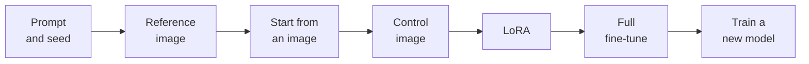
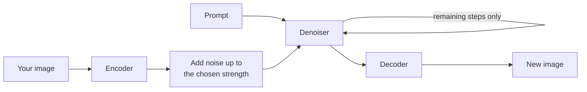

# Part 6: Shaping Models: Fine-Tunes, LoRAs, Style and Control

2026-09-19 · @Someone

## About this part

This is the sixth of seven parts in the generative media module. The aims of the course, the layout every part follows and suggested reading routes are in [Course introduction](file/0a139f54-ef01). The format is the same as before: **In plain terms** opens each numbered section, deep dives are optional, and a glossary closes the part. Reading time is about 50 minutes.

[Part 1](file/7c41d2a9-1e05) described the machine: noise in, a few dozen steps of cleaning up steered by a prompt, a picture out. It ended on a limit. Every output is a fresh draw, and a prompt alone cannot give you the same character twice, your product as it really looks, or your brand's style. This part is about everything that can.

The techniques were all developed for images, where they are most mature, so images are the example in sections 2 to 6. Section 7 shows how each carries over to video, music and 3D.

### What part 6 gives you

Part 6 builds one idea: there is a ladder of ways to shape what a generative model produces, from changing the words to changing the weights, and the skill is choosing the lowest rung that does the job.



Each rung costs more than the one before in effort, skill and risk, and each can do something the rungs below cannot. Sections 2 to 6 climb the ladder, and section 7 carries it to the other media. Section 8 asks where to run all this, section 9 covers rights, likeness and provenance, and section 10 turns the ladder into a way of choosing.

Almost everything here depends on having the model's weights, which is why this part is mostly about open models. Hosted services offer some of the same abilities behind simpler names, and each section says which.

## 1. The open ecosystem

**In plain terms.** Some models can be downloaded and run on your own computer. Around them has grown a huge public library of adapted versions and add-ons, made by companies and hobbyists alike. That library is the reason to care about open models: not that they are free, but that they can be changed. **Who should read it:** everyone should read "What you are actually downloading". The family history is for people who will choose a model.

### Base models and families

A base model is one trained from scratch by a lab, at a cost of hundreds of thousands to many millions of dollars. Few organisations do this. Everyone else starts from a base model that someone has published. Parts 2 to 5 list the current families for images, video, music and 3D.

### Add-ons belong to a family

A LoRA, a control model or a fine-tune is made for one base model and works only with that model and its descendants. An add-on for Stable Diffusion 1.5 does nothing useful on SDXL. An add-on is a set of adjustments to particular weights, and it means nothing applied to different ones.

So the choice of family is a choice of ecosystem. The newest base model often produces the best raw images and has the fewest add-ons. SDXL, three years old, still has by far the largest library. For a job that needs a specific control or style, the older family is often the right answer, and for a job that needs lettering or a long, exact description, it never is.

### What you are actually downloading

Models are shared on public hubs as single files, and three facts about those files matter to anyone responsible for a team's machines.

- **They are large, and growing.** A first-generation model is about 2 GB. SDXL is about 6.5 GB. A 12 billion parameter model is over 20 GB at full precision and a 32 billion parameter one over 60 GB, before counting a text encoder that may be a large language model in its own right. These are usually run in an 8-bit or 4-bit quantised form to fit on one graphics card, with the same trade of a little quality for a lot of memory that part 3 of the language models module describes.
- **The old file format can run code.** Early checkpoints used a general-purpose Python format in which loading a file can execute whatever the file's author put there. The replacement, safetensors, holds only numbers and cannot. Treat any model file that is not safetensors the way you would treat an unknown executable, and do not load one on a work machine.
- **Anyone can upload.** Hubs host hundreds of thousands of community files with little review. Provenance, licence and content vary from careful to absent. Section 9 returns to this.

### The tools

Open models are run through community software, and the two main styles suit different people. Form-based interfaces present the settings from part 1 as boxes and sliders. Node-based interfaces present the pipeline as a graph of connected blocks: load model, encode prompt, sample, decode. The graph looks forbidding and is the better choice for anything repeatable, because the whole pipeline is a file that can be saved, shared, versioned and rerun. Engineers should recognise it as a build definition.

For integration into a product there are code libraries that expose the same pieces, and hosted inference services that will run an open model, with your add-ons, behind an API.

## 2. Fine-tunes and checkpoints

**In plain terms.** A fine-tune is a base model that someone has given further training on a particular kind of picture, such as photographs, anime or architectural renders. It is a whole new copy of the model, several gigabytes in size, and it is better at its speciality and worse at everything else. Most of the "models" people share are fine-tunes. **Who should read it:** non-technical readers need only the first three paragraphs.

A checkpoint is a complete set of model weights in one file. A full fine-tune takes a base checkpoint and continues training all of its weights on a new, narrower set of captioned images, using exactly the noise-removal game from [part 1](file/7c41d2a9-1e05). The result is a new checkpoint of the same size.

Communities have produced thousands of these, each pulling a base model towards one look: photorealism, a style of illustration, product shots, pixel art. For the first two generations of Stable Diffusion, nearly all serious work was done on a community fine-tune and not on the base model, because the fine-tunes were simply better within their niche.

The cost is breadth. Training on a narrow set overwrites some of what the model knew, and a checkpoint tuned on portraits may have lost most of its ability to draw a landscape. The same happens when a language model is fine-tuned, and the consequence is the same: a fine-tune is a specialist.

### Merges

Because two fine-tunes of the same base have the same shape, their weights can be averaged. A merge of a photographic checkpoint and an illustrative one gives something in between, with no training at all. Most popular community checkpoints are merges of merges.

This matters for one reason beyond curiosity. A merged checkpoint has no clean record of what it was trained on or what licences its ancestors carried. For hobby use that is unimportant. For commercial use it can be disqualifying.

### When a full fine-tune is the right tool

Rarely, for most organisations. It needs thousands of well-captioned images, real GPU time and someone who knows how to avoid wrecking the model. It makes sense when you need a broad, consistent house look across many subjects, and you have the image library to teach it: a game studio's art direction, a publisher's illustration style, a retailer's product photography.

For one character, one product or one style, a LoRA does the job at a hundredth of the cost, and section 3 is about that.

### Deep dive (optional): DreamBooth and textual inversion

Two earlier techniques for teaching a model one new thing are worth knowing, because their names survive in tools.

DreamBooth, published in 2022, fine-tunes the whole model on three to five images of a subject, tied to a rare made-up word used as its name. Its important idea is prior preservation: while learning "a photo of sks dog", the model is also trained on its own images of ordinary dogs, so that it does not forget what dogs in general look like and turn every dog into yours. Most LoRA training recipes inherit this idea under the name regularisation images.

Textual inversion, from the same year, changes no weights at all. It learns a new entry for the text encoder's vocabulary: a single vector that, when used in a prompt, steers the model towards the subject. The file is a few kilobytes. It can only reach what the model can already draw, so it captures a style or a common kind of object better than a specific face. Small files called embeddings that people share for use in negative prompts are textual inversions.

## 3. LoRAs

**In plain terms.** A LoRA is a small add-on file that teaches an existing model one new thing: a person, a product, a character, a drawing style. It is trained on a few dozen pictures in about an hour on a good graphics card, it is a fraction of the size of the model, and several can be plugged in at once. It is the most useful tool in this part, and also the one that most needs a policy. **Who should read it:** everyone should read up to "What goes wrong". Non-technical readers can stop there.

### The idea

Low-rank adaptation was invented in 2021 for large language models and adopted by the image community within months of Stable Diffusion's release. [Part 2 of the language models module](file/5086e893-fa85) describes it in a deep dive, and the mechanism here is identical.

A full fine-tune changes every number in every weight matrix. LoRA makes a bet: the change needed to teach a model one new concept is simple, and can be captured by a much smaller set of numbers. So the original weights are frozen, and beside each of the chosen matrices, usually those in the attention layers, training learns a small correction. At generation time the correction is added to the original weights.

Three properties follow, and they are what made LoRAs take over.

- **They are small.** Typically 10 to 200 MB, against several gigabytes for the model. A library of hundreds is practical.
- **They have a strength dial.** Because the correction is added, it can be added at half strength, or at one and a half. Most tools write this in the prompt, as a name and a number.
- **They stack.** Two or three can be applied at once: a character, a style and a lighting look. They interfere with each other as the count and strengths rise, so stacking is a craft and not a guarantee.

### What people train them on

| Kind | Teaches | Typical training set | Used for |
| --- | --- | --- | --- |
| Subject | One person, character, product or place | 15 to 50 varied images of it | Consistent characters across a campaign or a storyboard. Products shown as they really look |
| Style | A way of drawing, lighting or grading | 30 to 200 images in the style | Brand illustration style. Matching existing artwork |
| Concept | A pose, a composition, a kind of object the base model draws badly | 50 or more examples | Filling gaps in the base model |
| Speed | How to finish in very few steps | Distilled from the base model by its publisher | Turning a normal model into a few-step model, as described in part 1 |

A subject LoRA is normally trained with a trigger word, a rare token that stands for the subject in captions. Put the trigger in a prompt and the subject appears. Leave it out and the model behaves nearly as before.

### The training set is the whole job

LoRA training is ordinary supervised learning on a tiny dataset, and everything the language models module says about data quality applies with more force. A few rules account for most of the difference between a LoRA that works and one that does not.

- **Vary everything except the thing you are teaching.** If every photo of the product is on a white table, the model learns that the product includes a white table. Different backgrounds, angles, lighting and distances teach it what is constant.
- **Caption what you want to stay changeable.** Anything described in a training caption is attributed to the caption's words. Anything left out is absorbed into the trigger. Caption the background and the pose, and they remain under your control. Leave out the jacket the character always wears, and the jacket becomes part of the character.
- **A few good images beat many poor ones.** Blurry, cropped or watermarked images teach blur, crops and watermarks.
- **Stop early.** An overtrained LoRA reproduces its training images and resists the prompt. Trainers save a copy every few hundred steps so you can pick the last one that still listens.

### What goes wrong

- **It bleeds.** A style LoRA trained on portraits makes everything a portrait. A character LoRA pulls every face towards the character. Lower the strength before anything else.
- **It fights the base.** A LoRA trained on one fine-tune often works on its siblings and sometimes does not. Test on the checkpoint you will actually use.
- **It quietly carries its data.** A LoRA trained on an illustrator's portfolio reproduces that illustrator's style on demand. A LoRA trained on photos of a real person produces that person doing anything at all. Both are trivially easy, and section 9 explains why an organisation needs a rule about each.

### What hosted services offer instead

Hosted services rarely let you upload a LoRA, but many offer the same outcomes under other names: "custom models" or "brand styles" trained from your uploads are usually LoRAs behind the scenes, and "character reference" and "style reference" features are the adapter techniques in section 6. The service chooses the settings. You give up control and portability, and gain not having to run anything.

### Deep dive (optional): the arithmetic

Take one attention matrix 4,096 wide. It holds 4,096 x 4,096 numbers, about 16.8 million. LoRA leaves it alone and learns two thin matrices, one 4,096 by r and one r by 4,096, whose product has the same shape as the original. The number r is the rank.

```python
W_used = W + strength * (B @ A)   # W: 4096 by 4096.  B: 4096 by r.  A: r by 4096
```

At rank 16 the pair holds 2 x 4,096 x 16 numbers, about 131,000, which is under 1% of the matrix they adjust. Rank is the capacity dial: low ranks of 4 to 16 suit a style or a simple subject, higher ranks hold more detail and overfit more readily.

Because the correction is a plain sum, it can be folded into the weights once, after which the model runs at full speed with no sign a LoRA was ever involved. That is what a merge of a checkpoint and a LoRA is. It is also why a LoRA cannot be reliably detected in a model, or an image, after the fact.

Training needs far less memory than a full fine-tune, since only the small matrices have gradients and optimiser state. A first-generation model can be trained on a graphics card with 8 GB of memory, SDXL on 12 to 16 GB, and the 12 billion parameter models on 24 GB with quantisation, in an hour or two.

## 4. Starting from an image

**In plain terms.** You do not have to start from static. You can hand the model a picture, a photo, a sketch or an earlier result, and ask it to redo part of the work. One control sets how much it may change: a little, for a polish, or a lot, for a reinvention that keeps only the layout. You can also mask off an area and have just that area redone. **Who should read it:** everyone. These are the everyday editing tools, and hosted services have them too.

### Image-to-image

[Part 1](file/7c41d2a9-1e05) explained that a picture forms coarse to fine: layout in the early steps, detail in the late ones. Image-to-image exploits that directly.

Encode your starting image into a latent. Add noise to it, but not all the way: stop at a chosen point part way up the noise scale. Then run the ordinary loop from that point down. The model treats your noised image as if it were its own half-finished work, and finishes it according to the prompt.



The one setting that matters is how far up the scale you go, called denoising strength, from 0 to 1.

| Strength | What survives from your image | What it is for |
| --- | --- | --- |
| 0.1 to 0.3 | Almost everything. Only fine texture is redone | Cleaning up, adding detail, harmonising a composite you pasted together |
| 0.4 to 0.6 | Layout, shapes and colours. Surfaces and details are reinvented | Turning a rough sketch or a 3D block-out into a finished image. Restyling a photo |
| 0.7 to 0.9 | Only the broad masses of light and colour | Using an image as a loose colour and composition guide |
| 1.0 | Nothing. This is ordinary generation | |

A sketch, a photograph of a whiteboard, a screenshot of grey boxes from a layout tool or a crude 3D render all work as starting images. For many design tasks this is the best trade in the whole field: a person supplies the composition, which models are poor at following from words, and the model supplies the rendering, which is slow for a person.

### Inpainting and outpainting

Inpainting redoes part of an image and leaves the rest untouched. You paint a mask over the area to change and write a prompt for what should be there. During the loop, the area outside the mask is reset at every step to the original image at the matching noise level, so the model is constantly shown the true surroundings and paints the masked area to fit them.

Outpainting is the same operation with the mask outside the frame: extend the canvas, mask the new empty area, and the model continues the scene.

Three practical points save most of the frustration.

- **The model only knows what it can see.** Tools usually crop to a region around the mask for speed. If the crop excludes the light source or the rest of the figure, the fill will not match. Widen the context area.
- **Seams come from hard masks.** Feather the mask edge and let it overlap what you are keeping by a few pixels.
- **Dedicated inpainting models do it better.** These are versions of a base model trained with the mask and the surrounding image as extra inputs. They fill more coherently than a standard model used with the reset trick.

Inpainting is how professionals fix the failures that part 2 listed. A wrong hand, garbled lettering or an extra finger is masked and regenerated, several times if need be, while the ninety-five percent of the image that was right is kept.

### Editing by instruction

A newer kind of model takes an image and a written instruction, "make it night", "remove the car", "put her in a red coat", and returns the edited image with no mask. Early versions from 2022 were unreliable. Open and hosted editing models released since 2025 are good enough for routine work, and they keep a face or a product recognisable across edits far better than image-to-image does.

They work by giving the denoiser the original image as an additional input alongside the noise, and training on large sets of before-and-after pairs. When a hosted assistant edits a picture in conversation, this, or the token-based design from part 1, is what is happening.

Treat instruction editing as the first thing to try for a simple change, and masks as the tool for when it gets the area or the extent wrong.

## 5. Controlling structure

**In plain terms.** Words are bad at saying where things go. Control models let you show the model instead: a stick figure for the pose, an outline for the shapes, a depth map for what is near and far. The model then paints whatever you describe, in exactly that arrangement. **Who should read it:** everyone should read the table. The rest is mechanics.

Part 2 showed that composition is the weakest thing to steer with a prompt: counts, positions and relationships all go astray. Image-to-image helps but carries colour and texture along with layout. Control models separate the two. They take a structural map of an image and make the generated image conform to it, leaving appearance entirely to the prompt.

The best-known method, ControlNet, was published in early 2023. Each control model is trained for one kind of map.

| Control image | What it fixes | Where the map comes from | Typical use |
| --- | --- | --- | --- |
| Pose skeleton | The position of bodies, limbs, and often hands and faces | Detected from a photo, or posed by hand in a small 3D tool | A character in a specific pose. The same pose across a series |
| Edges or line art | Outlines of every shape | Edge detection on a photo or render. A clean drawing | Colouring line art. Keeping a logo or a product silhouette exact |
| Depth map | What is near and what is far | Estimated from a photo. Exported from 3D software | Room and architecture shots. Placing a product in a scene |
| Scribble | Rough shapes only | A quick sketch | Fast composition from a thumbnail |
| Segmentation map | Which region is which kind of thing | Painted in flat colours, one per category | Landscapes and interiors laid out by area |
| Tile or blur | The content of a low-detail image | The image itself, shrunk or blurred | Upscaling that adds detail without changing the content |

The maps are made by small preprocessing models that ship with the tools: one click turns a photograph into its pose, edges or depth. So a common workflow is to find or shoot a reference with the right structure, extract the map, and generate something entirely different on top of it.

Two settings matter. Control weight sets how strictly the map is followed. Start and end points set which part of the step range it applies to. Because structure is settled in the early steps, a control applied only for the first third or half of the steps fixes the layout and then lets the model finish freely, which usually looks more natural than full control throughout.

Several controls can be combined, such as pose and depth together, at the cost of memory and time. Control models are tied to a base model family, as every add-on is, and the older families have by far the widest selection.

Hosted services expose little of this. Some accept a "structure reference" or a sketch. If a job depends on exact layout, that alone can decide between hosted and local.

### Deep dive (optional): how a control model attaches

ControlNet makes a trainable copy of the first half of the denoiser, the half that reads the noisy latent and builds up an understanding of it. The copy receives the control map as well as the latent. Its outputs are added into the matching points of the second half of the original, frozen denoiser.

The connections are initialised at zero. At the start of training the copy therefore contributes nothing, and the combined model behaves exactly like the original. The influence of the control is learned gradually from there, which is why control models can be trained on modest datasets without damaging the base model.

Because the copy is about half the size of the denoiser, each control model is a large file and each active control adds substantially to memory and time. Lighter methods, often called adapters, feed the map in through a much smaller network. They cost less and constrain less tightly. For the transformer-based models the same ideas apply with different plumbing, and the map is often passed in as extra tokens.

## 6. Style transfer

**In plain terms.** "Make this look like that" can be done four ways, from a line in the prompt to a custom add-on. They differ in how faithful the result is and how much work they need. The term "style transfer" also names a much older technique that works differently, which is a common source of confusion. **Who should read it:** everyone. The table is the part to keep.

### Two things with one name

Neural style transfer, from 2015, takes one content image and one style image and optimises a new image until its large-scale structure matches the first and its texture statistics match the second. It involves no text and no diffusion. It produced the "photo as a Van Gogh" filters of the following years, and it copies brushwork and palette well and understanding not at all: it cannot redraw a face the way an artist would, only repaint the photograph in their textures.

What people mean today is broader: produce new images, of any subject, that belong to a given visual style. A diffusion model can do that because it has learned styles as concepts, and there are four routes to it.

### Four routes

| Route | How | Fidelity to the style | Effort | Works on hosted services |
| --- | --- | --- | --- | --- |
| Describe it | Name the medium, era, technique, palette and lighting in the prompt | Low to moderate. Limited to styles the model already knows and words can reach | None | Yes |
| Restyle an image | Image-to-image at moderate strength with a style prompt, often with an edge or depth control to hold the structure | Moderate. The content is kept, the rendering changes | Low | Often |
| Show a reference | An adapter encodes one or more reference images and feeds them to the denoiser alongside the prompt | Good for palette, texture and mood. Weaker on the logic of a style | Low | Yes, as "style reference" |
| Train a style LoRA | Section 3, on 30 to 200 images | High and repeatable. The only route to a genuinely new or proprietary style | Hours, plus curation | As "custom style", on some |

### Reference adapters

The third route deserves a little more, because it is new since the first generation and changes what is possible without training.

Part 1 described how the denoiser consults the prompt through cross-attention. An image prompt adapter adds a second, parallel channel. A reference image is passed through an image encoder, usually the image half of CLIP, and the resulting vectors are offered to the denoiser through additional attention layers trained for the purpose. The model can then be steered by a picture in the same way it is steered by words, and by both at once.

One reference image can stand in for a paragraph of description that no one could write. The same mechanism, trained on faces, gives the "character reference" features that hold a person's appearance across images without a LoRA. The limits follow from the encoder: it captures the overall look, the palette and the subject, and loses fine detail, so a reference gets you a family resemblance and a LoRA gets you the thing itself.

### Choosing between them

Start at the top of the table and move down only when the result is not close enough. A described style costs nothing to try. A reference image is the right tool for one-off work and mood exploration. A LoRA is justified when the style must be held across hundreds of images and many people, which is the definition of a brand style.

The harder question is whose style it is. All four routes can imitate a living artist, and the last does it best. Section 9 deals with that.

## 7. The ladder in other media

**In plain terms.** Every rung of the ladder exists for video, music and 3D as well. The names change and the idea does not: show the model something to start from, show it a structure to follow, or teach it one new thing with a small add-on. They are less developed than for images, and the newest models increasingly build them in. **Who should read it:** anyone working beyond still images. Parts 3 to 5 give the detail for each medium.

| Rung | Images | Video | Music and audio | 3D |
| --- | --- | --- | --- | --- |
| Reference | A style or character reference image | Reference images of a character, object or style, held across a new shot | A reference track for style. A voice or persona held across songs | One or several pictures of the object. This is the normal input |
| Start from media | Image-to-image | Image-to-video from a first frame, or first and last. Video-to-video to restyle footage | Audio-to-audio: a cover that keeps the melody and changes the style. Extending a clip | Painting a new surface onto an existing shape |
| Redo a part | Inpainting and outpainting | Replacing an object or a performer in a clip. Extending a clip | Replacing a section, or the lyrics over a span | Regenerating textures only |
| Control the structure | Pose, edges, depth | A driving video of poses or depth. Drawn paths for objects and the camera | Lyrics with structure tags. In some tools, a melody to follow | Several views. A rough block-out shape |
| LoRA | Subject, style, concept, speed | Character, style and kinds of motion, for the main open families | Genre, or an artist's catalogue, on open models | Rare |
| Full fine-tune | A house look | Rare outside large studios, for cost | Rare | Rare |

Three things are worth drawing out.

- **Starting from media is the normal method everywhere except images.** Parts 3 and 5 both recommend making a still first and generating from it. The still carries the composition and the consistency, which means the image techniques in sections 2 to 6 are how you control video and 3D as well.
- **LoRAs carry over where there is an open family to attach them to.** Open video models have growing libraries of them. Training one for video needs far more memory and time than for images, and clips in place of pictures. For music they exist on open models and raise section 9's questions in their sharpest form, since a LoRA of one artist's catalogue imitates a living performer.
- **The rungs are merging into the models.** Part 2 noted that current image models generate, edit and follow references in one system. The same is happening in video, and it is how hosted services expose these abilities at all. The ladder remains the right way to think, since it tells you what kind of input will fix what kind of problem, even when all of it sits behind one prompt box.

## 8. Local or hosted

**In plain terms.** You can use a hosted service and pay per picture, or run an open model on your own hardware. Hosted is easier and usually produces better raw images. Local gives you control, privacy, repeatability and the add-ons in this part. Most teams that do serious volume end up using both. **Who should read it:** everyone. This is the decision most readers will actually face.

### What local needs

An image model needs a graphics card with enough memory to hold the weights and the working data. The figures below are illustrative and assume a consumer card.

| Model size | Memory needed | Time per image | Runs on |
| --- | --- | --- | --- |
| First-generation, about 1 billion parameters | 4 to 6 GB | 1 to 5 seconds | Almost any recent graphics card. Recent laptops |
| SDXL class, about 3 billion | 8 to 12 GB | 5 to 15 seconds | A mid-range gaming card |
| 8 to 12 billion, quantised | 12 to 16 GB | 15 to 60 seconds | A high-end gaming card |
| 8 to 12 billion, full precision | 24 GB or more | 10 to 30 seconds | The top consumer card, or a workstation or cloud GPU |
| 20 to 32 billion | 24 GB with 4-bit quantisation and the text encoder run elsewhere. Otherwise 48 to 80 GB | 30 seconds to minutes | A workstation or cloud GPU |
| Video, 5 billion | 24 GB | Up to nine minutes for five seconds at 720p | The top consumer card |
| Video, 14 billion and up | 80 GB, or less with quantisation and patience | Minutes per clip | A data-centre GPU |
| Music, open diffusion model | 8 GB | Seconds to a minute or two per song | Most recent graphics cards |
| 3D, shape and texture | 24 to 29 GB | Under a minute to a few minutes | The top consumer card |

Laptops and desktops that share memory between processor and graphics can run the larger models, more slowly. Each control model or additional encoder adds to the memory needed. For a team, the usual arrangement is one shared workstation or a rented cloud GPU with a web interface, not a powerful card on every desk.

### The comparison

| Question | Hosted service | Open model, run yourself |
| --- | --- | --- |
| Raw image quality | Usually the best available, and improving without effort from you | One generation behind at the top end. Equal or better within a niche, with the right fine-tune |
| Following complex prompts, lettering | Strongest, especially in assistants built on language models | Good in the newest families, weak in older ones |
| Control over layout, pose, character, style | Whatever the service chooses to expose | Everything in sections 2 to 6 |
| Repeatability | The model changes under you. Last quarter's prompt may not give last quarter's look | A pinned model file never changes. The same settings give the same image next year |
| Privacy | Prompts and uploaded images go to the vendor. Check the terms, as part 5 of the language models module describes | Nothing leaves your network |
| Content rules | The vendor's filters, which sometimes block legitimate work and cannot be adjusted | None built in. Your policy is the only control |
| Cost shape | Per image or per seat. Illustratively, one to ten cents an image | Hardware or GPU rental, plus someone's time. Near zero per image at volume |
| Legal comfort | Some vendors train only on licensed material and indemnify business customers | Training data is what it is. Section 9 |
| Effort | None | Real. Installation, updates, model management, and a person who understands this part |

The balance differs by medium, as parts 3 to 5 found. In video and in song generation the hosted services are well ahead and the open models demand serious hardware, so local is a deliberate choice made for control or privacy. In 3D the open models are close to the front. For sound effects and instrumental music, open models are small and easy to run.

### How the decision usually goes

Hosted is the default, for the same reasons an API is the default for language models: no operations, the best quality, and someone else carries the upgrade burden. Most marketing, presentation and concept work needs nothing more.

Local earns its place when one of four things is true.

- **The work needs control that hosted does not expose.** A consistent character across a hundred frames, a product that must be exact, layouts that follow a wireframe.
- **The inputs cannot leave.** Unreleased products, client material, anything under a confidentiality agreement.
- **The output must be reproducible.** Regulated or audited work, or a production pipeline that cannot tolerate the model changing mid-project.
- **The volume is high and steady.** Catalogue imagery, game assets, personalised creative at scale. At thousands of images a day the arithmetic reverses.

Unlike a large language model, an image model that is good enough for production still fits on one consumer card, even though the largest no longer do. The self-hosting sums that the language models module found so unfavourable are far kinder here, and that is why a do-it-yourself ecosystem thrives for images in a way it does not for the largest language models.

## 9. Rights, likeness and provenance

**In plain terms.** Three questions decide whether an image is safe to use: was it lawful to make, who owns it, and can you show where it came from. The law on the first is unsettled, the answer to the second is "possibly no one", and the third is something you can start doing today. None of this is legal advice, and all of it is as of September 2026. **Who should read it:** everyone. If you read one section of this part, read this one.

### Training data

The first open models were trained on billions of images scraped from the web without the permission of the people who made them. Whether that is lawful is being fought over in several countries, and the answer differs by jurisdiction and is not final in any of them.

One decided case shows how narrow the answers so far have been. In November 2025 the High Court in London ruled on a claim by a large picture agency against the maker of Stable Diffusion. The agency abandoned its central claim, that training on its images infringed copyright, because it could not show that the training had happened in the United Kingdom. The court then rejected the argument that the model is itself an "infringing copy" of the images it was trained on, observing that the model does not store them. The agency won on one point, that some early versions had generated images bearing its watermark, which the judge described as historic and extremely limited in scope. The main question was never reached.

Cases in the United States, including claims by artists and by film studios, are continuing. The practical position for an organisation is a choice of risk, not a settled rule.

- **Lowest risk:** a hosted service from a vendor that trains only on licensed and public-domain images and offers business customers an indemnity.
- **Moderate:** a major hosted or open model with a known publisher, used for ordinary purposes.
- **Highest:** an anonymous community merge of unknown ancestry, or a LoRA trained on one living artist's work and used to produce work in competition with theirs. Whatever the courts decide about training in general, that last case is the one most likely to end badly, legally and reputationally.

### Who owns the output

In the United States, a work must have a human author to be protected by copyright. The Copyright Office's position, set out in a report in January 2025, is that an image produced from a prompt alone is not protected, however elaborate the prompt, because the user does not control how the model turns it into an image. Human contributions are protected where they exist: a selection and arrangement, substantial editing, a drawing that the model rendered. The United Kingdom and some other countries treat computer-generated works differently, and the position there is under review.

The consequence is easy to miss. If your campaign image came straight from a prompt, a competitor may be free to copy it. For anything that matters commercially, make sure a person does real creative work on the image, through composition, control images, painting over or compositing, and keep the working files that show it.

Model licences are a separate matter. "Open" covers everything from permissive licences that allow any use, through licences that forbid listed harmful uses, to licences that are free only for non-commercial use or only for companies below a revenue threshold. Different sizes of the same model often carry different licences. Read the licence of the exact file, and of every add-on, before commercial use.

### Music

Recorded music is the exception to almost everything above, because it is owned by a few large companies that acted together. Part 4 covers the lawsuits, the settlements of late 2025 and what they mean for using a generated song. The short version is that what you may do depends on the service and on your plan, and that resemblance to an existing tune is a more serious risk than resemblance to an existing picture.

### Likeness

A subject LoRA of a real person takes twenty photographs and an hour. It will then produce that person anywhere, doing anything. Reference adapters do nearly as well with one photograph. A voice can be copied from under a minute of recording, as part 4 describes, and part 3 noted that video models now generate speech with matching lip movement, so a convincing clip of a real person saying something they never said is a single prompt.

Non-consensual sexual imagery of real people made this way is a crime in a growing number of jurisdictions and a serious harm everywhere. Fake images of public figures are a fraud and disinformation tool. Even benign uses, such as an employee's likeness in marketing, engage rights of publicity and data protection law, since a face is biometric personal data.

Hosted services block much of this with filters. A local model has no filters at all, so the only control is the organisation's own. A workable rule is short: no model, LoRA, reference or voice clone of a real person without their written consent for the specific use, and no exceptions for "internal" or "just testing".

### Provenance

Part 2 argued that no one can reliably tell a generated image by eye, and the same now goes for a voice and for a few seconds of video. The alternative is to record where an image came from at the moment it is made, in a way that can be checked later.

The industry standard for this is Content Credentials, from a coalition called C2PA. A credential is a signed record attached to the file: what made it, when, and what edits followed, each step signed by the tool that performed it. Cameras from several manufacturers, the major creative software suites and most large hosted image generators now attach them, and some platforms display them.

Three limits keep expectations honest.

- **They are easily lost.** A screenshot, or an upload to a platform that strips metadata, removes the credential. Its absence therefore proves nothing.
- **They record, they do not judge.** A credential says "this tool made this", not "this is true".
- **Open models attach nothing unless you make them.** A locally generated image is, by default, unlabelled.

Some hosted generators also embed an invisible watermark in the pixels themselves, which survives cropping and compression better than metadata does. Only the vendor's detector can read it, and open models have nothing equivalent that cannot be switched off.

Labelling is also becoming a legal duty. The EU AI Act's transparency duties, which have applied since 2 August 2026, require that AI-generated or manipulated images that could pass as real are disclosed as such. Part 5 of the language models module covers the Act and its dates.

For your own work the habit is simple and cheap: keep, for every published image, the model and version, the add-ons, the prompt, the seed and settings, the source images and the name of the person who made it. Tools for open models already write most of this into the file. It is your evidence of authorship, your answer to a rights query, and your way of making the image again.

## 10. Choosing the lightest tool

**In plain terms.** Always try the simplest thing first. Most jobs are solved by a better prompt or a reference image. Reach for training only when the same subject or style must be held across many images. **Who should read it:** everyone. This section turns the part into a procedure.

The ladder from the start of this part, as a decision table:

| You need | Try first | Then | Last resort |
| --- | --- | --- | --- |
| A good one-off image | Prompt, and vary the seed | Inpaint the flaws | |
| A specific composition | A sketch or block-out, with image-to-image | An edge, depth or pose control | |
| To change one thing in an image | Instruction editing | Inpainting with a mask | |
| The same character in many images | A character reference | A subject LoRA | |
| Your real product in generated scenes | Composite the real photo, then low-strength image-to-image to blend | A subject LoRA, with a depth or edge control | |
| A brand style across many images and people | A described style with a fixed prompt template, and style references | A style LoRA | A full fine-tune |
| A broad house look for a whole image library | A community fine-tune close to it | A style LoRA on top | A full fine-tune |
| A video shot | A still made with everything above, then image-to-video | First and last frames. A driving video for the motion | A character or motion LoRA on an open model |
| The same character across video shots | Make consistent stills first, and animate each | Reference images in the video model | A character LoRA |
| A piece of music in our style | A detailed style brief and a reference track | A cover of a rough recording you made | A LoRA on an open model, trained on music you own |
| A 3D prop | A clean picture of it, then image-to-3D | Several views of it | A modeller, starting from the generated shape |

Three rules sit behind the table.

**Move down a rung only when you can say what the rung above failed at.** "It does not look right" is a reason to improve the prompt. "The face changes between images" is a reason for a reference or a LoRA. Naming the failure tells you which tool addresses it.

**Put people where models are weak.** Composition, exact products and lettering are cheap for a person and unreliable for a model. Rendering, lighting, texture and variation are the reverse. The strongest workflows hand each side the work it is good at: a person blocks out the layout and supplies the real logo, the model renders the scene, and a person fixes what is left.

**Treat a working setup as an asset.** A model file, its add-ons and their strengths, a prompt template, the settings and a control workflow together are a piece of production tooling. Pin the versions, store them with the project, and record them with every image. This is the image counterpart of the rule in the practical AI module that prompts are code.

### The whiteboard version

A base model can be pushed towards what you need at several levels. Words and seeds cost nothing and cannot hold a subject or a layout. A starting image or a control image fixes the layout and leaves the look to the prompt. A reference image lends a look or a face without training. A LoRA, a small add-on trained on a few dozen images, teaches one subject or style and holds it reliably. A full fine-tune changes the whole model for a broad house look. Hosted services are easier and better out of the box, and open models are the ones you can shape, pin and keep private. Whichever you use, know the licence, never model a real person without consent, make sure a person's creative work is in anything you need to own, and keep the record of how each image was made.

## Say it two ways

Each idea below has a version for engineers and a version for everyone else. The non-technical versions are simplified but not wrong, so an engineer in the room will not wince.

| Idea | Technical version | Non-technical version |
| --- | --- | --- |
| Fine-tune | Continued training of all of a base model's weights on a narrower captioned dataset, producing a new full-size checkpoint | A copy of the model that has been given extra schooling in one kind of picture. Better at that, worse at the rest |
| LoRA | Frozen base weights plus small trained low-rank corrections to chosen matrices, added at an adjustable strength | A small plug-in that teaches the model one new thing, such as our product or our illustration style, with a dial for how strongly to apply it |
| Image-to-image | Encoding an input image, adding noise to a chosen level, and denoising from there under a prompt | The model redoes a picture you give it. One dial sets whether it polishes it or reinvents it |
| Inpainting | Denoising only a masked region while resetting the rest to the original at each step | Paint over the bit that is wrong and have just that bit redone to match |
| ControlNet | An auxiliary network conditioned on a structural map, whose outputs are added into the frozen denoiser | We show the model the layout, as a stick figure or an outline, and it paints our description onto exactly that layout |
| Content Credentials | A cryptographically signed manifest of an asset's origin and edit history, embedded in the file | A tamper-evident label saying what made this image and what was done to it. It can fall off, so a missing label means nothing |

## Misconceptions to correct

Four claims come up constantly. Each contains something true, which is why flat contradiction fails. Agree with the true part first, then add what it leaves out.

### "To get our brand style we need to train our own model"

**True:** a prompt alone will not hold a distinctive style across hundreds of images and a dozen people.

**Misleading:** "our own model" suggests a project costing months and millions. What is needed is usually a style LoRA: a few dozen to a couple of hundred approved images, an afternoon of training on one graphics card, and a file of a hundred megabytes. Often a fixed prompt template and two or three style reference images are enough, with no training at all.

**What to say:** "We do not need to build a model. We need to teach an existing one our style, which is a small add-on trained on our approved artwork. Let us try reference images first, and train the add-on if that does not hold."

### "Open models are the free version of the good ones"

**True:** the best hosted services usually produce better raw images than any open model, and open models cost nothing to download.

**Misleading:** the reason to use an open model is not price. It is that the weights can be adapted, controlled, pinned and kept private. For work that needs an exact layout, a consistent character or confidential inputs, an open model with the right add-ons beats a better model that cannot be steered. And it is not free: it costs hardware and a person who understands it.

**What to say:** "Hosted gives us the best picture for the least effort. Open gives us control. We should use hosted by default and run our own where we need the same character, our real product, or privacy."

### "If it is AI-generated, no one can sue us, and no one can copy it"

**True:** the law on training is unsettled, and there is no general rule that generated images infringe anything.

**Misleading:** both halves are wrong in ways that matter. An output that closely resembles a protected work, character or trade mark can infringe whatever made it. And in the United States an image made from a prompt alone has no copyright protection, so a competitor may be free to reuse it.

**What to say:** "Two checks before we publish. Does it resemble anything recognisable: run a reverse image search and look for logos and characters. And is there enough of our own creative work in it for us to own it: if it matters, a designer should be composing and editing, not just prompting."

### "We can just train it on that illustrator's work"

**True:** it is technically trivial. Thirty images and an hour produce a LoRA that imitates a living artist's style on demand.

**Misleading:** style as such is not protected by copyright in most places, but the training images are, the artist's name may be, and the case law is moving. Beyond the law, it is the use of generative AI most likely to cause public damage to the organisation, because it substitutes directly for the person whose work made it possible.

**What to say:** "We can, and we should not. If we want that look, we commission the artist, or license their work for a style add-on with their agreement."

## Glossary

Every technical term used in this part, in plain language and in alphabetical order.

| Term | Meaning |
| --- | --- |
| Adapter | A small network attached to a frozen base model to give it a new input or ability, such as following a reference image |
| Base model | A model trained from scratch by a lab, which fine-tunes and add-ons start from |
| C2PA | The industry coalition that defines the Content Credentials standard |
| Checkpoint | A complete set of model weights saved as one file |
| Content Credentials | A signed record attached to an image file, saying what made it and how it has been edited |
| Control image | A structural map, such as a pose skeleton, edges or a depth map, that a control model makes the output conform to |
| Control weight | How strictly a control image is followed |
| ControlNet | The best-known method for steering a diffusion model with a control image |
| Denoising strength | In image-to-image, how far the starting image is noised before the model redoes it. Low keeps the image, high reinvents it |
| Depth map | An image in which brightness records how far each point is from the viewer |
| DreamBooth | An early method of teaching a model one subject from a handful of images by fine-tuning the whole model |
| Embedding (textual inversion) | A tiny file holding one learned vector for the text encoder, used as a new word in prompts |
| Fine-tune | A base model given further training on a narrower set of images. Also the act of doing so |
| Image prompt adapter | An adapter that lets a reference image steer generation alongside the text prompt |
| Image-to-image | Generating from an existing image with noise added, instead of from pure noise |
| Inpainting | Regenerating a masked area of an image to fit its surroundings |
| Instruction editing | Changing an image by written instruction, with no mask, using a model trained on before-and-after pairs |
| LoRA (low-rank adaptation) | A small add-on that adjusts a frozen model's weights to teach it one subject, style or concept |
| Mask | The painted area that tells an inpainting tool which part of the image to redo |
| Merge | A checkpoint made by averaging the weights of two or more fine-tunes of the same base |
| Neural style transfer | A 2015 technique that repaints one image in the textures of another. Not a diffusion method |
| Outpainting | Extending an image beyond its original edges |
| Prior preservation | Training on the model's own ordinary examples alongside the new subject, so that it does not forget the general category |
| Provenance | A checkable record of where an image came from and what was done to it |
| Quantisation | Storing weights at lower precision to save memory, at a small cost in quality |
| Rank | The size of a LoRA's correction matrices. Higher rank holds more detail and overfits more easily |
| Safetensors | A model file format that holds only numbers and cannot run code when loaded |
| Style reference, character reference | Hosted services' names for image prompt adapters |
| Trigger word | A rare token used in a LoRA's training captions to stand for its subject |
| Watermark, invisible | A signal hidden in an image's pixels that a vendor's detector can find |

## Sources

Dates, figures and findings quoted in this part come from these papers, reports and judgments. The account of the law is as of September 2026 and is not legal advice.

- [LoRA: Low-Rank Adaptation of Large Language Models](https://arxiv.org/abs/2106.09685), 2021, for the low-rank method
- [DreamBooth](https://arxiv.org/abs/2208.12242), 2022, for subject fine-tuning from a few images and prior preservation
- [An Image is Worth One Word](https://arxiv.org/abs/2208.01618), 2022, for textual inversion
- [SDEdit](https://arxiv.org/abs/2108.01073), 2021, for generating from a partly noised image, the basis of image-to-image
- [InstructPix2Pix](https://arxiv.org/abs/2211.09800), 2022, for editing by written instruction
- [Adding Conditional Control to Text-to-Image Diffusion Models](https://arxiv.org/abs/2302.05543), 2023, for ControlNet and its zero-initialised connections
- [T2I-Adapter](https://arxiv.org/abs/2302.08453), 2023, for lighter control adapters
- [IP-Adapter](https://arxiv.org/abs/2308.06721), 2023, for image prompt adapters
- [LCM-LoRA](https://arxiv.org/abs/2311.05556), 2023, for few-step generation delivered as a LoRA
- [A Neural Algorithm of Artistic Style](https://arxiv.org/abs/1508.06576), 2015, for the original neural style transfer
- [Safetensors](https://huggingface.co/docs/safetensors/index), for the file format that cannot execute code
- [Getty Images v Stability AI](https://www.judiciary.uk/judgments/getty-images-v-stability-ai/), High Court of England and Wales, November 2025, for the abandoned training claim, the failed secondary infringement claim and the limited trade mark finding
- [Copyright and Artificial Intelligence, Part 2: Copyrightability](https://www.copyright.gov/ai/Copyright-and-Artificial-Intelligence-Part-2-Copyrightability-Report.pdf), United States Copyright Office, January 2025, for the position on prompts and human authorship
- [C2PA](https://c2pa.org/), for the Content Credentials standard
