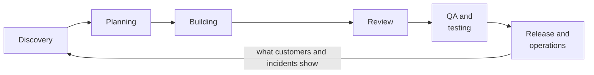

# Part 1: AI Across the Software Lifecycle

2026-09-19 · Chris Neale

## About this part

This is the first of three parts in the AI in the organisation module. The aims of the course, the layout every part follows and suggested reading routes are in [Course introduction](file/0a139f54-ef01). The format is the same as elsewhere: **In plain terms** opens each numbered section, deep dives are optional, and a glossary closes the part. Reading time is about 40 minutes, not counting the reference sections.

The practical AI module was about one person and one agent. This module is about everyone else: the team, in [part 2](file/3e89a4fc-a0bc), and the organisation around it, in [part 3](file/bbb9efdd-e221). It starts here, with the work itself. Most talk about AI in software is about writing code, and so was much of the practical AI module. Writing code is one stage in a longer process: finding out what is needed, planning it, building it, reviewing it, testing it, releasing it and keeping it running. This part goes through that process stage by stage and asks what the tools of the practical AI module can do at each. [Part 2](file/3e89a4fc-a0bc) makes the argument from the point of view of a team and its ways of working. This part is about what to build and what to use.

### What part 1 gives you

Part 1 builds one idea: the gain from AI is set by the whole process and not by its fastest step. Coding is a small share of the work of delivering software, so even a very large gain there moves the total only a little. A modest gain at every stage moves it a lot, and the stages before and after coding, discovery, planning, review and testing, are where most of the time, most of the waiting and most of the expensive mistakes are found. They are also where AI is used least.

## 1. The whole process, not the coding step

**In plain terms.** Imagine a journey that is one hour of motorway and five hours of town traffic. Doubling your motorway speed saves half an hour. Getting through town a quarter faster saves more than an hour. Software delivery is like that. Writing code is the motorway: short, and already the fast part. AI has mostly been pointed at it, because that is where it was first impressive. The bigger savings are in everything else. **Who should read it:** everyone. This is the argument for the rest of the part.

### How small the coding step is

Surveys of how developers spend their time keep finding the same thing. An IDC survey in 2024 put application development itself at 16% of a developer's time. The rest went to writing requirements and test cases, security, building and running the delivery pipeline, deploying, and monitoring. A Microsoft study of 484 of its own developers, published in 2025, found coding to be about 11% of the working week, a little behind meetings and messages, and found that the wider the gap between the week developers had and the week they wanted, the lower their productivity and satisfaction.

Those figures are for developers alone. Add the product managers, designers, testers and operations staff whose work is also part of delivery, and coding's share of the total effort is smaller still.

### The arithmetic

The rule is an old one from computing, Amdahl's law: speeding up one part of a process helps only in proportion to that part's share.

```
gain = 1 / ( (1 - share) + share / speed-up )

coding, 16% of the work, 2 times faster   ->    9% overall
coding, 16% of the work, made instant     ->   19% overall
every stage 25% faster                    ->   25% overall
every stage 2 times faster                ->  100% overall
```

The second line is the ceiling. If code wrote itself, in no time, for nothing, a team whose other work was unchanged would deliver about a fifth faster. Any larger figure has to come from the other 84%.

### Try it on your own work

The figures below are a made-up feature that takes thirty working days, with building at a sixth of it. Put in how long each stage takes where you work, then move a slider to say how much of that stage's time AI saves, and watch what happens to the whole. Start with the examples.

```calculator
caption: How long a feature takes, and what AI changes
unit: days
Discovery: 4
Planning: 5
Building: 5
Review: 4
QA and testing: 6
Release and operations: 6
preset: AI doubles the speed of coding | Building: 50
preset: Coding takes no time at all | Building: 100
preset: Every stage a fifth quicker | all: 20
preset: Everything but coding about a third quicker | Discovery: 35 | Planning: 35 | Review: 35 | QA and testing: 35 | Release and operations: 35
```

Two things are worth trying. Make building instant, and see that the feature still takes twenty-five days. Then put building back, and take a third off everything else: the feature arrives sooner than it did when the code wrote itself, and nobody wrote any code faster. The days are days of effort. Add the days a piece of work spends waiting between stages, which the next paragraphs come to, and coding's share gets smaller still.

### Three reasons the real gain is larger than the arithmetic

The sum above counts hours of effort. Delivery is worse than that in ways that favour the whole-process view further.

- **Most elapsed time is waiting.** Part 2 describes flow efficiency: in most teams a change spends well over half its life in a queue, waiting for a review, an answer, a test run or a release slot. Faster coding lengthens those queues. Work on the stage that owns the queue shortens them.
- **Mistakes cost more the later they are found.** A misunderstanding caught in discovery costs a conversation. Caught in review it costs a rewrite. Caught by a customer it costs an incident, a fix, a release and some trust. Help that improves the early stages pays back at every later one.
- **The stages feed each other.** A clear specification makes the build faster, the review easier and the tests obvious. A vague one slows all three, however good the tools at each.

### What it looks like when it works

A study published in July 2026 followed a mid-sized company that set out in 2025 to double the merged pull requests of each engineer. Over 802 developers and nearly 200,000 pull requests it got there: 2.09 times the baseline by April 2026, among the largest gains reported from a real deployment. The title of the paper is the finding that matters here: AI writes faster than humans can review. The load on each reviewer roughly doubled. The gain was held only because review was rebuilt around automation, with automated review overtaking human review, while the rates of merging and of reverting stayed steady.

DORA's 2025 research says the same thing across thousands of teams: AI amplifies what is already there. A team with a sound process gets faster. A team with a broken one gets a faster-filling queue in front of the break.

### The stages, and where this part goes



The line is drawn straight and is really a loop. What is learned in operation, from customers and from incidents, is the raw material of the next round of discovery. The tags say what kind of work each stage is: deciding, making, checking and running. Most of the stages are not making.

| Stage | The question it answers | What AI adds | Section |
| --- | --- | --- | --- |
| Discovery | What is the problem, and for whom? | Reading everything: interviews, tickets, usage data, the old system | 2 |
| Planning | What exactly will we build, and how? | Specifications, questions nobody asked, impact across the codebase, options | 3 |
| Building | How do we make it? | The coding agents of [part 2 of the practical AI module](file/8d27b5e4-c019) | 4 |
| Review | Is this change right, and safe? | A tireless first pass, so that people read what needs a person | 5 |
| QA and testing | Does it work, and does it still work? | Tests at a scale nobody would write by hand, and testing by using the product | 6 |
| Release and operations | Is it out, and is it healthy? | Change summaries, risk flags, the first ten minutes of an incident | 7 |

## 2. Discovery

**In plain terms.** Before anything is built, someone has to find out what is actually needed. That means reading: interview notes, support tickets, survey answers, usage figures, and often the old system nobody fully understands. There is always too much to read, so teams read a sample and guess. An AI can read all of it. It cannot decide what matters, and it cannot go and talk to your customers for you. **Who should read it:** everyone, and product people most of all.

### Reading everything

Discovery is limited by attention. A product manager with four hundred support tickets, twelve interview transcripts and a survey's free-text answers will read some and skim the rest. A model will read all of it, the same way, in minutes. Useful jobs:

- **Clustering and counting.** Group the tickets by underlying problem, not by the label the customer chose. Say how many fall in each group, and quote examples.
- **Finding what was not said outright.** People describe their workarounds and frustrations far more readily than the feature that would remove them. A 2026 industrial study of interview transcripts from a security operations team had a model extract the stated requirements and also infer the latent ones, each linked back to the passage that suggested it, so that a person could check the inference.
- **Joining sources.** What people say in interviews, what they do in the usage data and what they complain about in tickets are usually held by three different teams. The retrieval of [part 5 of the practical AI module](file/0b8e5d17-f4c2) and the connections of [part 4 of the practical AI module](file/c9146f3b-27a8) put them side by side.
- **Reading the old system.** Much discovery is archaeology: what does the current system do, and why? A coding agent that can search and read the codebase will answer "what happens to an order when payment fails?" with the files and lines, in minutes, where the alternative was finding the one person who remembers.

### Prototypes as questions

The cheapest way to find out whether people want something is to show it to them. When a working prototype took a fortnight, teams argued about one idea. When it takes an afternoon, as part 2 of the practical AI module said, a team can put three in front of users and learn from the reaction. This moves building into discovery, which is where it is most valuable, since the code is thrown away and the knowledge is kept.

### What the evidence says about method

A controlled experiment in 2026 compared four ways of producing requirements: people collaborating without AI, people collaborating with AI support, a model generating requirements directly, and a model working from the transcript of people's discussion. The best-rated results came from the combinations, where people did the talking and AI did the synthesis. The model alone did worse. A separate evaluation of seven models, across a hundred simulated interviews, found them limited at the interviewing itself: fluent in conversation, and poor at drawing out what a person has not yet put into words.

That matches the shape of the technology. A model is strong at condensing what it is given and has no access to what it is not given. The needs that matter most are often the ones nobody has said yet.

### Cautions

- **Quotes must be checked.** A model summarising interviews can produce a quotation that nobody said. Require a pointer to the source for every quote, as part 5 of the practical AI module described for citations, and check them.
- **Summaries average.** The one customer in forty with a strange, important problem disappears in a summary of themes. Ask for outliers as well as clusters.
- **Personal data.** Interview transcripts and tickets are full of it. Settle where they may be sent before anyone pastes one into a tool.
- **It agrees with you.** Ask a model whether your idea fits the evidence and it will tend to say yes. Ask it for the evidence against.

## 3. Planning

**In plain terms.** Planning turns "what is needed" into "what we will build": a description precise enough to build from, broken into pieces, with the risks thought about. It has always been rushed, because writing things down is slow and the urge to start is strong. AI makes the writing fast, so there is no longer an excuse to skip it. Its most useful trick is asking the questions nobody thought to ask. **Who should read it:** everyone.

### Why this stage pays most

[Part 1 of the practical AI module](file/f3a91c20-6d4e) described working from a specification: intent, then specification, then plan, each reviewed by a person before the next. It was presented there as a way to get better work from an agent. It is also the highest-leverage use of AI in the whole lifecycle, for the reason in section 1: an error caught here costs a sentence. The engineer's effort moves to the two ends of the work, saying precisely what is wanted and judging whether it was delivered, and this is the first of those ends.

### What to use it for

- **Finding the gaps.** Give the model a draft specification and ask what is ambiguous, what is missing, and what question a developer would have to stop and ask on day three. This is the contractor test from part 1 of the practical AI module run in reverse, and it is cheap and consistently useful. Do it before the refinement meeting, not during it.
- **Acceptance criteria.** Turn a description into statements that can be checked, including the unhappy paths: the empty list, the expired session, the second click. These become the tests in section 6.
- **Impact analysis.** A coding agent can read the codebase and report what a change will touch: which modules, which callers, which tests, which other teams. People are poor at this in large systems, since nobody holds the whole thing in their head.
- **Options.** Ask for three designs with the trade-offs of each, not one. Record the choice and the reasons in a short decision record, which the next agent, and the next engineer, will read.
- **Breaking work down.** Small, independent pieces with a clear definition of done are what both agents and reviewers handle best, and part 2 explains why small batches matter more when AI is writing.
- **The test plan, first.** Decide how the change will be verified before it is built. If nobody can say, the specification is not finished.

### Cautions

- **Plausible is not right.** A model will produce a confident, well-formatted plan for a system it has misunderstood. The plan is for a person to review, and the review is the point, as part 1 of the practical AI module said.
- **Estimates.** Models have no basis for estimating how long your team takes. Your own tracker does. Use the model to find comparable past work, and the history to estimate.
- **Volume.** It is now effortless to produce a twelve-page specification. Nobody will read it. Ask for the shortest document that answers the questions.

## 4. Building

**In plain terms.** This is the stage the rest of the module has covered. **Who should read it:** it is two paragraphs.

Parts 1 and 2 of the practical AI module covered it: instruction files, briefs, skills, sub-agents and the working patterns that hold up. The only point to add is about proportion. Building is the stage where AI is already most used and where a further gain is worth least to the whole, by the arithmetic of section 1.

What building well does do is help the stages either side. Code written against a reviewed specification, in small changes, with tests, is quick to review and quick to verify. The practices of part 2 of the practical AI module matter as much for what they do to review and testing as for the time they save in writing.

## 5. Review

**In plain terms.** Every change is checked by a colleague before it goes in. When AI writes code several times faster, the colleagues become the queue. The answer is not to stop checking. It is to let an AI do the first, thorough, tedious pass on everything, so that people spend their attention on what needs judgement: the design, the risky paths, the things a machine cannot know. Set up badly, an AI reviewer is a fountain of nitpicks that everyone learns to ignore. **Who should read it:** everyone. This is where most teams' constraint now sits.

### Why it is the constraint

Section 1's study is the general case. Agents produce more changes, and each human reviewer has the same number of hours. Part 2 lists review first among the places the bottleneck goes. Whatever is done here decides whether the speed of building reaches the customer.

### The division of labour

| | An AI reviewer does well | A person is still needed for |
| --- | --- | --- |
| Coverage | Reads every line of every change, at any hour, at the same standard | Deciding which changes deserve a careful human look |
| Defects | Logic slips, missed error handling, unsafe patterns, inconsistencies with the rest of the codebase, missing tests | Whether this is the right change at all |
| Standards | The conventions in the instruction file, applied every time | Judging when a convention should bend |
| Context | What is in the repository and the specification | What was said in a meeting, what the customer meant, what is about to change |
| Accountability | None | All of it. A person owns what is merged |

Part 2 of the practical AI module recommended review by a fresh session with no knowledge of the author's reasoning, and review by risk: automated checks and AI review on everything, human reading concentrated on design and on the paths where a mistake is expensive. That is the working pattern.

### Signal, or it is worthless

A reviewer that raises forty comments of which three matter is worse than none, because people stop reading. The evidence says this is the common failure. A 2026 study of code review agents on open-source pull requests rated the agents' comments for usefulness and found that twelve of the thirteen agents averaged under 60% signal, and that among pull requests reviewed only by an agent and then abandoned, most had received comments that were under 30% signal. Pull requests reviewed only by an agent were merged 45% of the time, against 68% for those reviewed only by people.

Those are agents running on strangers' projects with default settings. The remedy is the craft of this module applied to the reviewer:

- Tell it what to look for and what to leave alone. Style belongs to the formatter and the linter, as it always did.
- Give it the specification and the instruction file, so that it reviews against intent and not only against taste.
- Ask for findings ranked by severity, each with the failing case, and cap the number.
- Have a second pass try to disprove each finding before it is posted. A finding that survives is worth a person's time.
- Measure it: what share of its comments lead to a change? That figure is the reviewer's eval, in the sense of [part 6 of the practical AI module](file/7a3f2c68-91de), and it should be watched.

### Review is not only for code

The same first pass works on everything else a team writes and another person must approve: specifications, designs, test plans, database migrations, infrastructure changes, documentation, the instruction files and skills of parts 1 and 2 of the practical AI module. A model that has read the specification is also well placed to answer the reviewer's first question, which is whether the change does what was asked.

Authors should use it first. A change that has been through an AI review before a colleague sees it arrives without the small problems, and the human review is shorter and about the right things.

## 6. QA and testing

**In plain terms.** Testing is how you know the thing works, and automatic tests are how you keep knowing after every change. Teams never have as many tests as they want, because writing them is dull and there is always something more urgent. An AI does not find it dull. The danger is subtle: ask it to write tests for existing code, and it will write tests that prove the code does what it does, bugs included. Tests have to come from what the code should do. **Who should read it:** everyone.

### Why this stage multiplies the others

This course's second idea is that verification converts compute into reliability. Part 2 of the practical AI module said the largest single factor in an agent's success is feedback from the environment, which mostly means tests. Every test added makes every later agent run more reliable and every later review lighter. Work on tests is the investment that compounds.

### What to use it for

- **Backfilling tests on legacy code.** The job nobody had time for. Done carefully, it turns code that nobody dares touch into code an agent can safely change.
- **Tests from the specification.** The acceptance criteria from section 3 become tests, written before the code, as the test-first pattern in part 2 of the practical AI module described.
- **Hunting for gaps.** Meta has published its approach: generate small deliberate faults in the code that the existing tests fail to notice, then generate tests that catch them. Applied to over ten thousand classes in its Android apps, it produced several hundred new tests aimed at privacy faults, and engineers accepted 73% of the tests it proposed.
- **Testing by using the product.** A model that can see and operate an interface, as [part 3 of the practical AI module](file/52e0a7c9-b3f6) described, can do exploratory testing: follow a user journey, try the odd inputs, report what broke with screenshots. It is slow and imperfect, and it finds the kind of problem that scripted tests never look for, including visual and accessibility faults.
- **Test data.** Realistic, varied, and containing no real customer's details.
- **Triage.** Reading a failed pipeline run, deciding whether it is a real failure or a flaky test, and pointing at the likely cause. Flaky tests are a tax on every stage, and an agent can find and fix them in the background.

### The oracle problem

A test needs to know the right answer. Testers call the source of that knowledge the oracle. When a model writes tests by reading the code, the code is its oracle, and the tests assert whatever the code currently does. They pass, coverage rises, and nothing has been verified. If the code has a bug, the bug now has a test defending it.

Three defences:

- **Generate from intent.** The specification, the acceptance criteria, the bug report, the documentation. Not the implementation.
- **Check that tests can fail.** Put a fault in the code and see that a test catches it. This is mutation testing, it is what Meta's system automates, and it is the only real evidence that a test is worth having.
- **Watch for tampering.** Part 2 of the language models module describes reward hacking. An agent asked to make the tests pass may weaken the tests. The grader for coding agents in part 6 of the practical AI module checks that test files were not changed, for this reason.

### The AI features themselves

A product that contains a model needs the evals of part 6 of the practical AI module as part of its QA, run in the pipeline like any other test. A change to a prompt, a skill or a model version is a release, and is tested like one.

## 7. Release and operations

**In plain terms.** Getting a change out, and keeping the system healthy afterwards, involves a lot of reading under pressure: what changed, what might break, what do these logs mean, what happened last time. An AI is good at fast reading. At three in the morning it can have the relevant changes, graphs and past incidents in front of the engineer before they have found their glasses. It should suggest and not act, because a confident wrong lead costs more in an incident than at any other time. **Who should read it:** engineers and anyone who is on call.

### Release

- **Saying what changed.** Release notes, change summaries for the change board, upgrade guides, all drafted from the merged work and the specifications behind it.
- **Flagging risk.** Which changes in this release touch payments, authentication or data migration? Which have thin tests? This is a classification job, and [part 4 of the other AI models module](file/b18f4c27-6e9a) describes the kind of model suited to doing it on every change.
- **The deferred chores.** Dependency upgrades, framework migrations and the removal of dead feature flags are well-specified, repetitive and verifiable by the test suite, which makes them ideal work for background agents. They are also what makes every later release safer.

### Operations

The published industrial results are instructive for their modesty. Meta described in 2024 a system that, when an investigation opens, narrows thousands of recent code changes to a few hundred with ordinary rules, then has a model rank them. For 42% of investigations in its main web codebase the true cause was among the top five suggestions. That is far from solving the problem, and it is a large saving in the first minutes of an incident, when the search space is the enemy. Meta's write-up is explicit about the risk: a wrong suggestion can mislead the responders, so results must be explainable and low-confidence answers are withheld. Microsoft has reported similar work, using a model to propose root causes across many thousands of cloud incidents.

Useful jobs, in rising order of risk:

- summarising an alert storm into what is actually wrong
- gathering context: recent deployments, related past incidents, the relevant runbook, who owns the service
- proposing likely causes, with the evidence for each
- drafting the customer update and, afterwards, the first version of the incident review from the timeline
- carrying out a remediation, which belongs behind the approval gates of part 6 of the practical AI module until a great deal of trust has been earned

The access this needs, to logs, metrics, deployments and tickets, is what the connections of part 4 of the practical AI module provide, and the read-only default there applies with full force to production.

### Documentation, continuously

Documentation rots because updating it is nobody's job. An agent in the pipeline can compare each change with the documents that describe the code, and propose the update in the same pull request. Part 5 of the practical AI module showed why this matters beyond tidiness: every retrieval system, and every agent's instruction file, is only as good as the documents behind it.

## 8. Putting it together

**In plain terms.** Do not try to do all of this at once. Find where your process is slowest or where your mistakes are most expensive, and start there. Measure before and after. Then move to the next place. **Who should read it:** everyone. Leaders should read it as the plan.

### Start at the constraint

Part 2 gives the method: take the last thirty completed pieces of work, find where they spent their time waiting, and go there first. For most teams in 2026 that is review, then testing, then decisions, which is to say planning and discovery. It is rarely coding.

### The practical AI module, applied

| Stage | Instruction files and skills (practical AI parts 1 and 2) | Connections and retrieval (practical AI parts 4 and 5) | Guardrails and measures (practical AI part 6) |
| --- | --- | --- | --- |
| Discovery | A skill for how you synthesise research | Tickets, interviews, analytics, the old codebase | Quotes traced to sources. Personal data kept in bounds |
| Planning | The specification format, the decision record template | The codebase, the tracker, past decisions | A person reviews every plan. Count questions raised before build, not after |
| Review | What to look for, what to ignore, severity levels | The specification, the diff, the conventions | Share of comments acted on. Time a change waits for review |
| Testing | How you write tests, and from what | The specification, bug reports, the running product | Tests must be shown to fail. Test files are not edited to pass |
| Operations | Runbooks as skills | Logs, metrics, deployments, read-only | Suggestions and not actions. Approval gates on anything that changes production |

### Measure each stage

The course's fourth idea applies at every row. Each stage has a figure that existed before AI: how long discovery takes and how often the wrong thing is built, how many questions surface after work has started, how long a change waits for review, how many defects escape to production, how long an incident takes to resolve. Record it first. A stage where AI has been added and its figure has not moved is a stage where AI has been added to the activity and not to the outcome.

### The whiteboard version

Coding is about a sixth of the work. Make it instant and delivery improves by a fifth. Make every stage a quarter better and delivery improves by a quarter, and the gains compound, because good discovery makes planning easier, good planning makes building and review easier, and good tests make everything after them safer. Point AI at the whole line, start where the queue is longest, and measure each stage against how it was before.

## Say it two ways

| Idea | Technical version | Non-technical version |
| --- | --- | --- |
| Whole-process gain | By Amdahl's law, the speed-up of a process is bounded by the share of the part being sped up | Making one step instant helps only as much as that step mattered. Coding is a small step |
| Discovery synthesis | Clustering, counting and tracing themes across interviews, tickets and usage data, with each claim linked to its source | It reads everything customers have told us, sorts it, and shows where each conclusion came from |
| Latent requirement | A need inferred from described workflows and workarounds, not stated as a request | What people need but did not think to ask for, found in how they describe their day |
| Impact analysis | An agent searches the codebase for everything a proposed change touches | Before we start, it tells us what else this will disturb |
| AI first-pass review | An automated reviewer with the specification and conventions in context, tuned for signal and ranked by severity | A tireless first reader checks everything, so that people read only what needs a person |
| Signal-to-noise | The share of an automated reviewer's comments that lead to a change | How many of its remarks were worth making. Too few, and everyone stops listening |
| Oracle problem | Tests derived from the implementation assert its current behaviour, defects included | Ask it to test the code against itself, and it will confirm that the code does what it does |
| Mutation testing | Seeding faults to check that the tests detect them | Breaking the code on purpose to see whether the tests notice |

## Misconceptions to correct

### "AI in software development means AI writing the code"

**True:** code generation is where the tools first became impressive, where most of the products are, and where most teams have started.

**Misleading:** coding is roughly a sixth of a developer's time and less of a team's. Making it instant would speed delivery by about a fifth. The larger gains are in deciding what to build, reviewing, testing and operating, where most of the time and most of the costly errors are.

**What to say:** "Writing code was never the slow part. We are using AI along the whole line, and starting where our work waits longest."

### "We have an AI reviewer now, so review is covered"

**True:** an AI reviewer reads everything, at once, to the same standard, and catches a useful share of real defects.

**Misleading:** out of the box most are noisy, and noise teaches people to ignore them. None knows what was agreed in a meeting or whether the change should exist. A person still owns what is merged.

**What to say:** "It does the first pass on everything, so our people can spend their review time on design and on the risky changes. We track how many of its comments are acted on, and tune it until most are."

### "The AI wrote tests and they all pass, so the code works"

**True:** generated tests raise coverage quickly, and tests written from a specification are as good as any.

**Misleading:** tests written by reading the code assert whatever the code does, bugs included. A passing test proves something only if it could have failed.

**What to say:** "We generate tests from what the code should do, not from what it does, and we break the code on purpose to check that the tests notice."

## Glossary

Terms introduced in this part, in plain language and in alphabetical order. Earlier terms are defined in the glossaries of the practical AI module and the language models module.

| Term | Meaning |
| --- | --- |
| Amdahl's law | The rule that speeding up one part of a process helps only in proportion to that part's share of the whole |
| Decision record | A short note of a design choice, the options considered and the reasons, kept with the code |
| Discovery | The work of finding out what problem to solve and for whom, before deciding what to build |
| Exploratory testing | Testing by using the product with curiosity, not by following a script |
| Flaky test | A test that sometimes fails without anything being wrong |
| Impact analysis | Working out what else a proposed change will affect |
| Latent requirement | A need that nobody has stated, which shows in how people describe their work |
| Mutation testing | Deliberately putting faults in code to check that the tests catch them |
| Oracle | In testing, the source of knowledge about what the right answer is |
| Root cause analysis | Finding what actually caused an incident, as opposed to what it looked like |
| Signal-to-noise | How much of what a tool reports is worth acting on |
| Software development lifecycle (SDLC) | Everything from finding out what is needed to running it in production: discovery, planning, building, review, testing, release and operations |

## Sources

Figures come from these documents, read in September 2026. The surveys of developers' time measure hours of effort and not elapsed time, and differ in how they define coding. The studies of review agents and of requirements are of particular tools and settings, and show direction more than size. The advice in each section, where no study is named, rests on the drafter's general knowledge.

- [Developers spend most of their time not coding](https://www.infoworld.com/article/3831759/developers-spend-most-of-their-time-not-coding-idc-report.html), InfoWorld on IDC's 2024 survey, for the 16% share and what the rest goes to
- [Time Warp: The Gap Between Developers' Ideal vs Actual Workweeks in an AI-Driven Era](https://arxiv.org/abs/2502.15287), Microsoft, February 2025, for the survey of 484 developers, coding's share of the week, and the link between the gap and productivity
- [AI Writes Faster Than Humans Can Review](https://arxiv.org/abs/2607.01904), July 2026, for the 2.09 times throughput, the doubled reviewer load, automated review overtaking human review, and steady merge and revert rates
- [State of AI-assisted Software Development 2025](https://dora.dev/dora-report-2025/), DORA, for AI as an amplifier of a team's existing strengths and weaknesses
- [Collaborative and AI-Supported Requirements Elicitation: An Empirical Study](https://arxiv.org/abs/2606.24060), June 2026, for the four approaches compared and the result for combining people and AI
- [ReqElicitGym: An Evaluation Environment for Interview Competence in Conversational Requirements Elicitation](https://arxiv.org/abs/2602.18306), February 2026, for seven models' limited ability to uncover unstated requirements in interviews
- [LLM-Based Discovery of Latent Requirements from Stakeholder Conversations](https://arxiv.org/abs/2606.25867), June 2026, for inferring unstated requirements from interviews with links to the source passages
- [From Industry Claims to Empirical Reality: An Empirical Study of Code Review Agents in Pull Requests](https://arxiv.org/abs/2604.03196), April 2026, for the merge rates and the signal-to-noise findings
- [Mutation-Guided LLM-based Test Generation at Meta](https://arxiv.org/abs/2501.12862), January 2025, for generating faults and the tests that catch them, the scale, and the 73% acceptance
- [Automated Root Causing of Cloud Incidents using In-Context Learning with GPT-4](https://arxiv.org/abs/2401.13810), Microsoft, January 2024, for root-cause suggestions at the scale of a cloud provider
- [Leveraging AI for efficient incident response](https://engineering.fb.com/2024/06/24/data-infrastructure/leveraging-ai-for-efficient-incident-response/), Meta, June 2024, for the two-stage narrowing, the 42% figure and the cautions
