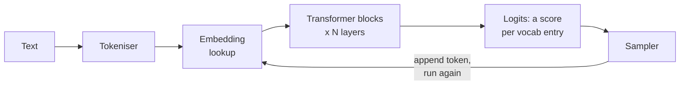
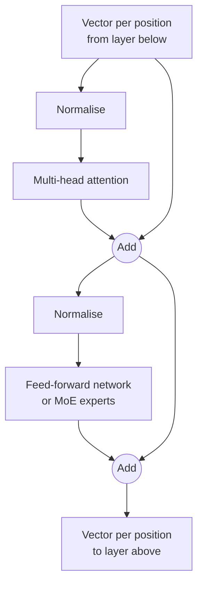

# Part 1: How an LLM Actually Works

2026-09-18 · @Someone

## About this part

This is the first of five parts. The aims of the course, the layout every part follows and suggested reading routes are in [Course introduction](file/0a139f54-ef01). The format here is the one described there: **In plain terms** opens each numbered section, deep dives are optional, and a glossary closes the part. Reading time is about 35 minutes.

### What part 1 gives you

Part 1 builds one mental model: text goes in as tokens, flows through a stack of identical layers, and comes out as a probability for every possible next token. Most of what people find surprising about LLMs, good and bad, follows from that design. By the end you should be able to sketch the whole pipeline on a whiteboard and defend each box.

## 1. The whole thing in one sentence

**In plain terms.** An LLM writes text one small piece at a time. Before each piece, it looks at everything written so far and works out what is likely to come next. **Who should read it:** everyone. This section is short and frames everything that follows.

An LLM is a function that takes a sequence of tokens and returns a probability for every possible next token. Generation is that function called in a loop: pick a token, append it, call again. Everything else in this part is detail inside that sentence.

As code, the entire runtime looks like this:

```python
tokens = tokenize(prompt)
while not done:
    probs = model(tokens)       # one probability per vocabulary entry
    next_token = sample(probs)  # pick one
    tokens.append(next_token)
print(detokenize(tokens))
```

Three things are worth noticing before we open up `model`.

- **The model is a pure function.** Its weights are billions of numbers fixed at training time. They are identical for every user and every call, and nothing you type changes them.
- **All state lives in the token list.** The model has no session, no memory and no hidden scratchpad between calls. If it is not in `tokens`, the model does not know it.
- **Chat is a formatting convention.** A conversation is serialised into one long token sequence with special markers for system, user and assistant turns. The model simply continues that document.

The pipeline inside one call to `model` has five stages:



Text becomes token IDs, IDs become vectors, the vectors pass through a deep stack of identical blocks, and the final vector becomes a score for every token in the vocabulary. Sections 2 to 6 take these stages in order. Section 7 draws out what the design implies.

## 2. Tokenisation

**In plain terms.** The model does not read letters or words. It reads text chopped into chunks called tokens, a bit shorter than a word on average. Everything you pay for, and every size limit you hit, is counted in these chunks. **Who should read it:** non-technical readers can go straight to the list under "What this explains" and skip the rest.

A model never sees characters or words. It sees integers, each one an index into a fixed vocabulary of text fragments called tokens. The tokeniser is a separate, deterministic piece of code that runs before and after the neural network.

### Why fragments

Characters would make sequences very long, and every step costs compute. Whole words would need an unbounded vocabulary and would fail on typos, new names and code. Sub-word fragments sit in between: common words are one token, rare words are several, and anything at all can be spelled out from smaller pieces.

Current models use vocabularies of roughly 30,000 to 250,000 tokens, and most recent ones use more than 100,000. The usual algorithm is byte-pair encoding (BPE). It starts from raw bytes and repeatedly merges the most frequent adjacent pair in a large text sample until the vocabulary is full. The result is a lookup table, learned once and then frozen.

Useful rules of thumb for English prose: one token is about four characters, or about three quarters of a word. A 1,000-word document is roughly 1,300 tokens. Code, numbers and other languages behave differently, which is where the consequences start.

### What this explains

- **Letter-level blind spots.** Asked how many times a letter appears in a word, a model is reasoning about one or two opaque IDs, not a string of letters. It has to have learned the spelling of that token as a fact. Newer models mostly have, but the weakness is structural.
- **Arithmetic quirks.** Long numbers are split into chunks of digits, and the chunking does not align with place value. Models now handle this far better, and reach for a code tool when precision matters, but it is why raw mental arithmetic was an early embarrassment.
- **Language cost.** Tokenisers are trained mostly on English and code. The same sentence in Polish, Hindi or Japanese can take two to four times as many tokens. That means higher cost, slower output and less effective context for the same content.
- **Whitespace and code.** Indentation, brackets and common keywords get their own tokens, which is one reason code is handled efficiently. Minified or unusual formatting costs more than clean code.
- **Tokens are the unit of everything commercial.** Context limits, pricing, rate limits and output caps are all counted in tokens. Each vendor has its own tokeniser, so the same prompt has a different token count, and a different price, on each model.

One practical habit follows. When you estimate cost or check whether something fits in context, count tokens with the vendor's tokeniser. Character counts and word counts will mislead you, especially for code and non-English text.

### Deep dive (optional): how BPE merges produce odd tokens

BPE training is greedy and purely statistical. Count every adjacent pair of symbols in the sample, merge the most common pair into a new symbol, and repeat about 100,000 times. Because it starts from bytes, there is no such thing as an unknown token: any input falls back to byte-level pieces.

Two engineering choices shape the odd results. First, text is pre-split with a regular expression so that merges never cross word or punctuation boundaries. The leading space is kept as part of the following word, so `  hello ` and `hello` are different tokens with different IDs. Second, designers decide how digits group. Most modern tokenisers cap number tokens at one to three digits, precisely to make arithmetic more learnable.

The greedy process also produces tokens for strings that were common in the tokeniser's sample but rare in the model's training data, such as usernames from a scraped forum. Their embeddings barely get trained. These became known as glitch tokens: feeding one to an early model produced bizarre output. Vendors now filter for them, but the episode is a good illustration that the tokeniser and the model are two separately trained artefacts that can disagree.

## 3. Embeddings

**In plain terms.** The model turns each chunk of text into a long list of numbers that captures its meaning, so that similar things get similar numbers. This is how a machine that only does arithmetic can work with language. **Who should read it:** safe to skip if you do not need the mechanics. Nothing later depends on it for a non-technical reader.

The first thing the network does is turn each token ID into a vector: a list of several thousand numbers. This is a plain table lookup. The table has one row per vocabulary entry, and its contents are learned during training like every other weight.

### Meaning as geometry

Training pushes tokens that behave alike towards similar vectors. `Python` ends up near `Ruby`, `Tuesday` near `Thursday`. More usefully, consistent directions emerge: the step from `walk` to `walked` points roughly the same way as the step from `jump` to `jumped`. Nobody designs these directions. They appear because they make next-token prediction easier.

Two cautions keep this picture honest.

- **Single dimensions mean nothing.** There is no "formality" number at position 412. Concepts are directions that cut across many dimensions, and models pack in far more concepts than they have dimensions by letting them overlap slightly.
- **The input embedding has no context.** The token `bank` gets the same starting vector in "river bank" and "bank loan". Sorting that out is the job of the layers above.

### From static to contextual

Think of each position in the sequence as carrying a vector up through the stack. At the bottom it means "this token, in isolation". Each layer edits it using information from other positions. By the top, the vector at a position no longer represents the token that went in. It represents everything the model has worked out that is relevant to predicting what comes next at that point.

That top vector is then compared against an output table, one row per vocabulary entry, to produce a score for every possible next token. So the model begins and ends with the same kind of operation: a mapping between tokens and points in space.

### Why this matters later

The semantic search behind RAG, which the practical AI module covers, uses the same idea with a different model. An embedding model is trained to produce one vector for a whole passage, so that passages with similar meaning land close together. If you have worked with vector similarity, you already have the right intuition: distance in the space stands in for similarity of meaning, imperfectly.

## 4. Attention

**In plain terms.** For every word it writes, the model looks back over everything so far and picks out the parts that matter most right now. This is how it knows what "it" refers to, or what a variable was called 200 lines earlier. It is also why very long inputs cost more and run slower. **Who should read it:** non-technical readers need only "A worked example" and "The cost".

Attention is how positions in the sequence share information, and it is the only place in the architecture where they do. Every other operation works on one position at a time. If you understand attention, you understand how a model uses context.

### The mechanism

A developer-friendly way in: attention is a fuzzy hash map lookup. A normal map takes a key, finds the one exact match and returns its value. Attention takes a query, scores it against every key, and returns a weighted blend of all the values.

At each position the model multiplies the current vector by three learned matrices to get three new vectors:

- a **query**: what this position is looking for
- a **key**: what this position offers to others
- a **value**: the information it hands over if selected

The position's query is compared with the key of every earlier position using a dot product. The scores are normalised so they sum to 1. The output is the values of all those positions, blended by those weights, and it is added to the current position's vector.

### A worked example

Take the sentence "The server crashed because it ran out of memory". When the model processes `it`, the vector at that position needs to find out what `it` refers to. One attention head might produce these weights (illustrative numbers):

| Position attended to | Weight |
| --- | --- |
| The | 0.02 |
| server | 0.71 |
| crashed | 0.12 |
| because | 0.05 |
| it | 0.10 |

The query from `it` matched the key from `server` most strongly, so most of what flows into the `it` position is the value from `server`. After this step, the vector at `it` carries "this refers to the server". A later layer can then connect "ran out of memory" to a server, not to something else.

### Three details that matter

**Causal masking.** A position may only attend to itself and earlier positions. This is what makes left-to-right generation possible. It also makes training efficient, because every position in a document is a prediction exercise at once.

**Many heads.** Each layer runs dozens of attention heads in parallel, each with its own query, key and value matrices. Different heads learn different relationships: the previous token, the subject of the verb, the matching open bracket, the earlier definition of this variable. One well-studied type finds an earlier occurrence of the current token and copies what came after it. That simple circuit is a building block for learning patterns from examples in the prompt.

**Position.** The blend operation is blind to order. Without help, "dog bites man" and "man bites dog" would look the same. Modern models fix this by rotating queries and keys by an angle that depends on position, so that the match score depends on how far apart two tokens are.

### The cost

Each new token is compared against every token before it. Work per token grows linearly with context length, so total work for a sequence grows with the square of its length. A 100,000-token prompt implies on the order of ten billion pairwise scores for each head in each layer.

This single fact drives much of part 3: why long prompts are slow to start, why providers cache the keys and values of earlier tokens, why cached input is priced lower, and why context length is an engineering trade-off and not a free upgrade.

### Deep dive (optional): the attention calculation

For one head, stack the queries, keys and values for all positions into matrices Q, K and V. The whole operation is:

```
Attention(Q, K, V) = softmax( (Q K^T) / sqrt(d_k) + mask ) V
```

`Q K^T` gives an n-by-n grid of raw scores. The mask sets every score for a future position to negative infinity, so softmax turns it into zero. Softmax is applied per row, so each position's weights sum to 1.

The `sqrt(d_k)` divisor is there for training stability. The dot product of two vectors with d\_k roughly independent unit-variance components has variance d\_k. With d\_k of 128, raw scores would often be large enough to push softmax into near one-hot outputs, where gradients vanish. Dividing by the square root brings the variance back to about 1.

Multi-head attention splits the model width across heads. A model 8,192 wide with 64 heads gives each head 128 dimensions. Head outputs are concatenated and passed through one more learned matrix, which mixes them back into the full width. Most current models also share keys and values across groups of heads to shrink the cache, which part 3 covers.

### Deep dive (optional): rotary position embeddings and context extension

Rotary position embedding (RoPE) treats each query and key as a set of two-dimensional pairs and rotates each pair by an angle proportional to the token's position. Different pairs rotate at different frequencies, from very fast to very slow, like the hands of many clocks.

The useful property is that the dot product of a rotated query and a rotated key depends only on the difference between their positions. The model therefore learns relative relationships ("three tokens back") that apply anywhere in the sequence.

It also explains how context windows grow after the fact. A model trained at 8,000 tokens has never seen the rotation angles that occur at position 100,000. Extension methods rescale the frequencies so that long positions map back into the familiar range, followed by a short extra training run on long documents. This works well, but it is one reason why a model's advertised context length and the length over which it performs reliably are different numbers.

## 5. The transformer block and the stack

**In plain terms.** A model is one processing step repeated many dozens of times, each pass refining its understanding of the text. The "size" of a model is the number of adjustable settings in those steps. Many modern models use only a small part of themselves for each word, which makes them cheaper to run than their size suggests. **Who should read it:** non-technical readers need only "Mixture of experts", for the two meanings of model size.

A transformer is one block design repeated many times. Each block has two sub-layers: attention, which moves information between positions, and a feed-forward network, which processes information at each position. Small models stack a few dozen of these blocks or fewer. The largest stack many dozens, in some cases more than a hundred.



The two "Add" nodes are the important part. Each sub-layer computes an adjustment and adds it to the vector it received. Nothing is overwritten.

### The residual stream

Because every sub-layer adds to the same running vector, that vector acts as a shared workspace running the full height of the model. It is usually called the residual stream. Each layer reads what earlier layers wrote, contributes a small patch, and passes it on.

For a developer, the closest picture is a pipeline where every stage applies a diff to shared state. Early stages can leave information that a stage fifty layers later picks up. This design is also what makes very deep networks trainable at all.

### The feed-forward network

The feed-forward sub-layer works on each position independently. It expands the vector to several times its width, applies a simple non-linear function, and projects it back down. In a standard dense model it holds around two thirds of all the parameters.

A useful reading is that it behaves like a very large learned key-value memory. Each of its internal units detects some pattern in the incoming vector and, when it fires, writes associated information back to the stream. Research that traces factual recall, such as completing "The Eiffel Tower is in" with "Paris", finds much of the work happening in these layers.

So a rough division of labour is: attention decides what information goes where, and feed-forward layers decide what to do with it once it arrives. It is a simplification, but a serviceable one.

### Depth is serial compute

Layers run in sequence, so the number of layers is the number of sequential processing steps the model gets for each token. That number is fixed. The model spends exactly the same compute producing the next token of "2 + 2 =" as the next token of a subtle architectural judgement.

Remember this for section 6. The only way a model can spend more computation on a hard problem is to generate more tokens.

### Where the parameters are

When someone quotes a parameter count, almost all of it is the attention and feed-forward matrices, multiplied by the number of layers. One well-documented open model with 70 billion parameters has 80 layers, a vector width of 8,192 and 64 attention heads. The embedding tables are a rounding error by comparison.

### Mixture of experts

Most of the largest models are now believed to be mixture-of-experts (MoE) designs. The change is confined to the feed-forward sub-layer. Instead of one large network, each layer holds many smaller ones, called experts, plus a small router. For each token, the router picks a few experts to run and ignores the rest.

This splits the parameter count into two numbers:

- **Total parameters** set how much the model can know and how much memory it needs to serve.
- **Active parameters** set how much compute each token costs, and therefore speed and price.

One published open model has 671 billion total parameters but activates about 37 billion per token, choosing 8 of 256 experts in each layer. It stores knowledge like a very large model and runs at roughly the cost of a mid-sized one. The trade is not free: an MoE model is generally weaker than a dense model of the same total size, and it needs all its experts held in memory.

For conversations, the takeaway is that "how big is it?" now has two answers, and they predict different things. Total size hints at capability. Active size hints at cost and latency.

### Deep dive (optional): MoE routing in practice

The router is a single small matrix. It scores every expert for the current token, keeps the top few, and blends their outputs using the normalised scores. Routing happens per token and per layer, so one sentence may touch most of the experts in the model on its way through.

Left alone, routers collapse: a few experts get picked early, improve fastest and then get picked even more. Training therefore includes a balancing pressure, either an extra loss term or a bias adjustment, to spread load evenly. Many designs also keep one or two shared experts that always run, to hold common knowledge.

A common assumption is that experts specialise by subject, giving a "Python expert" and a "legal expert". Studies of open models mostly find otherwise. Specialisation tends to follow token-level and syntactic patterns, such as punctuation, numerals or verb forms, and it differs layer by layer. You cannot extract one expert and get a domain model.

Serving is where MoE hurts. All experts must sit in GPU memory even though few run per token, and they are usually spread across many GPUs, so tokens are shuffled between devices at every layer. Because expert capacity is shared across all requests in a batch, which other requests you are batched with can subtly change your result. Part 3 returns to this as one cause of non-determinism.

### Deep dive (optional): what interpretability research has found inside

We know the architecture exactly, because people wrote it. We understand the algorithms the weights have learned only partly. Interpretability research is the effort to close that gap.

The main finding so far is that models represent concepts as directions in the residual stream, and pack in far more of them than there are dimensions. Dictionary-learning methods can pull these apart into millions of features, many of them recognisable: a specific landmark, a security vulnerability in code, flattery. Turning a feature up or down changes behaviour in the expected way, which is good evidence that the feature is really used.

Researchers have also traced small circuits end to end. Examples include the copying mechanism from section 4 and two-step recall, where a question about the capital of the state containing a given city visibly passes through the state as an intermediate concept. Other work shows a model choosing a rhyme word in advance and then writing the line to reach it.

The limits are real. These methods explain a fraction of what a model computes, they take heavy manual effort, and they cannot yet certify how a model will behave in general. The honest summary for a sceptical audience is this: models demonstrably hold intermediate concepts and do multi-step computation, not just surface word statistics, and nobody can yet read out the full program.

## 6. From numbers to text

**In plain terms.** The model does not choose a word. It gives every possible next chunk a probability, and a simple piece of code rolls weighted dice. That is why answers vary between runs, why a model cannot take back what it has written, and why letting it think out loud gives better answers. **Who should read it:** skip the first two sub-sections if you like, but read "What the loop implies". Most of it matters in practice.

The network's output is not a token. It is a score for every token in the vocabulary, and ordinary code outside the network decides which one to use. That separation explains randomness, reproducibility settings and structured output.

### Logits and probabilities

The vector at the final position is compared against the output table to give one raw score per vocabulary entry. These scores are called logits. A softmax converts them into probabilities that sum to 1.

The shape of that distribution depends on the context (illustrative numbers):

| Context so far | Top candidates | Shape |
| --- | --- | --- |
| "The capital of France is" | Paris 0.93, a 0.02, the 0.01 | Sharp: one answer dominates |
| "For this service I would choose" | Go 0.18, Python 0.15, a 0.11, Rust 0.09 | Flat: many reasonable continuations |

A sharp distribution means the model is confident about the next token. It does not mean the token is true. Confidence here is about text likelihood, and part 3 shows how that gap produces hallucination.

### Sampling controls

- **Temperature** divides the logits before softmax. Below 1 it sharpens the distribution towards the top choice. Above 1 it flattens it and lets unlikely tokens through. At 0 the sampler simply takes the highest-scoring token every time.
- **Top-p** keeps the smallest set of tokens whose probabilities add up to p, for example 0.95, and samples only from those. It cuts off the long tail of nonsense options while keeping real alternatives.
- **Top-k** keeps a fixed number of top tokens. It is cruder and less common now.

In practice, use low temperature for extraction, classification and code edits, where you want the same answer each run. Use the default or higher for drafting and brainstorming, where variety is the point. Some reasoning models fix these settings on the vendor side, so check before you build around them.

### What the loop implies

**Output is random by construction.** The same prompt can give different answers because the sampler rolls dice. This is a feature of the design and not a defect. Any process you build on a model has to tolerate it, through validation, retries or evaluation over many runs.

**There is no backspace.** Once a token is emitted it becomes input, and the model treats its own earlier output as given. An early wrong turn tends to be followed by fluent text that justifies it. A model can correct itself, but only by appending "actually, that is wrong". It cannot quietly revise.

**Thinking out loud is real computation.** Section 5 showed that compute per token is fixed. Writing intermediate steps buys more passes through the network, and puts partial results into the context where attention can use them. This is why asking for reasoning before the answer improves accuracy. Reasoning models are trained to do this at length before replying, which part 2 covers. Those thinking tokens are billed as output.

**Input is cheap, output is slow.** All prompt tokens can be processed in one parallel pass. Output tokens must be produced one at a time, each needing a full pass through every layer. That asymmetry is why output is priced several times higher than input and why long answers feel slow.

**Stopping is learned.** The model ends a reply by emitting a special end-of-turn token. If it hits your maximum token limit first, the output is simply cut off, mid-sentence or mid-JSON.

**The sampler can be constrained.** Because token choice is ordinary code, a system can mask out any token that would break a grammar or a JSON schema. That is how structured output modes guarantee valid syntax. They guarantee the shape, not that the content is right.

## 7. What falls out of this design

**In plain terms.** The model remembers nothing between requests, holds no database of facts, and does not learn from being used. It knows two things: what it absorbed in training, which is broad but fuzzy, and what is in front of it right now, which is exact but limited. **Who should read it:** everyone. This section needs no technical background and is the most useful one in conversations.

Six properties follow directly from sections 1 to 6. They account for most of the confusion you will meet when people reason about what these systems can do.

### The model is stateless; products are stateful

Nothing persists inside the model between calls. A long chat works because the application re-sends the whole conversation every turn. Product features called "memory" work by storing notes elsewhere and inserting them into the prompt. When behaviour seems to carry over, look for what the application put in the context.

### Recall is reconstruction, not lookup

There is no database inside the model. Facts exist only as statistical associations spread across billions of weights. Recalling one means regenerating it, in the same way the model generates everything else.

This is why a model can be right about the gist and wrong about the version number, the date or the citation. It is also why it cannot tell you where it learned something, and why it has no built-in signal for "I have no record of that".

### Two kinds of knowledge

| Property | In the weights | In the context |
| --- | --- | --- |
| How it got there | Training | You, or your application, put it in the prompt |
| Freshness | Frozen at the training cutoff | As current as you make it |
| Precision | Fuzzy, reconstructed | Exact, can be quoted back |
| Capacity | Vast | Limited by the context window |
| Cost | Free at run time | Paid in tokens on every call |
| How to change it | Retrain or fine-tune | Edit the prompt |

Most practical AI engineering, which the practical AI module covers, is the work of getting the right information into the context at the right time. When precision matters, put the source in the prompt and do not rely on recall.

### In-context learning

A model can pick up a pattern from the prompt and apply it immediately, with no change to its weights. Show it three examples of your commit message format and the fourth follows suit. Give it your team's conventions file and its code shifts to match.

This is the most useful property for day-to-day work, and it is temporary by nature. When the context ends, the learning is gone. Anything you want a model to "know" reliably has to be supplied every time.

### It does not learn from your conversations

Typing into a model does not update it. Weights change only when the vendor runs a new training process. Whether a vendor may use your conversations as training data for a future model is a separate, contractual question. Business and API terms generally exclude it by default, and part 5 covers how to check.

### Parameter count is capacity, not quality

More parameters give a model more room to store knowledge and skills. How well that room is used depends on the training data, the training recipe and the post-training, which part 2 covers. A recent small model regularly beats a large model from two years earlier. Treat a parameter count like a server's RAM: relevant, but not a performance figure.

### The whiteboard version

Text is split into tokens. Each token becomes a vector. The vectors climb a tall stack of identical layers, where attention moves information between positions and feed-forward layers process it. The top vector becomes a probability for every possible next token, one is sampled, and the loop repeats. The weights never change while you use it, and the prompt is the only thing it knows about you.

## Say it two ways

Each idea below has a version for engineers and a version for everyone else. The non-technical versions are simplified but not wrong, so an engineer in the room will not wince.

| Idea | Technical version | Non-technical version |
| --- | --- | --- |
| What an LLM is | A fixed function from a token sequence to a probability distribution over the next token, run in a loop | A system that writes one word-piece at a time, each time choosing what is most likely to come next given everything so far |
| Tokens | Sub-word units from a learned vocabulary of 100,000 or more entries; the unit for context limits and billing | The chunks the model reads and writes in, a bit shorter than a word. We pay per chunk |
| Attention | Each position scores its query against the keys of all earlier positions and takes a weighted blend of their values | For every word it writes, the model looks back over everything so far and decides which parts matter most right now |
| Parameters | Learned weights, mostly in the attention and feed-forward matrices across all layers | The dials that were tuned during training. More dials means more capacity, not automatically better answers |
| Mixture of experts | Per-token routing to a few of many feed-forward experts; total parameters set capacity, active parameters set cost | A big team where only a few specialists work on each word. You get the knowledge of the whole team at the running cost of a few |
| Temperature | A divisor applied to logits before softmax; lower values concentrate probability on the top tokens | A creativity dial. Low means predictable and repeatable, high means varied and occasionally odd |

Two habits make these land. Lead with the consequence before the mechanism: "we pay per chunk" matters more to a finance lead than how chunks are made. And keep one step of depth in reserve, so that a follow-up question gets a better answer and not a repeat.

## Misconceptions to correct

Four claims come up constantly. Each contains something true, which is why flat contradiction fails. Agree with the true part first, then add what it leaves out.

### "It's just autocomplete"

**True:** the training objective and the output step are next-token prediction, exactly as in section 1.

**Misleading:** the objective says nothing about what the network must learn in order to do it well. Predicting the next line of a proof, a code review or a legal argument rewards building internal models of logic, programs and intent. The interpretability work in section 5 shows intermediate concepts and multi-step computation inside the network.

**What to say:** "Yes, it predicts the next word. To do that well across all of human writing, it had to learn a great deal about how the world works. Judge it by what it can do, and test that, not by how simple the objective sounds."

### "It looks things up in a database"

**True:** products often attach search or document retrieval, and then the model really is reading sources.

**Misleading:** the model on its own has no store of records. It regenerates facts from weights, which is why details drift. Whether a given answer came from a retrieved source or from recall changes how far you should trust it.

**What to say:** "On its own it works from memory, like a well-read colleague without their notes. If accuracy matters, we give it the documents and ask it to work from those."

### "It learns from our conversations"

**True:** within one conversation it adapts to what you have said, and some products carry notes across sessions.

**Misleading:** none of that changes the model. Adaptation lives in the context and ends with it. Training on customer data is a contractual matter, not something that happens as you type.

**What to say:** "It does not get smarter or leak as we use it. It only knows what is in front of it each time. What the vendor may do with our data later is set by the contract, and we check that separately."

### "Bigger is always better"

**True:** within one model family and generation, the larger model is usually more capable.

**Misleading:** across generations, training quality dominates size. Larger models are also slower and cost more per token, and for many tasks a small model is indistinguishable in quality. With MoE, the headline size does not even tell you the running cost.

**What to say:** "We should pick the smallest model that passes our tests for the task. Part of the saving pays for using the biggest model where it counts."

## Glossary

Every technical term used in this part, in plain language and in alphabetical order.

| Term | Meaning |
| --- | --- |
| Active parameters | The part of a mixture-of-experts model that actually runs for each token. Predicts speed and cost |
| Attention | The step where the model looks back over earlier text and pulls in the parts relevant to the current position |
| Attention head | One of many parallel attention units in a layer, each learning its own kind of relationship |
| Autoregressive | Producing output one token at a time, with each new token fed back in as input for the next |
| Byte-pair encoding (BPE) | The usual method for building a token vocabulary, by repeatedly merging the most common adjacent pieces of text |
| Causal masking | The rule that a position may only look at itself and earlier positions, never ahead |
| Context | Everything the model is given for one call: instructions, conversation so far, documents, its own output so far |
| Context window | The maximum amount of context a model accepts, counted in tokens |
| Dense model | A model in which every parameter is used for every token. The opposite of mixture of experts |
| Embedding | A list of numbers representing a token, or a passage, so that similar meanings get similar numbers |
| Expert | One of the many small feed-forward networks inside a mixture-of-experts layer |
| Feature | A concept the model represents internally, found by interpretability research as a direction in its vectors |
| Feed-forward network | The part of each layer that processes one position at a time. Holds most of the parameters and much of the factual knowledge |
| Fine-tuning | Further training of an existing model on extra data to change its behaviour or knowledge |
| Glitch token | A token the model barely saw in training, which can trigger strange output |
| Hallucination | Fluent output that is false or unsupported. Covered in part 3 |
| In-context learning | Picking up a pattern, format or fact from the prompt and using it at once, with no change to the model |
| Interpretability | Research into what is happening inside a trained model |
| Layer (block) | One repeat of the attention plus feed-forward unit. Models stack many dozens of them |
| Logits | The raw scores the model gives every possible next token, before they are turned into probabilities |
| Mixture of experts (MoE) | A design where each token uses only a few of many expert networks, cutting running cost for a given total size |
| Parameters (weights) | The numbers inside the model that were adjusted during training. Fixed while the model is in use |
| Post-training | The training stages after the main one that turn a raw text predictor into a helpful assistant. Covered in part 2 |
| Prompt | The input you send to the model |
| Query, key, value | The three vectors attention uses: what a position is looking for, what it offers, and the information it passes on |
| RAG (retrieval-augmented generation) | Fetching relevant documents and putting them in the prompt so the model works from sources. Covered in the practical AI module |
| Reasoning model | A model trained to write out extended thinking before it answers |
| Residual stream | The running vector at each position that every layer reads from and adds to. The model's shared workspace |
| Rotary position embedding (RoPE) | The common way of telling attention how far apart two tokens are |
| Router | The small component in a mixture-of-experts layer that picks which experts handle each token |
| Sampling | Choosing the next token at random according to the model's probabilities |
| Softmax | The formula that turns a list of scores into probabilities that add up to 1 |
| Structured output | Forcing the model's output to follow a fixed format, such as a JSON schema |
| Temperature | A setting that makes token choice more predictable when low and more varied when high |
| Token | A chunk of text, usually shorter than a word. The unit models read, write and are billed in |
| Tokeniser | The program that converts text to tokens and back |
| Top-p | A setting that stops the sampler from picking very unlikely tokens |
| Total parameters | All the parameters in a model, whether or not they run for a given token. Predicts knowledge capacity and memory needs |
| Training cutoff | The date after which the model has seen no data |
| Transformer | The neural network design, built from stacked attention and feed-forward layers, behind all current LLMs |
| Vector | A list of numbers treated as a point or direction in space |
| Vocabulary | The fixed list of all tokens a model can read or write |
