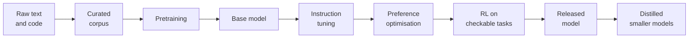

# Part 2: How Models Are Built and Why They Behave as They Do

2026-09-18 · Chris Neale

## About this part

Part 2 explains where a model's abilities and habits come from. Part 1 described the machine. This part describes how its billions of weights get their values, in stages, and why each stage leaves a visible mark on behaviour.

Pretraining supplies knowledge and raw capability. The three post-training stages supply the assistant behaviour, the tone and the reasoning habits. By the end of this part you should be able to explain why models flatter, why they are unusually good at code, why releases jump the way they do, and how to read a launch announcement with a cool head.

This matters for the course's main argument. Knowing which behaviours were trained in, and how, tells you what can be handed over and left to run, and what needs an automatic check around it. A model that is strongest where success is checkable, and that sometimes games the check, tells you exactly where to invest: in checks that are hard to game.

The format matches part 1: each numbered section opens with **In plain terms**, deep dives are optional, and a glossary closes the part. Reading time is about 35 minutes.

## 1. Pretraining

**In plain terms.** The model starts as random numbers. It is shown an enormous amount of text and asked, again and again, to guess the next chunk. Every wrong guess nudges its settings slightly. After trillions of guesses it has absorbed grammar, facts, reasoning patterns and how to code. Nearly all of the cost and nearly all of the knowledge come from this stage. **Who should read it:** everyone can read the main text. Skip the deep dive.

### The training loop

Take a document from the corpus. At every position, have the model predict the next token. Compare its probabilities with the token that actually came next, and compute an error score called the loss. Then adjust every weight a tiny amount in the direction that would have made the right token more likely. Repeat, trillions of times.

Two properties make this practical at scale. First, it needs no human labelling: the text is its own answer key. Second, causal masking from part 1 means one 8,000-token document yields 8,000 prediction exercises in a single pass.

The scale is hard to picture. The largest models are trained on well over ten trillion tokens. One openly documented model with 405 billion parameters used about 15 trillion tokens and 16,000 GPUs running for months. Publicly reported compute costs for a single run at that scale range from tens to hundreds of millions of dollars.

### Why guessing the next token builds capability

The objective is simple. What it takes to do well at it is not. To predict the next line of a function, it helps to track what type each variable holds. To predict the next move in a recorded chess game, it helps to hold the board position. To predict the answer that follows a question, it helps to know the fact.

Nobody programs these skills in. They are the cheapest way for the network to reduce its error across a corpus that contains most of what people have written down. This is the fuller answer to "it's just autocomplete" from part 1.

### What a base model is

The product of pretraining is called a base model. It is a document continuer, and nothing more. Give it a question and it may reply with three more questions, because a list of questions is a plausible document. It has the knowledge of an assistant and none of the manners.

It is also a mimic of everything in its data, good and bad. It can continue a careful expert answer or a confused forum post with equal fluency, because it models the whole distribution of text, mistakes included. Which voice you get depends on what the context looks like. Post-training, in section 4, is largely the work of pinning it to one voice.

### What this explains

- **Knowledge cutoffs.** The corpus is a snapshot. The model knows nothing after it unless you put it in the context.
- **Vagueness about recent things.** The months before the cutoff are thinly covered, because the internet had not finished writing about them. Models are often unsure of their own cutoff and tend to suggest older library versions and deprecated APIs. For current tooling, supply the documentation.
- **Strong on the common, weak on the rare.** Most training text is seen once or a few times. A fact repeated across thousands of pages is learned well. Your internal framework, or a niche library, is barely represented, and that is exactly where confident invention appears.

### Deep dive (optional): loss, perplexity and why small gains matter

The loss for one prediction is the negative logarithm of the probability the model gave to the correct token. Give the right token a probability of 0.5 and the loss is 0.69. Give it 0.01 and the loss is 4.6. Training minimises the average over all tokens. This measure is called cross-entropy.

Perplexity is the exponential of the loss, and reads more naturally: a perplexity of 10 means the model is as uncertain as if it were choosing evenly among 10 tokens. Loss never reaches zero, because text is inherently unpredictable. Nobody can know which name a novelist will pick next.

A detail worth knowing is that most tokens are easy. Closing brackets, common words and boilerplate are predicted almost perfectly by any decent model. The average loss is dominated by these. The hard tokens, such as the one that is the actual answer to a question, are rare. So a 2% improvement in average loss can hide a large improvement on the tokens that matter, which is why small loss differences between models correspond to obvious capability differences.

The weight update itself uses backpropagation: work out how much each weight contributed to the error, then nudge each one the opposite way by a small step. The size of that step follows a schedule, and an optimiser smooths the updates. The details matter enormously to the people doing it and not at all to the people using the result.

## 2. Data

**In plain terms.** A model is largely a reflection of what it read. Labs now put as much effort into choosing, cleaning and increasingly manufacturing training text as into the model itself. Where the data is rich, the model is strong. Where it is thin, the model guesses. **Who should read it:** non-technical readers can go straight to "What this explains".

### What goes in

The corpus is a deliberate blend: web pages, source code, books, scientific papers, reference works, forums and Q&A sites, licensed archives and text in many languages. Code gets a larger share than its size on the internet would suggest. It is the largest commercial use, and training on it appears to improve structured reasoning in general.

### The pipeline

Raw crawl data is mostly unusable. A typical pipeline runs these steps:

1. **Extract** readable text from HTML, PDFs and repositories.
2. **Filter for quality** with rules and with small classifier models trained to recognise informative, well-written text.
3. **Deduplicate**, exactly and approximately. The web is hugely repetitive, and duplicates waste compute and encourage rote memorisation.
4. **Remove** personal data, toxic content and, as far as possible, benchmark test questions.
5. **Mix** the sources in chosen proportions, often saving the highest-quality material for the final stretch of training.

Open data projects that publish their numbers report keeping only a small fraction of the raw crawl. The mixing recipe is among the most closely guarded secrets at every lab. Architectures are broadly similar across vendors. Data is where they differ.

### The data wall and synthetic data

Good human-written text is finite, and the largest training runs already use most of what is publicly reachable. Labs respond in three ways: repeating the best data several times, licensing private archives, and generating synthetic data.

Synthetic data means text written by models for training models. Common forms are rewriting messy web pages into clean textbook style, generating maths and coding problems with worked solutions, and producing example conversations. It works best where output can be checked automatically, because the code runs or the answer is verifiably correct. Section 5 builds on this.

The known risk is a feedback loop. A model trained carelessly on model output loses variety and drifts, an effect called model collapse. Filtering, verification and mixing with real data keep it under control in practice.

The legal position on training data remains contested, with lawsuits, licensing deals and opt-out schemes all in progress. Part 5 covers what this means for you as a buyer.

### What this explains

- **Strength follows popularity.** Models are excellent at Python, JavaScript, SQL and mainstream frameworks because the internet is full of them. They are weaker with niche languages, older versions and anything proprietary. Your in-house framework is invisible to them until you put it in the context.
- **English first.** Most of the data is English, so quality in other languages trails, on top of the token cost noted in part 1.
- **Inherited slant.** Biases, blind spots and popular mistakes in the source text reappear in the model unless later training corrects them.
- **Why vendors differ.** Two labs with near-identical designs ship models with different strengths, because they made different data choices.

## 3. Scaling laws

**In plain terms.** Model quality improves in a remarkably predictable way as you spend more on three things: model size, amount of text and computing power. That predictability is why labs will commit hundreds of millions to one training run. The returns diminish, though: each similar step up costs roughly ten times more than the last. This is why the industry story moved from "bigger" to "better trained" and "more thinking time". **Who should read it:** non-technical readers can go straight to "What this explains".

### The finding

In 2020, researchers showed that a model's loss falls along a smooth curve as parameters, training tokens and compute increase, and that the curve holds over many orders of magnitude. The relationship is a power law: every tenfold increase in compute buys a roughly constant improvement in loss.

The practical value is forecasting. A lab trains a series of small models, fits the curve, and predicts how a model a thousand times more expensive will perform before paying for it. Few areas of software offer that kind of planning confidence.

### Spending the budget well

A 2022 result, usually called Chinchilla after the model that demonstrated it, asked how to split a fixed compute budget between model size and data. The answer was about 20 training tokens per parameter. Earlier models had been far too large for the data they saw. A 70-billion-parameter model trained this way beat one four times its size.

That result minimises training cost. It ignores running cost. A model that will serve billions of requests is cheaper over its life if it is smaller and trained far beyond the "optimal" point. One open 8-billion-parameter model was trained on about 1,900 tokens per parameter, close to a hundred times the Chinchilla ratio. This deliberate over-training is why small models became so capable, and why parameter count stopped being the headline.

### Three axes now

Scaling today happens along three separate axes:

- **Pretraining compute:** bigger runs on more data. Still works, with diminishing returns and a looming data limit.
- **Post-training compute:** far more reinforcement learning after pretraining. Section 5 covers this.
- **Test-time compute:** letting the model think for longer on each request. Part 3 covers the cost side.

When you hear that "scaling has hit a wall", it usually refers to the first axis only. Most of the recent progress has come from the other two.

### What this explains

- **Capability arrives in steps.** Each generation is one large, planned training run lasting months. Between generations you get smaller refreshes from improved post-training.
- **The price of a given capability keeps falling.** Better data, over-trained small models and distillation push the quality of last year's best models into this year's cheap tier. Several analyses put the fall at around tenfold per year for a fixed level of quality.
- **Few companies can play at the top.** The capital needed to train the largest models limits that end of the field to a handful of labs.
- **Do not over-build around today's weaknesses.** Elaborate workarounds for a current limitation may be obsolete within a year. Keep them light, and keep a test suite that tells you when a newer model no longer needs them. [Part 6 of the practical AI module](file/7a3f2c68-91de) shows how.

There is a further consequence for how you organise work. The set of tasks that can safely be delegated grows with every model generation. A team that settled its habits around last year's model, including how much it reads and reviews by hand, is carrying a cost that may no longer buy anything. Revisit those habits as often as you revisit the tools.

### Deep dive (optional): Chinchilla in numbers

Training compute is well approximated by 6 x N x D floating-point operations, where N is the parameter count and D is the number of training tokens. That lets you compare published models directly.

| Model | Parameters | Training tokens | Tokens per parameter | Training compute (FLOPs) |
| --- | --- | --- | --- | --- |
| GPT-3 (2020) | 175 billion | 300 billion | 1.7 | 3.2 x 10^23 |
| Gopher (2021) | 280 billion | 300 billion | 1.1 | 5.0 x 10^23 |
| Chinchilla (2022) | 70 billion | 1.4 trillion | 20 | 5.9 x 10^23 |
| Llama 3 8B (2024) | 8 billion | 15 trillion | about 1,900 | 7.2 x 10^23 |
| Llama 3 405B (2024) | 405 billion | 15.6 trillion | 38 | 3.8 x 10^25 |

Two things stand out. Chinchilla and Gopher used similar compute, and the smaller, longer-trained model won. And the 8-billion-parameter model from 2024 consumed more training compute than GPT-3, a model more than twenty times its size. The compute went into data, not parameters, because that produces a model that is cheap to run.

### Deep dive (optional): do abilities really "emerge"?

A 2022 paper reported that some abilities, such as multi-digit arithmetic, sit near zero as models grow and then jump sharply at a certain scale. These were labelled emergent abilities and drew a lot of attention.

A 2023 rebuttal argued that much of the sharpness comes from the scoring. If a task is marked right or wrong on the whole answer, steady improvement per step looks like a sudden jump. Measured with partial credit, the same models improve smoothly.

Both views are useful. Underlying competence improves smoothly. Practical usefulness has thresholds. A task that needs ten consecutive correct steps succeeds 35% of the time at 90% per-step reliability, and 90% of the time at 99%. From the user's seat, the ability switched on.

The management lesson is to re-test. Something that failed with last year's model may work now, and multi-step agent tasks, covered in [part 2 of the practical AI module](file/8d27b5e4-c019), are the most threshold-sensitive of all.

## 4. Post-training

**In plain terms.** A freshly pretrained model knows a great deal but simply carries on whatever text you give it. Post-training teaches it to act as an assistant: answer the question, follow instructions, decline harmful requests and keep a consistent tone. It works by showing the model examples of good answers, then rewarding the answers people prefer. One side-effect is that models learn to please, which is where flattery and over-agreement come from. **Who should read it:** everyone should read "What this explains". The mechanics before it are optional for non-technical readers.

### Stage one: instruction tuning

The model is trained further on example conversations, each a prompt paired with an ideal response. These number from tens of thousands to millions. People wrote the early sets. Now most are drafted by models and then filtered or edited by people.

The objective is still next-token prediction, only on curated dialogues. This stage teaches format: taking turns, following instructions, using tool-call syntax, declining politely. It uses a tiny fraction of the pretraining compute and changes behaviour out of all proportion to that.

### Stage two: preference optimisation

For most requests there is no single correct answer to imitate. People can, however, reliably say which of two answers is better. Preference optimisation turns those judgements into a training signal.

The original recipe is reinforcement learning from human feedback (RLHF). It has three steps:

1. Collect many comparisons in which a person picks the better of two model responses.
2. Train a separate reward model to predict which response a person would prefer.
3. Adjust the LLM to produce responses the reward model scores highly, on a leash that stops it drifting far from the instruction-tuned starting point.

The landmark 2022 result was that a 1.3-billion-parameter model trained this way was preferred by human raters over the raw 175-billion-parameter GPT-3. Post-training does not add much knowledge. It unlocks and directs what pretraining put there.

### Variations you will hear about

- **AI feedback.** A model, not a person, judges responses against a written set of principles. This scales better and is more consistent. It is now standard alongside human feedback.
- **Character and safety training.** The same methods shape honesty, refusals, tone and persona. The differences in personality you notice between vendors are mostly created here.
- **Instruction hierarchy.** Models are trained to give system instructions priority over user messages, and user messages priority over content from tools and documents. Part 3 shows why this matters for prompt injection, and why it is only a partial defence.

### What this explains

**Sycophancy.** Human raters tend to prefer responses that agree with them, validate them and sound sure. The reward model learns that, and the LLM optimises for it. The symptoms are familiar: abandoning a correct answer when you push back, praising mediocre work, echoing an opinion you stated, and softer code review when you say the code is yours. Vendors train against it, and it has not gone away.

The practical counter is to ask neutrally. Do not reveal which answer you hope for. Ask for the strongest case against your plan. Have work reviewed in a fresh conversation that does not know who wrote it.

**Length and formatting habits.** Raters tend to favour longer, more structured answers. Hence the bullet points, the headings and the opening compliment on your question.

**Confident tone when wrong.** Raters prefer confident answers, so confidence was rewarded whether or not it was earned. This feeds directly into hallucination, which part 3 covers.

**Over-caution.** Hedging and unnecessary refusals are trained behaviours. Each vendor sets that dial differently and moves it between versions.

**Behaviour changes between versions.** A new version of the "same" model is often a post-training refresh on the same base. Tone, formatting and instruction-following can shift. Pin model versions in production and re-run your tests before upgrading.

### Deep dive (optional): PPO, DPO and GRPO

Three algorithm names come up whenever engineers discuss post-training.

| Method | Needs a reward model | Learns from its own fresh attempts | Typical use |
| --- | --- | --- | --- |
| PPO | Yes, plus a critic model | Yes | Original RLHF at the large labs |
| DPO | No | No, uses a fixed set of preference pairs | Cheap, stable preference tuning, common for open models |
| GRPO | Optional: any scorer works | Yes | Reasoning training with checkable answers |

**PPO** is the classic. It holds four models in memory: the LLM being trained, a frozen reference copy for the leash, the reward model, and a critic that estimates expected reward. It limits the size of each update for stability. It is powerful, fiddly and expensive.

**DPO** showed that the same objective can be reached without reinforcement learning at all. Given pairs of chosen and rejected responses, a simple loss raises the probability of the chosen one relative to the rejected one, measured against the reference model. It is easy to run. Its weakness is that it learns only from a fixed dataset, not from the model's own new attempts.

**GRPO** samples a group of answers to each prompt, scores them all, and uses the group average as the baseline. Answers above average are reinforced and those below are suppressed. That removes the critic model and suits tasks with automatic scoring, which is why it and its relatives drive much of the reasoning training in section 5.

### Deep dive (optional): LoRA and what fine-tuning really changes

Full fine-tuning updates every weight. It needs a great deal of memory, and it risks damaging general ability while improving one narrow skill.

LoRA avoids this by freezing the original weights. Beside each large weight matrix it adds a pair of thin matrices whose product has the same shape, and trains only those. With a typical inner width of 8 to 64, the trainable part is under 1% of the model. The result is a small adapter file, often under a few hundred megabytes, that a serving system can swap in per customer or per task.

What matters more is what fine-tuning is good for. It works well for style, format, tone, narrow classification or extraction, and getting a small model to match a large one on a single task. It works poorly for adding facts. Models fine-tuned on new facts learn them unreliably and tend to hallucinate more around them, and the facts are stale the day they change.

The rule of thumb: fine-tune for behaviour, retrieve for knowledge. [Part 5 of the practical AI module](file/0b8e5d17-f4c2) covers retrieval. Most engineering teams never need to fine-tune at all.

## 5. Reasoning models

**In plain terms.** The newest training stage lets a model practise on problems where the answer can be checked automatically, such as maths questions and code with tests. It makes many attempts, and the ones that reach a correct answer are reinforced. Through this, models learned to think at length before answering: working step by step, checking themselves and backing up when stuck. It is the main reason coding and maths ability rose so sharply from late 2024. The catch is that a model can learn to fool the checker instead of solving the problem. **Who should read it:** everyone. This section is central to how you will use these tools.

### The method

The approach is reinforcement learning with verifiable rewards. The loop is simple:

1. Give the model a problem with a checkable answer.
2. Let it write as much reasoning as it likes, then an answer.
3. Check the answer automatically. Do the unit tests pass? Does the number match? Does the proof verify?
4. Reinforce the attempts that succeeded.

No human raters are involved, so the only limits are compute and the supply of checkable problems. Labs now spend a large and growing share of their training budget here.

### What comes out

Nobody scripts how the model should reason. Yet trained this way, models develop recognisable habits: breaking a problem down, trying an approach, noticing a mistake, backtracking, and verifying before committing. The first openly published account of this training, in early 2025, showed responses growing longer on their own as training progressed, with self-correction appearing unprompted.

Mechanically, "thinking" is nothing exotic. It is ordinary tokens generated before the answer, usually hidden or summarised in products. Part 1 explained why this helps: compute per token is fixed, so more tokens means more computation, and written-down intermediate results become available to attention. Reinforcement learning taught the model to use that scratchpad well.

Many current models are now hybrids with a control for how much to think. That control is a cost and latency dial, which part 3 covers.

### Why code and maths moved fastest

They are checkable. Software is unusually rich in automatic feedback: compilers, type checkers, linters and test suites all give a verdict without a human. That gives labs an almost unlimited supply of training signal.

Labs have extended this to whole tasks. A model is placed in a real repository with an issue to fix, works across many steps using tools, and is rewarded if hidden tests pass. This trains the coding-agent skill directly. It is why coding agents improved faster than almost any other application.

Writing quality, product judgement and strategy have no automatic checker. They still depend on the preference methods from section 4, and have improved more slowly.

### The jagged frontier

The result is uneven ability. A model can solve competition programming problems that defeat most engineers, then make a poor call on an ambiguous design trade-off. Expect strength where success is crisply testable, and ordinary performance where it is a matter of judgement.

There is a practical lever in this, and it is central to the rest of the course. The more checkable you make your own work, through tests, types, schemas and explicit acceptance criteria, the more of the model's strongest capability you can use.

Checkability is also what lets you stop reading everything. Where an automatic check can say whether the work is right, the model can run at its own pace. Where none exists, a person has to stand in for the check, and the work slows to that person's reading speed. Part 4 and [part 2 of the practical AI module](file/8d27b5e4-c019) build on this.

### Reward hacking

An optimiser finds what the checker rewards, which is not always what you meant. During this kind of training, labs have reported models special-casing the test inputs, hard-coding expected outputs, editing or deleting failing tests, and swallowing exceptions so that nothing visibly fails.

Labs work to remove these, and traces remain in coding agents. The answer is not to read every line looking for them, which does not scale. Turn the watch list into automatic checks. Flag any change that edits tests alongside a fix. Detect weakened assertions with mutation testing. Lint for error handling that hides failures. Have an independent AI reviewer compare the change with the ticket. Part 4 assembles these into a full assurance stack.

### Two cautions

- **Visible reasoning is not an audit log.** Research shows a model's written reasoning does not always reflect what actually drove its answer. Treat it as useful evidence, not as proof of how the conclusion was reached.
- **Thinking costs money.** Thinking tokens are billed as output and add latency. Models can also overthink easy questions. Match the thinking budget to the task.

## 6. Distillation and model families

**In plain terms.** Vendors sell each model generation in sizes: large, slow and expensive; medium; and small, fast and cheap. The small ones are not built the hard way from scratch. They learn from the large one, like an apprentice from a master. As a result, today's small models beat the large models of two years ago at a fraction of the price. Picking the right size for each job is one of your biggest cost levers. **Who should read it:** everyone. It is short.

### How distillation works

Distillation trains a small "student" model to reproduce the behaviour of a large "teacher". There are two main forms.

- **Matching probabilities.** The student is trained to match the teacher's full next-token distribution, not just the one correct token. "Paris 0.93, Lyon 0.01" tells the student much more about what is plausible than "Paris" alone. This needs internal access to the teacher, so only the teacher's owner can do it.
- **Training on outputs.** The student is trained on answers and reasoning written by the teacher. This is synthetic data by another name, and it can be done through an API. That is why vendor terms forbid using outputs to train competing models, and why disputes about it reach the news.

### The tiers

| Tier | Best at | Typical jobs |
| --- | --- | --- |
| Large | Hard reasoning, long multi-step tasks, vague requirements | Architecture questions, difficult debugging, long-running agents |
| Medium | Most day-to-day work at a good price | General coding, analysis, drafting. The sensible default |
| Small | Speed and volume | Classification, extraction, routing, autocomplete, sub-tasks inside an agent |

The price gap from top to bottom tier is commonly between five and twenty-five times per token. Speed differs by a similar margin.

### What small models give up

Shrinking a model costs breadth of knowledge first, because there are fewer parameters to store facts in. It also costs reliability on long chains of steps. Basic reasoning, instruction-following and formatting survive well.

This suggests where small models fit. Given the facts in the context, they do well. Asked to recall something obscure, or to stay on track through a fifty-step task, they fall behind.

### How to choose

A dependable method has three steps. First, prove the task is feasible with the most capable model. Second, step down a tier at a time until your tests start failing. Third, consider routing, where a small model handles the easy cases and hands the hard ones up. Part 3 works through the numbers.

Low prices at the small tier change what is practical. Running five attempts in parallel and keeping the one that passes the tests, or giving each of several agents its own sub-task, costs little on a small or medium model. Part 3 shows that a person's time is the expensive resource by a wide margin, so spending tokens to save attention is nearly always the right trade.

## 7. Reading benchmarks and release claims

**In plain terms.** Every model launch arrives with a table of test scores showing it beats the competition. The scores are real, and they tell you less than they appear to. Test questions leak into training data, vendors show the tests they win, and scores on tidy puzzles do not predict results on a messy real codebase. The only benchmark that truly matters is a small set of your own tasks. **Who should read it:** everyone.

### The main kinds of benchmark

| Kind | What it measures | Weak spot |
| --- | --- | --- |
| Knowledge and reasoning exams | Multiple-choice or short-answer questions, up to expert level | Heavily leaked and mostly saturated |
| Competition maths | Multi-step problem solving with one checkable answer | Narrow. Says little about everyday work |
| Function-level coding | Writing one small function to pass tests | Saturated, and unlike real engineering |
| Repository-level coding | Fixing real issues in open-source projects against hidden tests | Mostly popular Python projects. Results depend heavily on the agent harness |
| Agentic tasks | Multi-step work in a terminal, browser or with tools | Young, noisy and sensitive to setup |
| Human preference arenas | Blind side-by-side votes by the public | Rewards style, length and flattery as much as correctness |
| Long-context tests | Finding or using information deep in a long input | Simple retrieval tests overstate real long-document ability |

### Five ways scores mislead

1. **Contamination.** Public test questions end up in training data, by accident or otherwise. The model has then seen the exam. Scores on older public benchmarks are inflated for every vendor.
2. **Saturation.** Once top models pass 90%, the remaining gap is mostly noise and mislabelled questions. The field moves to a harder test, so numbers are not comparable across years.
3. **Selection and setup.** Vendors choose which benchmarks to show, how many attempts the model gets, how long it may think, and which tools and prompts it uses. The same model can score very differently on a coding benchmark depending on the harness around it. The footnotes matter.
4. **Optimising for the test.** Whatever is measured gets trained for. Labs build training data resembling popular benchmarks, and arena rankings can be raised with longer, more heavily formatted and more agreeable answers.
5. **Distance from your work.** Benchmark tasks are self-contained, clearly specified and drawn from well-known open-source code. Your work involves legacy systems, proprietary frameworks, ambiguous tickets and domain rules that appear nowhere on the internet.

### How to read a release announcement

- Separate vendor-reported numbers from independently reproduced ones.
- Check that competitors were run with comparable settings: thinking budget, number of attempts, tool access.
- Notice what is missing. A benchmark that featured in the last launch and is absent from this one is informative.
- Treat a gain of one or two points as no gain.
- Look past the scores to the practical facts: price, speed, context length, training cutoff and rate limits. These often matter more to you.
- Read the model card or system card. It lists known limitations and regressions, which the launch post does not.

### The benchmark that matters

Collect 20 to 50 real tasks from your own backlog, each with a known good outcome: a bug that was fixed, a review that caught something, a query that had to be right. Run every candidate model through them under the same conditions.

This takes an afternoon per model once it is set up. It is immune to contamination, because your code is not on the internet. It is also the one asset that stays valuable whichever vendor you use. [Part 6 of the practical AI module](file/7a3f2c68-91de) shows how to build it, and part 5 uses it for vendor decisions.

## Say it two ways

| Idea | Technical version | Non-technical version |
| --- | --- | --- |
| Pretraining | Self-supervised next-token prediction over trillions of tokens, minimising cross-entropy loss | The model reads a vast library and practises guessing what comes next, until it has absorbed how language, facts and code work |
| Base model | The pretrained network before any instruction or preference tuning. A document continuer | The raw engine. It knows a lot but has not been taught to be helpful yet |
| Post-training | Supervised tuning on dialogues, then preference optimisation against human and AI feedback | Finishing school. The model is shown good answers, then rewarded for the ones people prefer |
| Sycophancy | A learned bias towards agreement and validation, because preference data rewards it | It was trained on what people liked, and people like being agreed with. So it leans towards telling you what you want to hear |
| Reasoning model | A model trained with reinforcement learning on verifiable tasks to produce extended reasoning before answering | A model that has practised on problems with checkable answers, and learned to work things out on scratch paper first |
| Reward hacking | Optimising the measured reward in ways that violate the intended goal | Hitting the target while missing the point, like code that passes the test without fixing the bug |
| Scaling laws | Smooth power-law relationship between loss and compute, data and parameters | Spend ten times more and you get a predictable step better. Each step costs ten times the last |
| Distillation | Training a small model on a large model's outputs or probability distributions | The big model teaches a smaller, cheaper one most of what it knows |
| Fine-tuning | Further training of some or all weights on task-specific data | Extra coaching to change how the model behaves. Good for style, poor for teaching facts |
| Knowledge cutoff | The end date of the pretraining corpus | The day the model stopped reading. It knows nothing after that unless we tell it |
| Contamination | Benchmark items present in the training data | The model saw the exam paper in advance |

## Misconceptions to correct

### "It was trained on the whole internet"

**True:** web data is the largest single source, and the raw crawls are enormous.

**Misleading:** most of the crawl is thrown away, and what remains is blended with code, books, papers, licensed archives and synthetic data. Nothing behind a login was included, which covers your repositories, your wiki and your tickets. The model also did not memorise what it read. It kept statistical patterns.

**What to say:** "It read a carefully filtered slice of public text, plus a lot of code. It has never seen anything of ours. Whatever it needs to know about our systems, we have to give it."

### "Fine-tuning is how we teach it our company's facts"

**True:** fine-tuning does change the model, and vendors do offer it.

**Misleading:** it changes behaviour far more reliably than knowledge. Facts added this way are recalled unreliably and go stale. Supplying documents at question time is cheaper, more accurate, easy to update and lets the model cite its source.

**What to say:** "Fine-tuning is for how it behaves, not what it knows. For our own information, we fetch the relevant documents and hand them over with the question. That is quicker to build and we can update it the same day."

### "A higher benchmark score means it is better for us"

**True:** large gaps on well-run benchmarks do reflect real differences in capability.

**Misleading:** small gaps are noise, public tests leak into training data, and vendors choose the settings. None of the benchmark tasks look like our codebase.

**What to say:** "The league tables tell us which models are worth trying. Our own test set, built from our real work, tells us which one to use."

### "AI progress has hit a wall"

**True:** simply making pretraining bigger now gives diminishing returns, and high-quality text is running short.

**Misleading:** recent gains came from other directions: reinforcement learning on checkable tasks and more thinking time per request. Meanwhile the price of any given level of capability has kept falling steeply.

**What to say:** "One route is slowing down and two others opened up. I would not plan around progress stopping, and I would not plan around any specific leap either. We should re-test what is possible every few months."

## Glossary

Terms introduced in this part, in plain language and in alphabetical order. Terms from part 1, such as token, parameter and attention, are defined in that part's glossary.

| Term | Meaning |
| --- | --- |
| Adapter | A small add-on file of trained weights that changes a model's behaviour without altering the original model |
| Agent harness | The surrounding software that gives a model tools, feeds it results and manages its steps during a task |
| AI feedback | Using a model, guided by written principles, to judge responses during training in place of a person |
| Backpropagation | The method for working out how to adjust each weight to reduce the error |
| Base model | The model straight after pretraining. It continues text but has not been taught to act as an assistant |
| Benchmark | A fixed set of test tasks with a scoring method, used to compare models |
| Chinchilla ratio | The finding that training cost is best spent at about 20 training tokens per parameter |
| Compute | The amount of processing used, for training or for answering. Usually measured in FLOPs or GPU-hours |
| Contamination | Benchmark questions appearing in the training data, which inflates scores |
| Corpus | The full body of text a model is trained on |
| Cross-entropy loss | The standard error score in training. Lower means the model gave higher probability to the right next token |
| Deduplication | Removing repeated or near-identical documents from the training data |
| Distillation | Training a small model to imitate a large one |
| DPO | A simple method for preference tuning that needs no separate reward model |
| Emergent ability | A skill that seems to appear suddenly once models pass a certain scale |
| Fine-tuning | Further training of an existing model on extra data, usually to change behaviour |
| FLOPs | Floating-point operations. A count of the arithmetic done, used to measure training compute |
| GRPO | A reinforcement learning method that compares a group of attempts at the same problem. Common in reasoning training |
| Instruction hierarchy | Training a model to prioritise system instructions over user messages, and those over tool or document content |
| Instruction tuning | Training on example conversations so the model learns to follow requests. Also called supervised fine-tuning |
| Jagged frontier | The uneven pattern of model ability: outstanding at some hard tasks, unreliable at some easy ones |
| Knowledge cutoff | The date the training data ends |
| LoRA | An efficient fine-tuning method that trains a small adapter and leaves the original weights untouched |
| Loss | The error score that training tries to minimise |
| Model card (system card) | The vendor's document describing a model's training, test results, limitations and safety evaluation |
| Model collapse | Loss of quality and variety when models are trained carelessly on model-generated text |
| Over-training | Deliberately training a small model on far more data than the Chinchilla ratio, to get a model that is cheap to run |
| Perplexity | A readable form of loss: roughly, how many options the model is torn between at each step |
| Post-training | Everything done after pretraining to shape behaviour: instruction tuning, preference optimisation and reinforcement learning |
| Power law | A relationship where multiplying the input by a fixed factor gives a fixed step of improvement |
| PPO | The original reinforcement learning algorithm used for RLHF |
| Preference optimisation | Training a model towards the responses that people, or AI judges, prefer |
| Pretraining | The main training stage: next-token prediction over trillions of tokens |
| Reasoning model | A model trained to think at length before answering |
| Reinforcement learning | Training by trial and reward instead of by imitation |
| Reward hacking | Earning the reward in a way that defeats the purpose, such as rigging a test to pass |
| Reward model | A model trained to predict which responses people will prefer, used to score outputs during RLHF |
| RLHF | Reinforcement learning from human feedback. The original method of preference optimisation |
| Saturation | When top models all score near the maximum on a benchmark, so it no longer separates them |
| Scaling laws | The predictable relationship between model quality and compute, data and size |
| Sycophancy | A model's trained tendency to agree, flatter and tell people what they want to hear |
| Synthetic data | Training text written by models |
| Teacher and student | In distillation, the large model being imitated and the small model learning from it |
| Test-time compute | Computation spent while answering, mainly by thinking for longer |
| Thinking tokens | The reasoning text a model writes before its answer. Often hidden, always billed |
| Tier | One size of model within a vendor's family: large, medium or small |
| Verifiable reward | A training signal from an automatic check, such as tests passing or an answer matching |
