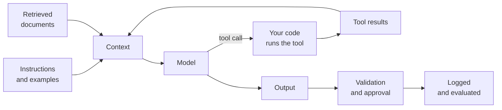
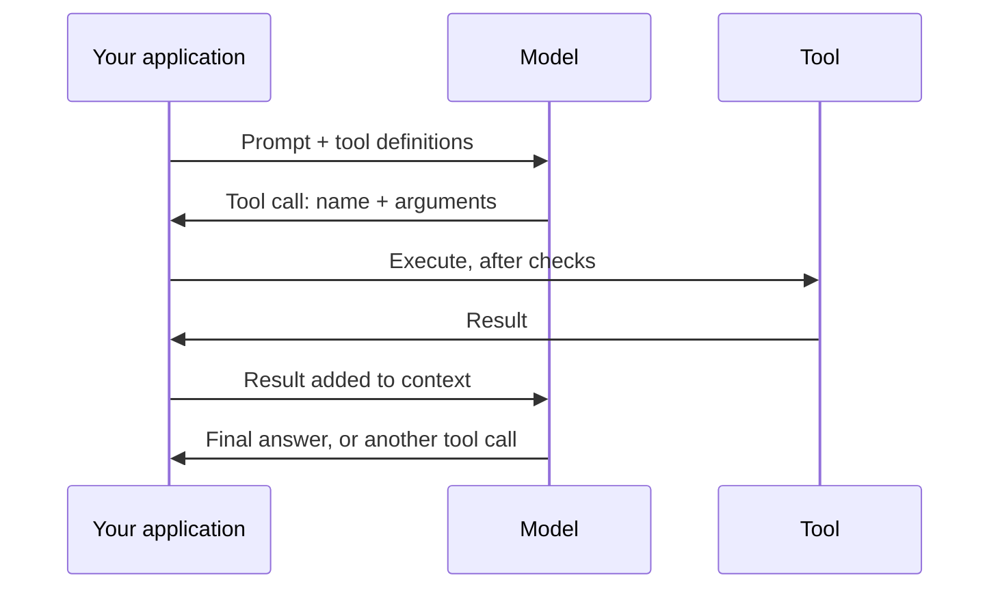
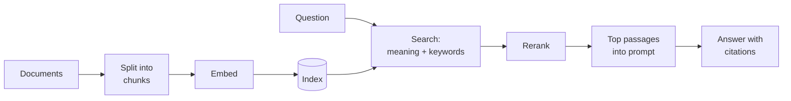

# Part 4: Building with Models

2026-09-18 · @Someone

## About this part

Part 4 is about the system around the model. The same model behaves like two different products in a bare chat window and inside a well-built agent. Most of the gain from AI, and most of the disappointment, is decided here and not by the choice of model.

There is a second purpose running through this part. A model can produce in minutes what takes a person a day. That speed is lost if a person then inspects every step and every line by hand, because the whole system slows to reading pace. The engineering described here exists to replace human checkpoints with automatic ones wherever that is safe, so that people spend their attention on direction and on the risky few percent, and the AI runs at its own pace on the rest.



Each box is a section of this part. Sections 1 to 3 cover what goes into the context. Sections 4 to 6 cover tools and agents. Sections 7 and 8 cover the controls and tests that make the result trustworthy. Section 9 condenses it all into a checklist for reviewing any AI feature or workflow.

This is the first of the three application parts. It assumes the failure modes from part 3, section 7, and supplies the defence for each. The format is unchanged. Reading time is about 45 minutes.

## 1. Context engineering

**In plain terms.** The model knows only what is in front of it, so the most valuable skill is deciding what to put there: clear instructions, the right background, a few examples, the relevant documents, and nothing else. "Prompt engineering" as a hunt for magic words is over. The job now resembles writing a good brief for a capable contractor who has never seen your company. **Who should read it:** everyone. This skill applies to anyone who uses these tools.

### The contractor test

Before sending a prompt, ask one question. Could a bright contractor with no knowledge of your organisation do this task well from what you have written? If they would need to ask five questions first, the model needs those five answers too. It will not ask. It will guess.

### What a good brief contains

- **The situation and purpose.** Who this is for and why it matters. Models generalise well from reasons and poorly from bare rules.
- **The task.** One clear statement of what to produce.
- **Constraints.** What must not change, what to avoid, how long, in what style.
- **Materials.** The code, document or data to work from. Supplied, not described.
- **Examples.** Two or three samples of good output. Vary them, because models copy examples closely.
- **Output format.** Exactly what shape you want back, especially if code will parse it.
- **What to do when unsure.** Permission to say "I don't know" or to ask, which reduces invention.

### Techniques that have lasted

- Say what to do, not only what to avoid. "Write in plain paragraphs" works better than "no bullet points".
- Separate instructions from material with clear delimiters, such as tagged sections or headings, so the model can tell a document from a directive.
- Put long documents first and the question last, as part 3 advised.
- For a model without a thinking mode, ask for reasoning before the conclusion.
- Fix problems at the source. When output is wrong, ask what the brief failed to say, and add that. Do not pile on capital letters.

### The layers of instruction

A request is shaped by several layers, each written by a different party: the vendor's training, the product's system prompt, a project instruction file, the user's message and the results returned by tools. When behaviour is puzzling, work out which layer caused it. Teams control the middle three, and that is where their effort belongs.

### Prompts are code

A prompt that runs in production is part of the system. Keep it in version control. Review changes to it. Test it with the evals from section 8 before release. Pin the model version it was tuned for, because a prompt tuned on one model often behaves differently on the next.

Shared prompts and instruction files are team assets. A good project instruction file improves every session for every engineer who uses it. Section 6 covers what belongs in one.

## 2. Structured output and tool use

**In plain terms.** On its own, a model only produces text. Tools let it do things: search, read files, run code, query a database, call your APIs. The model never runs anything itself. It writes a request, your software carries it out and hands back the result. This is what turns a chatbot into something that can do work. It also means your software stays in charge of what is allowed. **Who should read it:** everyone can read the main text. Skip the deep dive.

### Structured output

When code will consume the answer, ask for JSON that follows a schema. Part 1 explained how the sampler can be constrained so that the syntax is guaranteed valid. Use this for extraction, classification and any hand-off to another system.

Two cautions apply. The shape is guaranteed and the content is not, so validate values as you would any input. And give the model an honest way out: a field that allows "unknown" or null prevents it from being forced to invent a value.

### The tool-use loop



The model's part is limited to choosing a tool and writing its arguments. Your application decides whether to run it, runs it, and returns the result as more context. The loop repeats until the model answers without asking for a tool.

### The description is a prompt

A tool is defined by a name, a description and a schema for its parameters. The model chooses among tools by reading those descriptions, so they deserve the same care as any prompt. Most tool-selection mistakes trace back to vague or overlapping descriptions.

Good tool design follows a few rules:

- Offer a small number of distinct tools. Ten clear tools beat forty overlapping ones.
- Return concise, relevant results. A tool that dumps 10,000 lines fills the context and buries the answer.
- Write helpful error messages. The model reads them and retries, so "date must be YYYY-MM-DD" gets a fix and "invalid input" gets a guess.
- Set limits and pagination on anything that can return a lot.
- Make actions safe to repeat where you can, because retries happen.

### The control point

Because your code executes every call, that is where authorisation, validation, approval and logging belong. The model may ask for anything. The application decides what it gets. Section 7 builds on this.

### Built-in tools

Vendors offer ready-made tools alongside your own: web search, a sandbox for running code, file handling, and "computer use", where the model operates a graphical interface through screenshots and clicks. Computer use is slower and less reliable than an API call. It is useful for legacy systems that have no API.

### Deep dive (optional): tool calls at the token level

Tool use is still next-token prediction. The tool definitions are serialised into the prompt in a vendor-specific format. During post-training, the model learned to emit a special marker followed by a tool name and JSON arguments when a tool would help.

The serving layer watches for that marker. When it appears, generation stops, the text is parsed into a structured tool-call object, and that is what your application receives. Your result goes back in as a specially marked turn, and generation resumes.

Three consequences follow. Tool definitions are tokens, so every tool costs context on every call. When a model requests several tools at once, it has simply written several call blocks in one turn. And tool results are ordinary tokens in the context, which makes them a route for prompt injection, as part 3 warned.

## 3. Retrieval-augmented generation (RAG)

**In plain terms.** RAG means look it up, then answer. Before the model replies, the system searches your own documents for relevant passages and places them in the prompt. This is how a model gains knowledge of your codebase, wiki or tickets without any retraining, and how it can cite its sources. Quality depends mostly on the search step, not on the model. **Who should read it:** non-technical readers need "When to use what" and "What RAG does not fix".

### The pipeline



The top row runs ahead of time, whenever documents change. The bottom row runs for every question.

### The choices that matter

- **Chunking.** Documents are split into passages of a few hundred tokens. Split along the document's own structure, by heading, function or class, and not at arbitrary character counts. Attach the title and path to each chunk, because a paragraph torn from its page often means nothing alone.
- **Hybrid search.** Embedding search finds passages with similar meaning, even in different words. Keyword search finds exact strings: error codes, function names, ticket IDs. Engineering content needs both, and combining them is the sensible default.
- **Reranking.** A second, more careful model rescores the top 50 or so candidates and keeps the best handful. This step reliably improves precision.
- **Answering.** Instruct the model to answer from the passages only, to cite them, and to say so plainly when they do not contain the answer.

### Diagnosing a bad answer

A RAG failure has one of two causes, and they need different fixes. Either the right passage was never retrieved, or it was retrieved and the model misused it. Always look at the retrieved passages first. Most failures are retrieval failures.

The usual suspects are poor chunking, questions worded very differently from the documents, a stale index, and source material that is duplicated or contradicts itself. A wiki with three conflicting pages on the release process will yield a confident blend of all three. RAG exposes the state of your documentation.

### Let the model search

The one-shot pipeline above is no longer the only pattern. Give the model a search tool and let it search, read, refine its query and search again. This handles questions that need several hops.

Coding agents mostly work this way, using plain text search and file reads and no vector index at all. It is simpler and never stale. For many internal uses, a tool that wraps the search you already have is enough. Build an embedding pipeline when you have evidence that simple search falls short.

### When to use what

| Approach | Best when | Weakness |
| --- | --- | --- |
| Paste it into the context | The material is small enough to fit, or the task is a one-off | Cost and accuracy suffer as it grows |
| RAG or a search tool | The corpus is large or changes often, and answers need sources | Only as good as the search and the documents |
| Fine-tuning | You need to change style or behaviour | Poor at adding facts, as part 2 explained |

### Access control

Retrieval must respect the permissions of the person asking. Filter results by the user's access rights at query time. An assistant indexed with an administrator's view of everything becomes a data leak with a friendly interface.

### What RAG does not fix

RAG reduces hallucination a great deal and does not end it. The model can misread a passage, blend it with its own memory, or answer anyway when nothing relevant was found. Citations help only if someone, or some code, checks that the cited text says what is claimed.

### Deep dive (optional): how a vector index finds neighbours fast

Comparing a query with every stored vector gives exact results and scales badly. At millions of chunks it is too slow. Vector indexes trade a little accuracy for a lot of speed.

The most common design is HNSW, a layered graph. Every vector is a node linked to its near neighbours. Upper layers contain few nodes with long-range links. The bottom layer contains everything. A search starts at the top, hops greedily towards the query, and drops down a layer whenever it can get no closer. It behaves like zooming in on a map. Search time grows roughly with the logarithm of the collection size.

Its tuning parameters trade recall against speed and memory, and the memory cost is significant. Alternatives cluster the vectors and search only the nearest clusters, or compress vectors to shrink the index.

The practical advice is about restraint. Under about 100,000 chunks, exact search is fast enough, and the vector extension for the database you already run will do. Do not adopt a specialist vector database before you have a scale problem.

### Deep dive (optional): why rerankers work

An embedding model encodes the query and each passage separately. That makes search fast, because passage vectors are computed once in advance. It is also lossy: one vector must summarise everything a passage might be asked about.

A reranker, or cross-encoder, reads the query and the passage together in one pass. Attention can compare them token by token, so it catches matches and mismatches that separate vectors miss. It is far more accurate and far slower, since it must run once per candidate.

The two-stage design takes the best of each: fast, rough search to collect 50 to 100 candidates, then careful rescoring of just those. Using an LLM as the reranker is the same idea with a larger model.

## 4. Agents

**In plain terms.** An agent is a model running in a loop: look at the goal, choose an action, see the result, decide what to do next, and repeat until done. This is how AI moves from answering questions to completing tasks, such as fixing a bug across several files, running the tests, reading the failures and trying again. Agents are powerful and less predictable. More steps mean more chances to go wrong, so they need clear goals, fast feedback and firm limits. **Who should read it:** everyone can read the main text. Skip the deep dive.

### The loop

```python
messages = [system_prompt, task]
while True:
    reply = model(messages, tools)
    messages.append(reply)
    if not reply.tool_calls:
        break                       # the model considers the task done
    for call in reply.tool_calls:
        result = execute(call)      # your code, your rules
        messages.append(result)
```

That is the whole idea. The intelligence sits in the model. The reliability comes from everything around it: the tools, the brief, the feedback and the limits.

### Workflow or agent

|  | Workflow | Agent |
| --- | --- | --- |
| Who decides the steps | You, in code | The model, at run time |
| Behaviour | Predictable and testable | Flexible and variable |
| Cost and latency | Low and known | Higher and variable |
| Suits | Repeatable processes with a known shape: triage a ticket, summarise a PR, extract fields | Open-ended tasks where the path is unknown: investigate a bug, implement a feature |

Use the simplest design that works. Many things proposed as agents are better built as workflows with a model call at two or three points. Reserve agents for work where you cannot write down the steps in advance.

### What makes an agent succeed

- **A clear goal and a definition of done.** "Fix the failing test in the payments module without changing its public interface" works. "Improve the code" does not.
- **Feedback from the environment.** Tests, compilers, type checkers and linters tell the agent whether a step worked. This is the verification theme from parts 2 and 3, and it is the largest single factor in agent reliability.
- **Good tools**, designed as section 2 described.
- **A plan before action**, for anything sizeable. Have the agent write a plan, review it, then let it proceed. A wrong plan caught early costs a minute. Caught late it costs the whole run.
- **Limits** on steps, spend and time.

### Managing context on long tasks

Part 3 showed that a filling context degrades quality and raises cost. Agents counter this in four ways:

- **Compaction.** Summarise progress and continue from the summary.
- **Notes files.** The agent records decisions and progress in a file and re-reads it. This is memory outside the context, and it survives a restart.
- **Sub-agents.** Exploration is delegated to a fresh context that returns only a summary. The main context stays clean, and sub-agents can run in parallel.
- **Just-in-time loading.** Keep file paths and references in context, and load contents only when needed.

### Compounding error

Part 3 gave the arithmetic: 98% reliability per step gives 36% over 50 steps. The counters are checkpoints to return to, such as a commit after each working step, and automatic verification between steps. Human attention is best spent at the start, on the plan, where a minute of review prevents an hour of wasted work. Review at the end should be proportional to risk, which section 6 sets out.

### Multi-agent systems

An orchestrating agent can hand parts of a task to worker agents. This suits broad, parallel work such as researching many sources or searching a large codebase. It multiplies token use several times over and adds coordination failures. Do not begin there. Add agents when a single one demonstrably runs out of context or time.

### Levels of autonomy

There are three broad levels of autonomy: the agent suggests and a person acts; the agent acts after each approval; the agent acts freely inside a sandbox and reports at the end. The first two run at human speed, because a person is in every step. Only the third runs at the AI's speed.

The third level is safe only where nothing in reach can do lasting harm and the result can be checked automatically. So the engineering goal is to make that true for as much work as possible: sandboxes, scoped credentials, strong tests and easy rollback. Every piece of that groundwork moves another class of task from supervised to delegated.

### Deep dive (optional): compaction strategies

Four techniques are in use, from cheapest to most invasive.

- **Clearing old tool results.** Bulky outputs from early steps are dropped, and the record that the call happened is kept. This is safe and recovers a lot of space.
- **Summarisation.** The model writes a state summary covering the goal, decisions made, files touched, open problems and next steps. The session restarts from that plus the most recent turns. The risk is losing a subtle constraint mentioned once, long ago.
- **Persistent notes.** Progress is written to a file outside the context as the task goes on, so a restart loses little.
- **Sub-agent isolation.** Noisy work never enters the main context at all.

There is a trade-off with prompt caching from part 3. Compaction rewrites the start of the context, which invalidates the cache. Good harnesses therefore compact rarely and in large steps, not a little on every turn.

## 5. MCP and integration

**In plain terms.** The Model Context Protocol (MCP) is a standard plug for connecting AI tools to other systems, a bit like USB for AI. A service such as your issue tracker, source host or an internal API is wrapped once as an "MCP server", and then any compatible AI application can use it. It saves building a separate integration for every tool. It also means each connection is a new route for data to flow in and out, so connections deserve the same scrutiny as any third-party integration. **Who should read it:** everyone can read the main text. Skip the deep dive.

### What it is

MCP is an open protocol, introduced in late 2024 and since adopted across the major vendors and developer tools. An AI application acts as the client. Each connected system is a server offering three kinds of thing:

- **Tools:** actions the model can request, such as "create ticket" or "run query"
- **Resources:** data the application can read, such as files or records
- **Prompts:** reusable templates for common tasks

A server can run as a local process on the developer's machine or as a remote service over HTTP with standard authorisation.

### What it buys you

Without a standard, connecting five AI tools to eight systems takes forty integrations. With one, it takes thirteen. There is a large catalogue of ready-made servers for common products. Writing one for an internal system is usually a thin wrapper over an API you already have, and takes a day or two.

### What it costs

**Context.** Every connected server's tool definitions are loaded into the context. Part 3 noted that a generous set can consume tens of thousands of tokens before any work starts. Enable only the servers a task needs. Some applications now load tool definitions on demand to reduce this.

**Security.** Tool descriptions and tool results are untrusted input, and part 3 explained what that means for prompt injection. A malicious or compromised server can feed instructions to the model. Credentials are often broader than they need to be. A community-built server is code that you run, and warrants the same review as any dependency.

Sensible governance is straightforward:

- maintain an allow-list of approved servers
- issue narrowly scoped credentials, read-only by default
- log every tool call
- treat write access to production systems as an exception that needs a case

### Access and know-how

MCP gives an agent access to a system. It does not tell the agent how your team uses that system. Some tools support packaged instructions, sometimes called skills, that are loaded on demand to teach a procedure such as your release process or your incident template. Access and know-how are separate, and a useful integration needs both.

### Deep dive (optional): anatomy of an MCP exchange

MCP messages use JSON-RPC 2.0. A session goes through four steps.

1. **Handshake.** The client sends `initialize`, and both sides declare what they support.
2. **Discovery.** The client calls `tools/list`. The server returns each tool's name, description and a JSON Schema for its inputs. The application inserts these into the model's tool definitions.
3. **Invocation.** When the model emits a tool call, the client sends `tools/call` with the name and arguments. The server returns a list of content items, such as text, images or links to resources, along with an error flag.
4. **Return.** The application appends that content to the context, and the model continues.

The model never talks to a server directly. The host application sits between them on every call. That makes the host the natural place for approval prompts, argument checks and audit logging, which is the control point from section 2 again.

## 6. Coding agents

**In plain terms.** A coding agent is an agent with a developer's tools: it can search the codebase, read and edit files, run commands and tests, and use version control. Given a task, it explores, makes changes, runs the tests, fixes what breaks and presents the result for review. How well it does depends as much on your codebase and your briefing as on the model. Well-tested, well-documented, modular code gets far better results, which are the same things that help human developers. **Who should read it:** everyone. Non-technical readers can skim the tables.

### How one works

The tools are file search, file read, file edit, a shell and version control, often with web or documentation search and MCP servers on top. At the start of a session the agent loads a project instruction file. Then it loops: explore, plan, edit, run, observe, adjust, and finally summarise what it did.

Four form factors are common:

- **Editor assistant:** inline completion and chat, with the developer driving every step
- **Interactive agent:** runs in the terminal or editor, carries out multi-step tasks while the developer watches and steers
- **Background agent:** takes a ticket, works in its own cloud environment, and returns a pull request
- **Pipeline agent:** runs in CI to review pull requests, triage failures or draft release notes

### What makes a repository agent-friendly

| Property | Why it helps |
| --- | --- |
| Fast, reliable test suite | It is the agent's feedback loop. Slow or flaky tests cripple it |
| One command each to build, test and lint | The agent can verify its work without guessing |
| Types and linters | Cheap automatic checks that catch invented methods at once |
| Clear module boundaries and modest file sizes | Relevant code fits in context, and changes stay contained |
| Consistent conventions | The agent copies the patterns it sees. Consistent code yields consistent output |
| Current README and architecture notes | Replaces the tribal knowledge the agent lacks |
| Project instruction file | Loaded every session, so lessons stick |
| Reproducible development environment | The agent can run things safely, in a container |

This list is simply good engineering practice. AI raises the return on it. Technical debt taxes an agent as it taxes a person, and arguably more, because the agent has no colleague to ask.

### The project instruction file

Most coding agents read a conventions file from the repository root at the start of every session. It is the highest-value prompt your team will write. Include:

- the exact commands to build, test, lint and run
- a short map of the codebase and where things live
- conventions that differ from common defaults
- things never to do, such as editing generated files or touching a legacy module
- the definition of done: tests pass, lint is clean, no unrelated changes

Keep it under a couple of hundred lines, because it costs context in every session. Review changes to it like code. Whenever the agent repeats a mistake, add a line.

### Briefing a task

Apply section 1 to engineering work. State the goal and the reason. Give acceptance criteria. Point to the relevant files and to an existing example to follow. State constraints, such as "do not change the public API". For anything non-trivial, ask for a plan first. Give one task per session.

### Working patterns that hold up

- **Plan, review, execute.** Approve the approach before code is written. This is the cheapest and most valuable place for human attention.
- **Test first.** Have the agent write a failing test from the bug report, confirm that it fails, then fix the code. This guards against the reward hacking described in part 2.
- **Commit often.** Small commits are checkpoints to roll back to.
- **Fresh session per task.** This avoids the stale context problems from part 3.
- **Independent review.** Have a fresh session, with no knowledge of the author, review every diff before a person sees it.
- **Review by risk, not by habit.** A person remains accountable for what is merged. How they discharge that changes. Automated checks and AI review cover everything. Human reading concentrates on design decisions and on high-risk paths such as money, security, personal data and regulated logic, with spot checks elsewhere.

### Working at the agent's pace

The common first pattern is one developer, one agent, watching it work and then reading every line it wrote. This feels responsible, and it caps the gain. The agent waits for the person, and total throughput is set by human reading speed.

Teams that get much more from these tools change the shape of the work:

- **Run agents in parallel.** One engineer directs several tasks at once, each in its own branch or environment, and moves between them as they need input.
- **Hand off to background agents.** Well-specified tickets go to agents that return tested pull requests. Nobody watches them work.
- **Shift effort to the two ends.** The engineer's time moves to specifying the task well and to deciding whether the result is acceptable. The middle belongs to the agent.
- **Invest in verification you can trust.** Reading every line is a substitute for tests, types and checks you do not have. Each improvement to automated verification reduces how much must be read.
- **Do what was not worth doing before.** Build three prototypes to choose between instead of debating one. Backfill tests on legacy code. Complete the migration that was always deferred. Write the internal tool nobody had time for.

None of this removes accountability. It changes where assurance comes from. Skipping review without stronger automated verification simply moves the cost to production. Part 5 covers how to make this shift across a team.

### Where they still struggle

- large cross-cutting changes in code without tests
- ambiguous requirements, where the hard part is deciding what to build
- proprietary frameworks with no documentation in the repository
- subtle concurrency and performance problems
- visual fidelity in user interfaces, unless the agent can see the rendered result
- differences between its sandbox and your real environment

## 7. Guardrails

**In plain terms.** Guardrails are the controls around a model that limit the damage when it is wrong or has been manipulated. The principle is not to rely on the model behaving well, but to design things so that misbehaviour cannot do much harm. The methods are those of ordinary security: minimal permissions, approval for risky actions, isolation and logging. **Who should read it:** everyone. Anyone approving an AI rollout should be able to ask about each of these.

### One guardrail per failure

| Failure from part 3 | Guardrail |
| --- | --- |
| Hallucination | Ground answers in sources, check citations, verify by running things |
| Non-determinism | Validate output, retry with the error, limit steps and time |
| Prompt injection | Least privilege, approval gates, isolation of untrusted content, sandboxing |
| Stale knowledge | Supply current documentation and version information |
| Sycophancy | Neutral prompts and independent review in a fresh context |
| Compounding error | Checkpoints and automatic verification between steps |

### Defending against prompt injection

Start from the assumption that an injection will sometimes succeed, and limit what it can achieve.

- **Least privilege.** Read-only by default. Narrowly scoped tokens. No production credentials in a development agent.
- **Break the dangerous combination.** Part 3 named it: private data, untrusted content and an outbound channel, all in one agent. Remove at least one. An agent that browses the web gets no secrets. An agent with repository access gets a network allow-list.
- **Approval gates.** A person confirms consequential actions: sending messages, merging, deploying, deleting, spending money.
- **Isolate untrusted content.** Process it in a separate model call that has no tools, and pass on only a structured result, such as a category or extracted fields.
- **Sandboxing.** Run agent actions in a container or virtual machine with no access to the host file system and restricted network access.
- **Keep secrets out of the context.** Credentials are injected by the tool layer at execution time. The model never sees them, so it cannot be tricked into revealing them.

Classifiers that detect injection attempts are a useful extra layer. They are not sufficient alone.

### Treat output as untrusted input

Model output that flows into another system needs the same handling as user input. Validate it against a schema. Escape it before rendering in a browser. Use parameterised queries, and never build SQL from it directly. Never pass it to `eval`. Before installing a package the model suggested, check that it exists and is the one you meant, because part 3 described how invented package names are exploited.

### Handling variability

When validation fails, retry and include the validation error in the retry, so that the model can correct itself. Provide a fallback for repeated failure. Give actions idempotency keys, so that a retried step does not send two emails or create two tickets. Put limits on steps, time and spend for every agent run.

### Approval without fatigue

If every action needs approval, people stop reading and click yes. Reserve approval for actions that are irreversible or high-impact, and let low-risk ones proceed. Make each request informative: show the exact command, or the actual diff, not a summary of intent.

Remember too that every approval gate is a point where the system runs at human speed. Place each one deliberately, and ask what would need to be true, in sandboxing, permissions or automated checks, for it to be removed.

### Observability

Log prompts, tool calls, outputs, approvals, token counts and cost, grouped into one trace per task. You need this to debug failures, which cannot otherwise be reproduced. You need it for audit, which matters in any regulated business. And you need it as the raw material for the evals in the next section.

## 8. System-level evals

**In plain terms.** An eval is a test suite for an AI feature: a set of realistic inputs and a way of scoring the outputs. It tells you whether the thing works, and whether a prompt change or a new model made it better or worse. It lets you argue from evidence. Without one, every change is a guess and every vendor claim is unverifiable. It is the most important practice in this part and the one most often skipped. **Who should read it:** everyone can read the main text. Skip the deep dive.

### Why ordinary tests are not enough

A unit test asserts one exact result. An AI feature has many acceptable outputs, varies between runs, and fails partially. So the question changes from "does it pass?" to "how often does it succeed across a representative set?"

### Build the dataset

- Start with 20 to 50 cases. A small, real set beats a large synthetic one.
- Draw them from real usage or your backlog. This is the same asset part 2 recommended for comparing models.
- Include easy, typical, hard and adversarial cases, including an injection attempt if the feature reads untrusted content.
- Turn every production failure into a new case. The set becomes your regression suite.
- Hold some cases back, and do not tune prompts against them. Otherwise you fit the prompt to the test, the same fault part 2 criticised in public benchmarks.

### Three kinds of grader

| Grader | Examples | Use |
| --- | --- | --- |
| Code | Exact match, schema valid, tests pass, quoted text really appears in the source | First choice. Cheap, fast and reliable |
| Model | An LLM scores the output against a written rubric | For open-ended quality. Must be calibrated against human labels |
| Human | An engineer reviews a sample | The reference standard. Use it to calibrate the others and for spot checks |

For a coding agent, a case is a repository state plus a task. The grader checks that hidden tests pass, that the lint is clean, that the test files were not tampered with and that the diff touches only what it should. Record cost, time and number of steps alongside success.

### Read the outputs first

Before building any grader, read 50 real outputs and sort the failures into categories by hand. This shows what actually goes wrong, which is rarely what you assumed. Teams that skip this step build elaborate scoring for the wrong problem.

### Reading the numbers

Run each case three to five times, because results vary between runs. Track success rate, cost per task, latency and the mix of failure categories.

Be honest about sample size. With 30 cases, a difference of under 10 to 15 percentage points could easily be chance. Small sets are good for catching regressions and large differences. They cannot settle a close contest.

### When to run them

- on every change to a prompt, tool or instruction file, ideally in CI
- before upgrading a model version
- when a new model is released, to compare it in an afternoon
- continuously, on a sample of production traffic

### Monitoring in production

Watch the signals users give without being asked: whether suggestions are accepted, edited or regenerated, and whether people give up on a task. Score a sample of live outputs with your graders. Put cost and latency on a dashboard, and alert on the failure rate as you would for any service.

### Deep dive (optional): biases in LLM judges

Model graders are convenient and have known, measurable biases.

- **Position bias.** In side-by-side comparisons, judges favour one position. Run each comparison in both orders and average.
- **Verbosity bias.** Longer answers score higher, whether or not they are better. Tell the judge to ignore length, and check that it does.
- **Self-preference.** Models favour output from their own family. When comparing vendors, use a judge from a third party, or several judges.
- **Deference.** A confident tone or a claimed authority in the answer sways the verdict, which is the judge's own sycophancy at work.
- **Unstable scales.** Scores from 1 to 10 drift and cluster. Prefer pass or fail against specific, checkable criteria, or pairwise comparison.

Two habits keep a model grader honest. Have it write its reasoning before its verdict. And calibrate it: label 50 to 100 cases by hand, measure how often the judge agrees, and repeat the check whenever the judge model changes.

## 9. A design review checklist

**In plain terms.** These are the questions to ask when someone proposes an AI feature or workflow, whether your own team, a vendor or another department. A proposal that cannot answer them is not ready. **Who should read it:** everyone. This section is this part in usable form.

**Purpose and fit**

- What does success look like, and how will it be measured?
- Does this need an agent, or would a fixed workflow with a model call do?
- What happens today without it, and what is the cost of a wrong output?
- Where is a person in the loop, and does that make the whole thing run at human pace? What would have to be true to take them out of the routine cases?

**Context**

- What does the model need to know, and where does that come from?
- Is the source material accurate, current and free of contradictions?
- Does retrieval respect the permissions of the person asking?
- How large is the context per call, and is it laid out for caching?

**Tools and permissions**

- Which tools can it call, and is each one necessary?
- What is the most damaging thing it could do with the access it has?
- Does it combine private data, untrusted content and an outbound channel?
- Which actions need a person's approval, and will that person see enough to judge?

**Failure handling**

- What happens when the output is invalid, wrong or missing?
- Is output validated before anything downstream uses it?
- Are there limits on steps, time and spend?

**Evidence**

- Is there an eval set drawn from real cases, and what is the current success rate?
- Which model version is pinned, and what is the process for upgrading it?
- Are prompts and instruction files in version control and reviewed?

**Operations**

- What will it cost per task and per month, using the model from part 3?
- Are prompts, tool calls and outputs logged and traceable?
- Who owns it once it is live?

## Say it two ways

| Idea | Technical version | Non-technical version |
| --- | --- | --- |
| Context engineering | Selecting and structuring the instructions, examples, documents and tool results placed in the context window | Writing a good brief. The AI knows only what we put in front of it, so what we choose to include decides the result |
| Tool use | The model emits a structured request, the application executes it and returns the result to the context | The AI asks our software to do something, such as run a search. Our software decides whether to do it and hands back the result |
| RAG | Retrieve relevant passages by embedding and keyword search, rerank them, and place them in the prompt with instructions to cite | It looks things up in our documents before answering, and shows where the answer came from |
| Embedding vs keyword search | Nearest-neighbour search over dense vectors, versus lexical matching of exact terms | One finds things that mean the same. The other finds the exact word. We use both |
| Agent | A model in a loop, choosing tool calls based on results until a goal is met | An AI that works through a task step by step, checking the result of each step before the next |
| Workflow vs agent | Steps fixed in code with model calls at set points, versus steps chosen by the model at run time | A checklist where the AI helps with certain steps, versus giving the AI the goal and letting it work out the steps |
| MCP | An open client-server protocol through which applications expose tools and data to models | A standard plug that connects AI tools to our systems, so we build each connection once |
| Coding agent | An agent with file, shell and version-control tools that iterates against tests | An AI that can read our code, make changes, run the tests and fix what it broke, then hand us the result to review |
| Sandbox | An isolated execution environment with restricted file and network access | A sealed room for the AI to work in, where mistakes cannot reach anything important |
| Least privilege | Granting only the minimum permissions and scopes the task requires | The AI gets the keys to the rooms it needs and no others |
| Eval | A dataset of representative cases with automated graders, run on every change | A test suite for the AI feature. It tells us the success rate, and whether a change helped or hurt |
| LLM as judge | Using a model with a rubric to grade open-ended outputs, calibrated against human labels | Using one AI to mark another's work, after checking that its marking agrees with ours |

## Misconceptions to correct

### "Prompt engineering is about finding the magic words"

**True:** with early models, odd phrasings and tricks did change results.

**Misleading:** current models respond to clarity and completeness, not incantations. The skill that matters is giving the right context, which looks far more like writing a good brief than like casting a spell.

**What to say:** "There are no secret phrases. If the output is poor, the brief was missing something. We fix the brief."

### "RAG eliminates hallucination"

**True:** answering from supplied sources cuts invention sharply and makes answers checkable.

**Misleading:** the model can still misread a passage, mix it with its own memory, or answer when the search found nothing useful. The result is also only as good as the documents.

**What to say:** "It makes the AI work from our documents and show its sources, which helps a lot. We still check that the sources say what it claims, and the quality of our documentation now matters more than ever."

### "An agent is just a smarter model"

**True:** better models do make better agents.

**Misleading:** an agent is a model plus tools, a loop, a brief, feedback and limits. Two agents on the same model can differ enormously. Much of what makes one work is ordinary engineering around it: tests, clear tasks and sensible permissions.

**What to say:** "The model is the engine. Whether the vehicle gets anywhere depends on everything we build around it, and most of that is in our hands."

### "We need to fine-tune it on our data"

**True:** fine-tuning exists and sounds like the natural way to teach a model about a business.

**Misleading:** as part 2 explained, it changes behaviour well and knowledge poorly. Good context, retrieval and an instruction file deliver most of what people hope fine-tuning will, faster and more cheaply, and they can be updated the same day.

**What to say:** "We start by giving it our information at question time. That takes days, not months, and we can see exactly what it was told. Fine-tuning is a later option for a narrow, high-volume task, if we ever need it."

## Glossary

Terms introduced in this part, in plain language and in alphabetical order. Earlier terms are defined in the glossaries of parts 1 to 3.

| Term | Meaning |
| --- | --- |
| Agent | A model running in a loop, choosing actions and reacting to their results until a task is done |
| Allow-list | A list of the only items permitted, such as approved servers or reachable network addresses |
| Approval gate | A point where a person must confirm before an action goes ahead |
| Background agent | A coding agent that works on a ticket unattended and returns a pull request |
| Chunking | Splitting documents into passages small enough to search and to fit in a prompt |
| Computer use | A model operating a graphical interface through screenshots, clicks and typing |
| Context engineering | Choosing and arranging what goes into the model's context |
| Cross-encoder | A model that reads a query and a passage together to score how well they match. Used for reranking |
| Eval | A set of test cases with a scoring method, used to measure how well an AI feature works |
| Grader | The part of an eval that decides whether an output is acceptable: code, a model or a person |
| Held-out set | Test cases kept aside and never used while tuning, to give an honest measure |
| HNSW | The most common index structure for finding similar vectors quickly |
| Hybrid search | Combining search by meaning with search by exact keyword |
| Idempotency key | An identifier that ensures a repeated request takes effect only once |
| JSON-RPC | A simple standard for sending requests and responses as JSON. MCP is built on it |
| JSON Schema | A standard way to describe the required shape of a JSON document |
| Keyword search | Search that matches exact words and strings |
| Least privilege | Giving a system only the permissions it needs for its task |
| LLM as judge | Using a model to grade the outputs of a model |
| MCP (Model Context Protocol) | An open standard for connecting AI applications to tools and data |
| MCP server | A wrapper around a system that exposes its actions and data through MCP |
| Multi-agent system | Several agents working on parts of one task, usually directed by an orchestrating agent |
| Observability | Logging and tracing that lets you see what a system did and why |
| Orchestrator | The agent that divides a task and hands parts to other agents |
| Position bias | A judge model's tendency to favour an answer because of where it appears |
| Project instruction file | A file in a repository that a coding agent loads every session, holding commands, conventions and rules |
| Regression suite | Tests kept to make sure that problems fixed once do not return |
| Reranking | A second, more careful scoring of search results to put the best ones first |
| Rubric | Written criteria that a grader scores against |
| Skill | A package of instructions, and sometimes scripts, that an agent loads on demand to follow a procedure |
| Structured output | Model output constrained to a defined format, usually JSON matching a schema |
| System prompt | Standing instructions that the application places ahead of the user's message |
| Tool | A function the model can ask the application to run on its behalf |
| Tool definition | The name, description and parameter schema that tell the model what a tool does |
| Trace | The full record of one task: every prompt, tool call, output and cost |
| Vector index | A data structure for finding the stored embeddings closest to a query |
| Workflow | A process whose steps are fixed in code, with model calls at chosen points |
