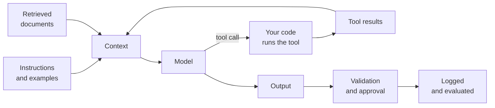

# Part 1: Intent, Agents and Other Instruction Files

2026-09-19 · Chris Neale

## About this part

This is the first of six parts in the practical AI module. The aims of the course, the layout every part follows and suggested reading routes are in [Course introduction](file/0a139f54-ef01). The format is the same as elsewhere: **In plain terms** opens each numbered section, deep dives are optional, and a glossary closes the part. Reading time is about 35 minutes.

The module is about the system around the model. The same model behaves like two different products in a bare chat window and inside a well-built agent. Most of the gain from AI, and most of the disappointment, is decided here and not by the choice of model.

There is a second purpose running through the module. A model can produce in minutes what takes a person a day. That speed is lost if a person then inspects every step and every line by hand, because the whole system slows to reading pace. The engineering described here exists to replace human checkpoints with automatic ones wherever that is safe, so that people spend their attention on direction and on the risky few percent, and the AI runs at its own pace on the rest.



Each box belongs to a part of the module. This part and [part 2](file/8d27b5e4-c019) cover the instructions: the files that stand in front of every request, and the packages that are fetched when needed. [Part 3](file/52e0a7c9-b3f6) covers input that is not text. [Part 4](file/c9146f3b-27a8) covers tools and the protocol that connects them. [Part 5](file/0b8e5d17-f4c2) covers retrieved documents. [Part 6](file/7a3f2c68-91de) covers the controls and tests that make the result trustworthy, and ends with a checklist for reviewing any AI feature. The [AI in the organisation module](file/d6e2a95b-3f14) then steps back from the diagram, and applies all of it along the whole software lifecycle, across a team and up through an organisation.

This is where the course starts, because everyone reading it already uses these tools, and using them well is the quickest thing to get better at. It names products and file names throughout, and those date quickly. The ideas under them have held steady for longer.

### Seven things to know about the model first

The module needs no knowledge of how a model works. It does lean on seven facts about how one behaves, and supplies a defence for each of the last six.

- **It knows two things.** What it absorbed in training, which is broad, fuzzy and stops at a date, and what is in front of it now, which is exact and limited. It knows nothing about you, your company or your code unless it is told.
- **It makes things up.** Where it lacks a fact it supplies a plausible one, in the same confident voice as the rest. This is called hallucination.
- **It answers differently each time.** The same request twice can give two different results.
- **It cannot tell an instruction from a document.** Any text it reads, from a web page, a ticket or a file, can steer it. This is called prompt injection.
- **It is out of date.** It suggests last year's versions and does not know what has changed since it was trained.
- **It agrees with you.** It was trained on what people liked, and people like being agreed with.
- **Its small errors add up.** A task of fifty steps, each done right 98 times in 100, comes out right about one time in three.

The [language models module](file/590c1ae1-8bf3) explains why each of these is so, and [its part 3](file/48a4ae01-75ae) sets the six failures out in full. You do not need the why to use what follows. It will make more sense of it afterwards.

### What part 1 gives you

Part 1 builds one idea: the model knows only what is in front of it, so the most valuable thing a team writes is the standing text that is put in front of it every time. That text now lives in files with names, and the names have multiplied. This part says what each file is for, what belongs in it, what the evidence says about whether it helps, and where a file stops being enough.

## 1. Context engineering

**In plain terms.** The model knows only what is in front of it, so the most valuable skill is deciding what to put there: clear instructions, the right background, a few examples, the relevant documents, and nothing else. "Prompt engineering" as a hunt for magic words is over. The job now resembles writing a good brief for a capable contractor who has never seen your company. **Who should read it:** everyone. This skill applies to anyone who uses these tools.

### The contractor test

Before sending a prompt, ask one question. Could a bright contractor with no knowledge of your organisation do this task well from what you have written? If they would need to ask five questions first, the model needs those five answers too. It will not ask. It will guess.

### What a good brief contains

- **The situation and purpose.** Who this is for and why it matters. Models generalise well from reasons and poorly from bare rules.
- **The task.** One clear statement of what to produce.
- **Constraints.** What must not change, what to avoid, how long, in what style.
- **Materials.** The code, document or data to work from. Supplied, not described.
- **Examples.** Two or three samples of good output. Vary them, because models copy examples closely.
- **Output format.** Exactly what shape you want back, especially if code will parse it.
- **What to do when unsure.** Permission to say "I don't know" or to ask, which reduces invention.

### Techniques that have lasted

- Say what to do, not only what to avoid. "Write in plain paragraphs" works better than "no bullet points".
- Separate instructions from material with clear delimiters, such as tagged sections or headings, so the model can tell a document from a directive.
- Put long documents first and the question last, as part 3 of the language models module advises.
- For a model without a thinking mode, ask for reasoning before the conclusion.
- Fix problems at the source. When output is wrong, ask what the brief failed to say, and add that. Do not pile on capital letters.

### Prompts are code

A prompt that runs in production is part of the system. Keep it in version control. Review changes to it. Test it with the evals from part 6 before release. Pin the model version it was tuned for, because a prompt tuned on one model often behaves differently on the next.

Shared prompts and instruction files are team assets. A good project instruction file improves every session for every engineer who uses it. The rest of this part is about those files.

## 2. The layers of instruction

**In plain terms.** By the time a model reads your message, several other parties have already spoken to it: the company that trained it, the product you are using, your organisation, your project and you on an earlier day. Each has a layer, and each layer is text. When the AI does something puzzling, the useful question is which layer told it to. **Who should read it:** everyone. The table is the part to keep.

### Who writes what

| Layer | Written by | When it reaches the model | Can you change it |
| --- | --- | --- | --- |
| Training | The vendor | Built in | No. You choose a model |
| System prompt | The product or harness | Every request | Only if you build the product |
| Organisation rules | An administrator | Every session, on every machine they manage | If you are the administrator |
| Personal instructions | You | Every session, in every project | Yes |
| Project instruction file | The team | Every session in that repository | Yes, and you should review it like code |
| Scoped rules | The team | When the agent works on matching files | Yes |
| Skills | Anyone | When a task calls for one. Part 2 covers them | Yes |
| The message | You | Now | Yes |
| Tool results | Whatever the tool read | As they arrive | No, and they are not to be trusted. Part 4 explains |

Teams control the middle of the table, and that is where their effort belongs. The layers are additive: a tool that reads several of these files puts all of them into the context at once. When two layers disagree, no rule in the software settles it. The model reads both and uses its judgement, usually favouring the more specific instruction. That is one reason contradictions between an organisation's rules and a project's file are worth hunting down.

### Always there, or fetched when needed

The most useful way to sort the layers is by when they load. Anything loaded in every session costs context in every session, whether the task needs it or not. Part 3 of the language models module shows that a filling context costs money and quality. So each layer has a budget.

Standing instructions should be short and should hold what is always true: the commands, the conventions, the things never to do. Reference material that is needed sometimes, such as the full API style guide or the release procedure, belongs in something fetched on demand. That is the job of scoped rules and of the skills in part 2. One vendor's documentation puts the dividing line plainly: put it in the standing file if the agent should always know it, and in a skill if it needs it sometimes.

### A request, not a guarantee

Every layer in the table is text the model reads. None of them is enforced. A line saying "never edit the generated files" makes that edit much less likely. It does not make it impossible, and an agent deep in a long task can lose track of a line it read at the start.

If a rule must hold every time, it needs a mechanism that does not depend on the model: a file permission, a pre-commit check, a hook in the harness that blocks the action, a credential the agent was never given. Part 6 builds on this. The instruction file is for shaping behaviour. It is the wrong tool for preventing harm.

## 3. The project instruction file

**In plain terms.** Most coding agents read a plain text file from the top of your project at the start of every session. It tells them what a new colleague would need on day one: how to build and test, where things are, what the house rules are. It is probably the highest-value prompt your team will write, and it works best short. There were once a dozen rival names for this file. Most tools now read one called `AGENTS.md`. **Who should read it:** everyone who works in a repository. Non-technical readers can skim the table of names.

### One file, many names

Every coding tool invented its own file, and for a while a repository that wanted to serve them all carried five copies of the same advice. In August 2025 OpenAI and others proposed a common one: `AGENTS.md`, plain Markdown at the repository root, with no required structure. Its own site calls it a README for agents. It is now stewarded by the Agentic AI Foundation under the Linux Foundation, the same body that looks after the Model Context Protocol from part 4. The site says more than 60,000 open-source projects use it and lists more than thirty tools that read it.

| File | Read by | Notes |
| --- | --- | --- |
| `AGENTS.md` | Most coding agents, including Codex, Cursor, GitHub Copilot, Gemini CLI, Jules, Aider, Zed and Warp | The common format. Start here |
| `CLAUDE.md` | Claude Code | Read in preference to `AGENTS.md` when both exist. Recent versions read `AGENTS.md` when there is no `CLAUDE.md`. It can import other files, so one line can point it at `AGENTS.md` |
| `GEMINI.md` | Gemini CLI | Its own name for the same idea |
| `.github/copilot-instructions.md` | GitHub Copilot | With `.github/instructions/*.instructions.md` for rules scoped to paths |
| `.cursor/rules/*.mdc` | Cursor | Rules with a header saying which files they apply to |
| `.claude/rules/*.md` | Claude Code | Rules that load only when the agent opens matching files |

The table was written in September 2026 and the list of readers grows monthly. The sensible arrangement is one source of truth. Write `AGENTS.md`, and where a tool insists on its own name, make that file a one-line import or a link to it. Do not maintain two copies. They will drift, and the agent that reads the stale one will be confidently wrong.

In a large repository, a folder can carry its own `AGENTS.md`. The rule in the specification is that the nearest file to the code being edited wins, so a package can state its own conventions without lengthening the file at the root.

### What belongs in it

- the exact commands to build, test, lint and run
- a short map of the codebase and where things live
- conventions that differ from common defaults
- things never to do, such as editing generated files or touching a legacy module
- the definition of done: tests pass, lint is clean, no unrelated changes

```file
# AGENTS.md

## Commands
- Install: pnpm install
- Test one package: pnpm test --filter <package>
- Full check before any commit: pnpm check

## Layout
- packages/core is the billing logic. It has no I/O and no framework code.
- packages/api is the HTTP layer. It calls core and never the database directly.

## Conventions
- Money is an integer number of pence. Never a float.
- New endpoints copy the shape of packages/api/src/invoices.ts.

## Never
- Edit anything under generated/. Change the schema and run pnpm codegen.
- Touch packages/legacy-ledger without asking.

## Done means
- pnpm check passes, and the diff contains nothing unrelated to the task.
```

Every line in that example tells the agent something it could not work out quickly by looking. That is the test for a line.

### What the evidence says

Two studies published in early 2026 looked at whether these files help, and they appear to disagree.

The first ran coding agents on 124 pull requests across ten repositories, with and without an `AGENTS.md`. With the file, the median run was about 29% shorter and used about 17% fewer output tokens, and the tasks were completed about as well. The agent spent less time finding out how the project worked.

The second, from ETH Zurich, measured whether tasks succeeded. It found that context files did not generally improve success rates and raised the cost of each run by more than a fifth, for files written by developers and for files generated by a model. Its detail is the useful part. Agents followed the instructions in the files well. What did not help was the repository overview, the prose tour of the codebase that tools offer to generate for you and that vendors recommend. The authors concluded that the files are useful for stating practices that are not standard, and that anything beyond that should be tested.

Both are small studies of a fast-moving target. Read together they say something a practitioner would recognise. An agent can discover a project's structure for itself, and it will do so whether or not you describe it. It cannot discover that your team never uses floats for money. Write down what cannot be found, keep out what can, and keep the file short.

The pair also shows the fourth of the course's four ideas at work: measure, do not feel. A tour of the codebase feels helpful, the tools offer to write one, and the vendors recommend it. Measured, it bought no more successes and a larger bill. The first study would have looked like a plain win had no one measured success as well as speed.

### Keeping it short, and keeping it true

Keep it under a couple of hundred lines. One vendor's documentation gives 200 lines as the target and says plainly that longer files reduce how well the instructions are followed. Review changes to it like code. Whenever the agent repeats a mistake, add a line. Whenever a line stops being true, delete it, because a stale instruction is worse than none.

Do not let a tool write the file for you and leave it there. A generated file is mostly overview, which is the part the evidence says does not help. Use the generated draft to find the commands, then cut the rest.

Some harnesses now keep a second file that the agent writes itself: notes on corrections you gave and preferences it noticed, loaded at the start of later sessions. It is useful, and it is a layer like any other. Read it now and then, because it shapes every session and nobody reviewed it.

### Deep dive (optional): how a harness finds its files

The details differ by tool, and one example shows the shape. Claude Code reads instruction files from several places and puts all of them in the context at launch: a file managed by the organisation, a personal file in the user's home directory, and every project file from the working directory up to the root of the file system. Files in folders below the working directory are not loaded at launch. They are picked up when the agent first reads something in that folder. A file can import another with a line that starts with an `@` and a path. Imports help with organisation and do not save context, since an imported file is loaded along with the file that imports it.

Scoped rules are the exception. A rule file with a `paths` line in its header, such as `src/api/**/*.ts`, is loaded only when the agent works with a matching file. This is how a large project keeps its standing file short without losing the detail: rules for the database layer are present when the agent is in the database layer and absent otherwise.

The same ideas appear elsewhere under other names. Cursor's rule files carry a header saying whether the rule always applies, applies to matching files, or is offered to the model by description. GitHub Copilot's scoped instruction files carry an `applyTo` pattern. The common lesson is that "which instructions are in the context right now" has become a question with a precise answer, and most harnesses will show it to you if you ask.

## 4. Intent files and working from a specification

**In plain terms.** An instruction file tells an agent how to work here. It does not say what you are trying to build, for whom, or how you will know it is finished. A second kind of file does that: a written statement of intent, or a specification, that the agent works from and is checked against. The habit is sound and old. The file formats are new, there are several, and none has won. **Who should read it:** everyone. It is the closest this module comes to product management.

### How differs from what

The instruction file answers "how do we work here?". It is true for months. A task brief answers "what do I want now?". It is true for an afternoon. Between them is a gap: the purpose of the product, who uses it, what it must never do, and what done means for the feature in hand. People on a team carry this in their heads. An agent does not, and a fresh one arrives every session.

Without it, an agent fills the gap by guessing, and it guesses the most ordinary product. Ask for an export feature with no statement of intent and you will get a reasonable export feature, for a reasonable imaginary customer, which may not be yours.

### What people are doing about it

Several practices go by the names intent-driven development and spec-driven development. They share a loop: state the intent, turn it into a specification, turn that into a plan, implement the plan, verify the result against the specification, and update the intent with what was learned. Each stage is a file in the repository, reviewed by a person before the next stage starts.

- **An intent file.** A single document at the repository root, commonly `INTENT.md`, saying what is being built, for whom, and what done means. It changes slowly.
- **A specification per feature.** Behaviour, acceptance criteria and what is out of scope, written before any code. Toolkits such as GitHub's Spec Kit, OpenSpec and Amazon's Kiro generate the files and walk the agent through the stages.
- **A plan.** The agent's own proposal for how to meet the specification, written down so that a person can correct it while correction is cheap.

This part names those tools and does not recommend one, because the formats compete and change. At the time of writing there are at least three published layouts for an intent file alone, from different authors, none with the standing of `AGENTS.md`. Choosing a format matters much less than having the content.

### Why it works

It works for the reasons given elsewhere in this course. A written acceptance criterion is something an agent can verify its work against, and verification is what turns compute into reliability. A reviewed plan is human attention spent at the start of a task, where a minute saves an hour. And a specification that lives in the repository survives the end of the session, which the conversation does not.

It also moves the engineer's effort to where it is now most valuable. If an agent can write the code in ten minutes, the scarce skill is saying precisely what the code should do.

### Where it goes wrong

- **Ceremony.** A three-line bug fix does not need four documents. Use the full loop for features, and a good brief for everything else.
- **Specifications nobody reads.** An agent will happily write a long, plausible specification from a one-line request. If no person reads it critically, the agent is checking its work against its own guess. The review is the point.
- **Drift.** A specification that is not updated when the decision changes becomes a confident source of wrong answers, like any stale document.

## 5. Briefing a task, and a repository that helps

**In plain terms.** With the standing files in place, each task still needs a brief. A good one is short: the goal, the reason, how you will judge it, where to look, and what not to touch. The agent's results also depend on the state of the codebase it works in. Well-tested, well-organised code gets far better results, which are the same things that help human developers. **Who should read it:** everyone. Non-technical readers can skim the table.

### Briefing a task

Apply section 1 to engineering work. State the goal and the reason. Give acceptance criteria. Point to the relevant files and to an existing example to follow. State constraints, such as "do not change the public API". For anything non-trivial, ask for a plan first. Give one task per session.

```prompt
Goal: invoices over 10,000 pounds need a second approver before they are sent.
Why: the finance audit in March found three sent on one signature.

Done when:
- an invoice over the limit cannot reach "sent" without two different approvers
- the limit is read from config, not written into the code
- the existing invoice tests still pass, and new tests cover both sides of the limit

Look at packages/core/src/approval.ts, and copy the shape of the
credit-note rule in the same file.

Do not change the public API of packages/api.
Show me a plan before you edit anything.
```

Nothing in that brief is clever. It is what you would tell a contractor, written down.

### What makes a repository agent-friendly

| Property | Why it helps |
| --- | --- |
| Fast, reliable test suite | It is the agent's feedback loop. Slow or flaky tests cripple it |
| One command each to build, test and lint | The agent can verify its work without guessing |
| Types and linters | Cheap automatic checks that catch invented methods at once |
| Clear module boundaries and modest file sizes | Relevant code fits in context, and changes stay contained |
| Consistent conventions | The agent copies the patterns it sees. Consistent code yields consistent output |
| Current README and architecture notes | Replaces the tribal knowledge the agent lacks |
| Project instruction file | Loaded every session, so lessons stick |
| Reproducible development environment | The agent can run things safely, in a container |

This list is simply good engineering practice. AI raises the return on it. Technical debt taxes an agent as it taxes a person, and arguably more, because the agent has no colleague to ask.

### The whiteboard version

Three kinds of writing sit in front of an agent. Standing instructions say how we work here, and they are short. A statement of intent says what we are building and how we will know it is done. A brief says what to do now. Most disappointing results trace back to one of the three being missing, and the fix is to write it, not to find a better model.

## Say it two ways

| Idea | Technical version | Non-technical version |
| --- | --- | --- |
| Context engineering | Selecting and structuring the instructions, examples, documents and tool results placed in the context window | Writing a good brief. The AI knows only what we put in front of it, so what we choose to include decides the result |
| Layers of instruction | Training, system prompt, managed, user and project files, scoped rules, the message and tool results, all concatenated into one context | Several people have briefed the AI before you speak. When it does something odd, find out whose briefing caused it |
| Project instruction file | A Markdown file at the repository root, loaded into every session, holding commands, conventions and prohibitions | The note we would leave for a new colleague on their first day, which the AI reads every morning |
| Scoped rule | An instruction file with a path pattern, loaded only when the agent works on matching files | House rules for one room, read only when the AI goes into that room |
| Instruction versus enforcement | Instruction files are context, not configuration. Rules that must hold need hooks, permissions or checks | We can ask the AI not to do something, and it usually will not. If it must never happen, we lock the door as well |
| Specification first | Acceptance criteria and scope are written and reviewed before implementation, and the result is verified against them | We agree what finished looks like before the AI starts, so there is something to check it against |

## Misconceptions to correct

### "Prompt engineering is about finding the magic words"

**True:** with early models, odd phrasings and tricks did change results.

**Misleading:** current models respond to clarity and completeness, not incantations. The skill that matters is giving the right context, which looks far more like writing a good brief than like casting a spell.

**What to say:** "There are no secret phrases. If the output is poor, the brief was missing something. We fix the brief."

### "A longer instruction file makes a better agent"

**True:** an agent with no instructions wastes time finding out how the project works, and repeats mistakes it could have been warned about.

**Misleading:** the file is loaded into every session, so every line costs context and money whether or not the task needs it, and long files are followed less well. The best evidence so far is that specific rules help and general overviews do not.

**What to say:** "We write down what the AI cannot find out for itself, and we keep it to a page or two. Anything it needs only sometimes goes somewhere it can fetch it from."

### "It is in the instruction file, so the agent will not do it"

**True:** agents follow written instructions well, and a clear prohibition prevents most occurrences.

**Misleading:** the file is advice the model reads, not a setting the software enforces. A long task, a conflicting instruction or a manipulated input can all lead the agent past it.

**What to say:** "The file shapes what it does. For anything that must never happen, we also make it impossible: no credentials, no write access, or a check that blocks it."

## Glossary

Terms introduced in this part, in plain language and in alphabetical order. Terms from the language models module are defined in its glossaries.

| Term | Meaning |
| --- | --- |
| Acceptance criteria | Statements that can be checked, which together say when a piece of work is finished |
| `AGENTS.md` | The common name for a project instruction file, read by most coding agents |
| Brief | The message that sets a task: the goal, the reason, the constraints and how the result will be judged |
| Context engineering | Choosing and arranging what goes into the model's context |
| Harness | The software around a model that gives it tools, files and a loop to work in |
| Hook | A script the harness runs at a fixed point, such as before a tool call, which can block the action |
| Import | A line in an instruction file that pulls another file into the context with it |
| Intent file | A document saying what is being built, for whom, and what done means |
| Managed instructions | Instruction files that an organisation's administrator places on every machine |
| Project instruction file | A file in a repository that a coding agent loads every session, holding commands, conventions and rules |
| Scoped rule | An instruction file that loads only when the agent works with files matching a pattern |
| Specification | A written description of what a feature must do, agreed before it is built |
| Spec-driven development | Working from a reviewed specification and plan, and verifying the result against them |
| System prompt | Standing instructions that the application places ahead of the user's message |

## Sources

File names, behaviours and figures in this part come from these documents, read in September 2026. Tools change monthly, so check each one's current documentation.

- [AGENTS.md](https://agents.md/), for the format, the nearest-file rule, its stewardship by the Agentic AI Foundation, the count of projects and the list of tools
- [Claude Code: how Claude remembers your project](https://code.claude.com/docs/en/memory), for where instruction files are read from, imports, scoped rules, the 200-line target, when `AGENTS.md` is read, and the note that instructions are context and not enforced configuration
- [Claude Code: extend Claude Code](https://code.claude.com/docs/en/features-overview), for the division between standing files and material loaded on demand, and for hooks as enforcement
- [On the Impact of AGENTS.md Files on the Efficiency of AI Coding Agents](https://arxiv.org/abs/2601.20404), January 2026, for the runtime and token figures across 124 pull requests
- [Evaluating AGENTS.md: Are Repository-Level Context Files Helpful for Coding Agents?](https://arxiv.org/abs/2602.11988), February 2026, for the finding on success rates, cost and repository overviews
- [Intent-driven development](https://intent-driven.dev/knowledge/intent-driven-development/) and [INTENT.md](https://www.intentdocs.com/intent-md), for the intent loop and one layout of an intent file
- [GitHub Spec Kit](https://github.com/github/spec-kit), for one toolkit that works from a specification
