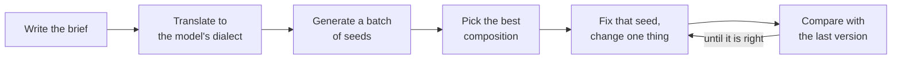

# Part 7: Prompting: One Brief, Many Dialects

2026-09-19 · Chris Neale

## About this part

This is the last of seven parts in the generative media module. The aims of the course, the layout every part follows and suggested reading routes are in [Course introduction](file/0a139f54-ef01). The format is the same as before: **In plain terms** opens each numbered section, deep dives are optional, and a glossary closes the part. Reading time is about 45 minutes.

[Part 1](file/7c41d2a9-1e05) explained that an image model does not read your prompt itself: a separate text encoder does, and encoders differ enormously. [Part 6](file/2f9be6c3-5a17) covered everything that shapes an output other than words. This part is about the words.

Most of it is about prompting for still images, for two reasons. Images are where the dialects differ most and where most readers will start. And parts 3 and 5 showed that the best route to a video clip or a 3D object is a good still, so image prompting is the larger part of prompting for those too. Section 7 covers what is particular to motion, sound and shape.

### What part 7 gives you

Part 7 builds one idea: a good prompt is a good brief, written in the dialect the model in front of you was trained to read. The brief is the same everywhere. The dialect changes with the model, and there are four: keywords and tags, descriptive prose, structured data, and conversation.

Most bad results come from one of two mistakes. Either the brief is missing something, so the model fills the gap with its defaults, or the brief is fine and written in the wrong dialect, so half of it is never read. Sections 1 and 2 deal with each in turn. Sections 3 to 6 take the dialects one at a time. Section 7 covers video, music and 3D. Section 8 is the method for improving a prompt, and section 9 is the summary to keep.

One scene runs through the whole part, so that the dialects can be compared: a woman repairing a bicycle in a small workshop in the evening.

## 1. The brief comes first

**In plain terms.** Before you worry about how to phrase anything, decide what the picture is. A photographer or illustrator would need to know the subject, what it is doing, where, how it is framed, how it is lit, what medium it is in and what mood it has. So does the model. Anything you leave out, it will choose for you, and it always chooses the most ordinary option. **Who should read it:** everyone. This section applies to every model and every tool.

### Seven slots

A complete brief answers seven questions. They are the same questions an art director answers when commissioning a person.

| Slot | The question | For the running example |
| --- | --- | --- |
| Subject | Who or what is it a picture of? | A woman in her fifties, grey hair tied back, in a canvas apron |
| Action | What is happening? | Truing a bicycle wheel, looking closely at the rim |
| Setting | Where and when? | A small, cluttered bicycle workshop, in the evening |
| Composition | How is it framed? | Medium shot from slightly below bench height, subject left of centre |
| Lighting | Where does the light come from, and what is it like? | One warm work lamp from the right, deep shadows, a dim blue window behind |
| Medium and style | Is it a photograph, a painting, a diagram? In what manner? | Documentary photograph, 35mm lens, shallow depth of field, slight film grain |
| Mood and colour | What should it feel like? | Quiet concentration. Amber and teal |

Part 1 showed why this matters. An underspecified prompt is completed with whatever was most common in the training data. Ask only for "a woman repairing a bicycle" and you will get a young woman, outdoors, in daylight, centred, smiling at the camera, holding a spanner near a bicycle that needs no repair. Every one of those is a default you did not choose.

You do not have to fill every slot every time. You do have to know which ones you left empty, because those are the ones the model decided.

### The vocabulary of pictures

Models learned from captions written by people who make pictures, so the working vocabulary of photography and illustration is unusually effective. It is also more precise than adjectives. "Dramatic" means little. "Lit from one side by a single low lamp" means one thing.

- **Framing:** close-up, medium shot, wide shot, full-length, overhead, low angle, over the shoulder, profile, three-quarter view.
- **Lens and focus:** wide-angle, 35mm, 85mm portrait lens, macro, shallow depth of field, everything in focus, motion blur.
- **Light:** soft window light, overcast, golden hour, backlit, rim light, hard midday sun, a single practical lamp, neon, candlelight.
- **Medium:** documentary photograph, studio product shot, gouache, linocut, watercolour, flat vector illustration, isometric diagram, pencil sketch, 3D render.
- **Finish:** film grain, matte, high-key, low-key, muted palette, limited to three colours.

A useful habit for anyone who does this often is to collect the terms that reliably produce a visible effect in the model you use, and ignore the rest.

### Describe the style, not the artist

Naming a living artist is the fastest way to a style and the one to avoid, for the reasons part 6 gave. It is also less controllable than it looks: a name brings the artist's subjects and compositions along with the manner. Describing the manner, as "loose gouache, visible brush strokes, flat shapes, limited earthy palette", travels between models and leaves no one's name in your working files.

### People, specifically

If a picture contains people, the defaults are where bias lives. Say who is in the picture: age, build, clothing and, where it matters to the use, ethnicity and gender. Then generate a batch and look at all of it. A single image tells you nothing about what the prompt tends to produce, and what it tends to produce is what will end up across a campaign.

## 2. Why models want different prompts

**In plain terms.** A model can only read prompts that look like the captions it was trained on. Early models learned from keyword-like web captions, so they read keywords. Newer ones learned from full written descriptions, so they read sentences. Some were trained on tagging systems from image boards and read those tags. The newest are language models and read almost anything. Writing in the wrong style does not break anything. It just wastes most of what you wrote. **Who should read it:** everyone. The table is the key to the rest of the part.

Two facts from part 1 decide what a model can read.

The first is its text encoder. CLIP treats a prompt as something close to a bag of concepts, with a hard limit of 75 usable tokens. A T5 encoder or a full language model reads sentences and keeps track of which adjective belongs to which noun.

The second is the captions the model was trained on. A model trained on web alt text has seen millions of captions like "sunset beach photo canvas print". A model trained on machine-written descriptions has seen millions like "A wide photograph of a beach at sunset. In the foreground, wet sand reflects an orange sky". Each learned to respond to what it saw.

| Dialect | Looks like | Models that read it | Why |
| --- | --- | --- | --- |
| Keywords | Short phrases separated by commas, most important first | First-generation open models and their fine-tunes, such as Stable Diffusion 1.5 and SDXL | CLIP encoder, trained on web captions |
| Tags | A fixed vocabulary of tags from image-board sites, in a customary order | Illustration and anime fine-tunes of those models | Fine-tuned on images captioned with exactly those tags |
| Prose | Full sentences describing the scene as a person would | Newer open models, such as Stable Diffusion 3.5 and FLUX, and most current hosted services | A sentence-level encoder, trained on written descriptions |
| Structured | The same content as labelled fields, often JSON | The newest models built on a language model, and at least one trained on nothing else | The encoder has read a great deal of structured data and keeps fields apart |
| Conversation | A request, then corrections, in a chat | Assistants with built-in image generation | A language model either writes the real prompt for you or is the image model |

### How to tell which you have

For a hosted service, read the prompting guide. For an open model, the model card names its text encoders, and a community fine-tune's page nearly always shows example prompts. Those examples are the most reliable evidence there is: they show the dialect the fine-tune was trained in.

Failing that, test it. Take one brief, write it as keywords and as two sentences of prose, fix the seed as part 1 described, and generate both. Then add a relationship that keywords cannot express, such as "the lamp is on her right and the window is behind her". A model that gets the relationship right from prose is a prose model.

### The cost of the wrong dialect

- **Prose into a keyword model:** the 75-token window fills with "a", "the", "which is" and "in the", and everything after it is cut off or weakened. The relationships you wrote so carefully are not understood anyway.
- **Keywords into a prose model:** it works, but the result is generic, because nothing says how the pieces relate. The model has the ability to follow a detailed description and was given a shopping list.
- **Tags into a base model:** tag vocabulary it never saw, such as "1girl", is noise at best.
- **JSON into a keyword model:** the field names themselves, "subject", "lighting", "camera", become words in the prompt. You may get a picture of a camera.

## 3. Keywords and tags

**In plain terms.** For older and community models, a prompt is a list: the subject first, then the details, separated by commas, with no grammar. You can turn individual words up or down with brackets and numbers, and a second list, the negative prompt, says what to avoid. It is closer to setting dials than to writing. **Who should read it:** anyone using Stable Diffusion 1.5, SDXL or the community fine-tunes of them. Others can skim the first example and move on.

### The keyword prompt

The running example, for a first-generation model:

```prompt
documentary photo of a middle-aged woman repairing a bicycle wheel, grey hair tied back, canvas apron, cluttered bicycle workshop, evening, single warm work lamp, deep shadows, blue window light in background, 35mm, shallow depth of field, film grain, amber and teal
```

And its negative prompt:

```prompt
smiling, looking at camera, daylight, outdoors, cartoon, illustration, blurry, deformed hands, extra fingers, watermark, text
```

The rules behind it are few.

- **Order is priority.** Earlier tokens carry more weight. Lead with the medium and the subject, and put finish and colour last.
- **Stay inside the window.** CLIP reads 75 tokens at a time. Tools accept longer prompts by cutting them into chunks of 75 and encoding each separately, so a phrase that straddles a boundary is split in two. Keep a prompt to one chunk where you can. Where you cannot, most tools have a keyword that forces a chunk break, so that you choose where the cut falls.
- **No grammar, no negation.** "Without a helmet" contains the word helmet. Anything unwanted goes in the negative prompt.
- **One concept per phrase.** "Red scarf, green coat" leaks colour between the two less than a long clause does, though part 2 explained why it still leaks.

### Weights

Tools for open models let you turn the emphasis on any phrase up or down. In the most widely used syntax, round brackets raise attention and a number sets the factor:

```prompt
documentary photo of a woman repairing a bicycle wheel, (single warm work lamp:1.3), (deep shadows:1.2), cluttered workshop, (smiling:0.6)
```

A bare pair of round brackets multiplies by 1.1, and square brackets reduce. Useful values sit between about 0.5 and 1.5. Beyond that the image degrades in the same harsh, overcooked way as excessive guidance, because the effect is similar: one direction is being exaggerated.

Weights are a feature of the tool, not the model. They work by scaling the encoder's output for those tokens, and the syntax differs between tools. They do little or nothing on prose models, whose encoders were not built for it.

### What goes in the negative prompt

Part 1 explained what a negative prompt is: the thing guidance pushes away from. That makes it a steering tool, not a bin for anxieties. Long boilerplate negatives copied from galleries are mostly superstition, and every token in them pulls the image away from something, often something harmless.

Use it for three things: the defaults you know the model will reach for (smiling, looking at camera), the wrong medium (cartoon, 3D render, when you want a photograph), and known defects of that model. Keep it short, and remember from part 1 that few-step and guidance-distilled models ignore it entirely.

### Quality words

Early prompts were full of phrases such as "highly detailed", "8k" and "trending on" a named art site. They had some effect, for an unglamorous reason: in scraped captions those words sat beside polished, professional images. The effect was always modest and is weaker still in newer models. One or two do no harm. A dozen use up a fifth of the window.

Tag-trained models are the exception, as the next section explains.

### Tag prompts

Many illustration and anime fine-tunes were trained on images from image-board sites, where volunteers label every picture with tags from a controlled vocabulary of many thousands of terms. For those models the tag vocabulary is the language, and ordinary description works poorly.

A tag prompt has a customary order: quality tags, the number and kind of subjects, the character, their features and clothing, the pose and action, the framing, the setting, and then style.

```prompt
masterpiece, best quality, 1girl, solo, mature female, grey hair, ponytail, apron, repairing, bicycle, bicycle wheel, looking down, focused, upper body, from below, workshop, indoors, evening, lamp, warm lighting, dark background
```

Three points are specific to this dialect.

- **Quality tags are real here.** These models were trained with tags marking how highly each image was rated, so "masterpiece, best quality" or a model's own rating tags genuinely select for its better training images. The model's page says which tags it expects, and using another model's will not work.
- **Use the exact tag.** "Ponytail" is a tag. "Hair tied back" is not. The tag for one female subject is "1girl" whatever her age, which is why "mature female" follows it. Tools offer tag auto-completion for this reason.
- **The tags are the limits.** Anything the vocabulary has no tag for is hard to get. Composition and relationships between two characters are the usual casualties, and part 6's control images are the usual answer.

### Deep dive (optional): prompt scheduling

Because a picture forms coarse to fine, the prompt does not have to stay the same throughout. Tools for open models let you switch a phrase part way through the steps. In the common syntax, a pair of alternatives in square brackets with a number says when to change over:

```prompt
a [stone cottage:glass pavilion:0.4] in a pine forest, morning mist
```

For the first 40% of the steps the model is told "stone cottage", and lays out a small, solid, pitched-roof building. For the remainder it is told "glass pavilion", and renders glass and steel onto that layout. The result is a blend that neither prompt would produce alone.

The same mechanism delays a detail until the composition has settled, or removes a phrase once it has done its work. It is the prompt-side counterpart of applying a control image only for the early steps.

## 4. Descriptive prose

**In plain terms.** For current models, write what you would say to a photographer over the phone: a few clear sentences, the most important thing first, with where things are and how the light falls. Put any text you want in the picture in quotation marks. Do not list what you do not want. Thirty to eighty words is usually right. **Who should read it:** everyone. This is the dialect most readers will use most.

### The prose prompt

The running example, for a prose model:

```prompt
A documentary photograph of a woman in her fifties truing a bicycle wheel in a small, cluttered workshop in the evening. She has grey hair tied back and wears a canvas apron, and she is looking closely at the rim, not at the camera. A single warm work lamp on her right lights her face and hands and leaves the rest of the room in deep shadow. Behind her, a small window shows dim blue dusk. Medium shot from slightly below bench height, with her left of centre. 35mm lens, shallow depth of field, slight film grain, a palette of amber and teal.
```

It carries the same seven slots as the keyword version. The difference is that it can say how they relate: the lamp is on her right, the window is behind her, she is left of centre, and she is not looking at the camera.

### How to write it

- **Most important first.** Order still matters. One publisher's guide says so directly and gives the order to use: main subject, then key action, then the critical style, then essential context, then secondary details. If the image must be a photograph, say so in the first five words.
- **One idea per sentence.** Plain declarative sentences are read more reliably than one long sentence with many clauses. This is the register the training captions were written in.
- **Say where things are.** Left, right, behind, in the foreground, in the top third. Spatial language is what prose models gained over keyword models, and most prompts do not use it.
- **Name the light source.** Where the light comes from fixes more of the look than any style word.
- **Be concrete.** "A chipped enamel mug" outperforms "a nice mug". Specific nouns carry more information than adjectives of approval, and "beautiful" carries none.
- **Stop when the brief is complete.** The same guide suggests 30 to 80 words for most work, with longer prompts for complex scenes. Beyond that, details begin to compete, and late ones are dropped.

### What prose models do not do

- **Negation.** "No people in the background" still risks adding people. Describe what is there: "the background is an empty brick wall".
- **Negative prompts, often.** Many current models have none. One major publisher's guide says flatly that its model does not support them, and to describe what you want. Where a tool still shows the box, part 1 explained how to tell whether it does anything.
- **Bracket weights.** Emphasis is given the way a writer gives it: by putting a thing first, giving it more words, or saying "the main focus of the image is".

### Lettering

Current prose models letter short text well, and the conventions are consistent across them. Put the exact words in quotation marks. Say what the text is on and where it sits. Describe the lettering as you would to a sign-writer: "bold condensed sans-serif capitals, white on red".

```prompt
A hand-painted wooden sign above the workshop door reads "MARLOWE CYCLES" in cream serif capitals on dark green, with "Repairs while you wait" in smaller script beneath it.
```

Keep it short, check every letter, and expect part 2's advice to hold: for anything that matters, add real type afterwards in a design tool.

### Exact colours

Some current models accept colour codes in the prompt, tied to a named object: "the apron is #2F4F4F". It is more reliable than colour words and useful for brand colours. Treat it as a strong hint and not a guarantee, and check the result with a colour picker.

## 5. Structured and JSON prompts

**In plain terms.** The newest models can read a prompt laid out as labelled fields, such as subject, lighting and camera, often in a format called JSON. This does not unlock better pictures. It is a tidier way to hold the same brief, and it is very useful when prompts are produced by software, reused as templates or edited by a team. **Who should read it:** engineers, and anyone building a repeatable image pipeline. Others need only the first three paragraphs.

### What it is

During 2025 a style spread in which the prompt is a data structure. The running example:

```json
{
  "scene": "A small, cluttered bicycle workshop in the evening",
  "subjects": [
    {
      "description": "A woman in her fifties, grey hair tied back, canvas apron",
      "action": "Truing a bicycle wheel, looking closely at the rim, not at the camera",
      "position": "Left of centre, medium shot"
    }
  ],
  "lighting": "A single warm work lamp on her right. Deep shadow elsewhere. Dim blue dusk through a small window behind her",
  "camera": {
    "angle": "Slightly below bench height",
    "lens": "35mm",
    "depth_of_field": "Shallow"
  },
  "style": "Documentary photograph, slight film grain",
  "color_palette": ["amber", "teal"],
  "mood": "Quiet concentration"
}
```

This works only where the text encoder is a language model, or where a language model sits in front of the image model. Such a model has read an enormous amount of JSON and understands that the value of "lighting" describes the lighting. There is no standard schema. At least one publisher documents a recommended set of fields for its model, close to the one above, and most models of this kind will accept any sensible field names.

### What it does and does not buy

Be clear-eyed about this, because the style is often oversold. One publisher that documents a JSON schema also says that its model understands both formats equally well, and that the choice should depend on your workflow. For most models that is the position: for a single image written by hand, well-organised prose does as well.

There is one real exception, and it shows where things may be heading. An open model released in June 2026 by a design-tool company, built for typography and layout, was trained only on structured JSON captions, with fields for each element's position, styling and colours. For that model JSON is not a convenience but the native dialect. Even there you need not write it by hand: by default a language model rewrites a plain request into the JSON the model expects, which is the prompt rewriting that section 6 describes. The lesson is the one from section 2. Find out what the model was trained to read.

The benefits are real, and they are engineering benefits.

- **Fields keep attributes apart.** Two subjects, each with its own description, position and action, are less likely to swap clothes and colours than the same content in one paragraph.
- **Templates become trivial.** A brand's lighting, camera, style and palette are fixed fields. Only the subject and scene change per image. Software fills the slots.
- **Changes are reviewable.** A difference between two versions of a JSON prompt shows exactly which field changed. That is the discipline of treating prompts as code, which [part 3 of the practical AI module](file/f3a91c20-6d4e) covers.
- **Iteration is cleaner.** Section 8's rule is to change one thing at a time. With fields, one thing is one field.
- **It forces a complete brief.** An empty "lighting" field is visible in a way that a missing sentence is not. For many people this is the largest benefit, and a checklist would achieve the same.

### Where it fails

On any model with a CLIP encoder the braces, quotation marks and field names are all just tokens, and they displace real content from a 75-token window. On tag-trained models it is meaningless. Even on models that read it, deep nesting and dozens of fields dilute the prompt in the same way a 300-word paragraph does.

### The middle path

If the model does not read JSON, the discipline is still available. Write prose in a fixed order with one sentence per slot, or use labelled lines:

```prompt
Subject: a woman in her fifties, grey hair tied back, canvas apron.
Action: truing a bicycle wheel, looking closely at the rim.
Setting: a small, cluttered bicycle workshop, evening.
Light: one warm work lamp on her right, deep shadow elsewhere, blue dusk in a window behind.
Camera: medium shot from below bench height, subject left of centre, 35mm, shallow depth of field.
Style: documentary photograph, slight film grain, amber and teal.
```

Most prose models handle this well. Keep the structured version in your own systems, and generate whichever dialect the target model needs from it. That arrangement also means a change of model is a change of template and not a rewrite of every prompt.

## 6. Hosted services and assistants

**In plain terms.** When you type a request into a chat assistant, a language model usually rewrites it into a much longer prompt before any image is made. That is why short requests work there, and also why you sometimes get things you never asked for. Other hosted services have their own house style and their own switches for shape, stylisation and variety. **Who should read it:** everyone who uses a hosted tool.

### Someone else writes your prompt

Part 1 mentioned that some assistants rewrite your prompt. The practice began when one vendor found that its image model, trained on long machine-written captions, performed far better on long detailed prompts than on the short ones people actually type. So a language model was placed in front to expand every request.

The consequences are worth knowing.

- **Short requests work, and come back embellished.** Ask for "a woman repairing a bicycle" and the rewriter adds a setting, a time of day, a style and, often, deliberately varied demographics. The defaults are now the rewriter's and not the image model's.
- **Your own long prompt may be rewritten too.** If you have written a complete brief, say so: "use this prompt exactly as written". Some services honour that, some only partly. Many will show you the prompt that was actually used, which is the first thing to look at when a result surprises you.
- **Content rules are applied at this stage.** Refusals, and silent softening of a request, mostly happen in the rewriter.

### Conversation as a dialect

Where the image model is itself a language model, or is tightly coupled to one, the prompt is a conversation, and the conversation can include pictures.

- **Ask, then correct.** "Make the lamp the only light source" and "move her to the left" are instructions a keyword model could never follow. Part 6 explained the editing models that make this work.
- **Show it things.** Upload a reference for the style, a photograph of the product, a sketch of the layout, and say what role each plays: "use the first image for the colour palette only".
- **Expect drift.** Each edit regenerates the image, and small things change that you did not mention. After three or four rounds, details from the first version have usually gone. When a conversation has established what you want, write it out as one complete prompt and start again from that.
- **It is slow and hard to repeat.** There is rarely a seed to fix, and the model behind the service changes without notice. Part 6's comparison of hosted and local applies in full.

### Services with a house style

Some hosted services are tuned hard towards an attractive, recognisable look, and are controlled less by description than by a handful of switches. The names differ. The switches are nearly always the same.

| Switch | What it controls | In part 1's terms |
| --- | --- | --- |
| Aspect ratio | The shape of the image | Size. It also changes composition: tall frames favour standing figures, wide ones favour landscapes |
| Stylisation | How far the service's own taste overrides your description | A house-style fine-tune or guidance, turned up or down |
| Variety, sometimes called chaos | How different the images in one batch are from each other | How widely the starting noise and interpretation vary |
| Exclusion | Things to leave out | A negative prompt |
| Style reference, character reference | An image to take the look, or the person, from | Part 6's image prompt adapters |
| Seed | Which starting noise | The seed, where the service exposes it |

On these services a short, evocative prompt often beats a long specification, because the house style fills the gaps attractively and a long prompt fights it. One well-known service, for example, takes its switches as flags typed after the prompt. When the house look is what you want, lean on it. When it is not, turn stylisation down before you write more words.

## 7. Motion, sound and shape

**In plain terms.** The same rule holds in every medium: write a complete brief, in the words the people who make that kind of thing would use. For video, say what moves and what the camera does, one action per shot. For music, give the genre, tempo, instruments and voice in one box and the words, marked into verses and choruses, in another. For 3D, the prompt is mostly a picture, and it needs to be a plain, evenly lit one. **Who should read it:** anyone working beyond still images.

### Video

Parts 3 and 6 recommend starting every shot from a still. When you do, the still has already answered most of the seven slots, and the prompt has a different job: it describes change. Repeating what the picture shows wastes the prompt and can fight the image.

A video brief has four slots of its own.

| Slot | The question | For the running example |
| --- | --- | --- |
| Subject motion | What happens, in one continuous action? | She spins the wheel slowly and watches the rim pass the gauge |
| Camera motion | What does the viewpoint do? | Slow dolly in from medium shot to close on her hands |
| Pace and ending | How fast, and where does it finish? | Unhurried. Ends on the wheel still turning |
| Sound, where the model makes it | What is heard? | The tick of the freewheel, a radio playing quietly, rain on the window. No music |

```prompt
She spins the wheel slowly with her left hand and watches the rim pass the gauge. The camera dollies in slowly from a medium shot to a close-up of her hands and the rim. Steady, unhurried movement. The shot ends with the wheel still turning. Sound: the tick of the freewheel, a radio playing quietly in the background, rain on the window.
```

- **One action and one camera move per shot.** A sequence of actions is a sequence of shots, as part 3 explained.
- **Use film language.** Static shot, pan, tilt, dolly, tracking shot, orbit, crane, handheld, rack focus. These are the words in the training descriptions.
- **Say what stays still.** "The camera is locked off" and "she stays seated" prevent the default drift and wander.
- **Prefer motion that footage is full of.** Walking, turning, pouring, weather, traffic, cloth and hair. Part 3 listed what goes wrong: precise interactions, sequences, anything with an exact outcome.
- **Dialogue goes in quotation marks,** with who says it and how, on models that generate speech. Keep it to a short line per shot.
- **Text-to-video, when you must,** needs the full seven-slot brief and the four above, in prose, in that order. Video models are all prose models, since they arrived after the change in text encoders.

### Music

A song generator takes two prompts, as part 4 explained, and they are written differently.

The style prompt is a brief in keywords or a short sentence. Its slots are genre and era, tempo, mood, instrumentation, the kind of voice, and production. It is a keyword dialect even on current services, since that is how music is catalogued and described.

```prompt
Late-1970s British folk rock, 96 bpm, warm and unhurried. Fingerpicked acoustic guitar, upright bass, brushed drums, a little fiddle. Female alto lead vocal, close and dry, with two-part harmony on the choruses. Live-room sound, no synths.
```

The lyrics are performed and not interpreted, so they are written as lyrics, with the structure marked by tags on their own lines: intro, verse, chorus, bridge, outro, and instrumental breaks. The tags are the main control over a song's shape.

- **Name the instruments you want and the ones you do not.** "No synths" and "no drums" work better here than negation does in images, because style prompts are short and services handle exclusions.
- **Tempo and key are hints.** Part 4 explained that the model has no notion of either. State them, then check.
- **Write singable words.** Regular line lengths, natural stresses, and no tongue-twisters or unusual names. Spell a name the way it sounds if it is being mispronounced.
- **Keep it short.** A three-minute song is about 200 to 300 words of lyric. More than that is crammed or dropped.
- **Avoid naming artists.** Describe the sound, for the reasons part 6 gave, which apply with more force in music. Many services block artist names in any case.

For sound effects and instrumental beds the brief is a plain description of the sound, its source, the space it is in and its length: "heavy rain on a tin roof, close, interior, steady, 60 seconds, loopable".

### 3D

Part 5 explained that the real input to a 3D model is a picture. So prompting for 3D is prompting an image model for a very particular kind of image, and the slots are constraints and not creative choices.

```prompt
A single vintage steel bicycle repair stand, whole object visible and centred, on a plain light grey background. Three-quarter view from slightly above. Soft, even studio lighting with no strong shadows or highlights. Matte painted steel, worn rubber clamp pads. Product reference photograph, sharp focus throughout.
```

- **One object, whole, centred, nothing cropped.**
- **Plain background.**
- **Flat, even lighting.** Anything dramatic is baked into the surface, as part 5 described.
- **Three-quarter view,** or a matched set of front, side and back views using part 6's reference techniques.
- **Characters in a neutral pose,** arms away from the body.
- **Describe materials plainly.** "Brushed steel", "matte rubber", "oiled oak". The painting stage turns these into material maps.
- **Avoid what 3D cannot hold.** Hair in wisps, foliage, wires, glass, smoke, and fine lettering.

Where a service takes text directly, write exactly this description and let it make the picture.

## 8. Iterating with purpose

**In plain terms.** Nobody gets the picture first time. The people who get there fastest work like engineers: they look at several attempts and not one, they change one thing at a time with everything else held still, and they keep notes. A language model is a very good assistant for writing image prompts, provided you tell it which model you are writing for. **Who should read it:** everyone. This section matters more than any phrasing trick.

### The loop



Part 1 gave the two modes. Exploring means one prompt and many seeds, because the seed mostly decides composition. Refining means one seed and one change at a time, because only then is the difference between two images caused by what you changed.

Three habits turn that into a method.

- **Judge batches.** Generate four to eight images before you touch the prompt. If one in eight is right, the prompt is nearly right and you need more seeds. If none is, the prompt is wrong and more seeds will not help.
- **Change one thing.** Rewriting the whole prompt after each disappointment tells you nothing. If three changes are needed, make them in three steps and keep the ones that helped.
- **Write it down.** Keep the prompt, seed and settings with each image you might return to. Tools for open models do this in the file itself, as part 6 described.

### Diagnosing a bad result

| Symptom | Likely cause | First thing to try |
| --- | --- | --- |
| Generic, stock-looking image | Empty slots in the brief, filled with defaults | Add lighting, framing and medium |
| Right content, wrong layout | Composition is set by the seed more than the words | More seeds. Then a sketch or a control image, from part 6 |
| Part of the prompt ignored | It fell outside the token window, came too late, or was written in the wrong dialect | Move it earlier, shorten the rest, check the dialect |
| Colours or clothes on the wrong person | Attribute leakage | One sentence or field per subject. Then inpainting, from part 6 |
| The thing you said you did not want | Negation in the main prompt | Remove the mention. Describe what is there instead |
| Harsh, oversaturated, overcooked | Guidance or weights too high | Lower guidance. Remove weights above 1.3 |
| Garbled lettering | Too much text, or a model that cannot letter | Shorter text in quotation marks. Otherwise add type afterwards |
| One detail wrong in a good image | Chance | Do not reprompt. Inpaint it |
| Same face or look every time | The model's or fine-tune's default, or a LoRA that is too strong | Describe the person specifically. Lower the LoRA's strength |

The last but one row is the one most often ignored. Once an image is ninety percent right, the prompt has done its job. Regenerating in the hope of a perfect draw wastes time that ten seconds of inpainting would save.

### Using a language model to write prompts

Turning a brief into a fluent prompt in a particular dialect is a translation task, and language models are good at translation. It works well under three conditions.

- **Tell it the target.** "Write a prompt for an SDXL fine-tune: comma-separated keywords, under 60 tokens, most important first, plus a short negative prompt" produces something usable. "Write an image prompt" produces 200 words of purple prose suited to no model in particular.
- **Give it the brief, not the wish.** Hand over the seven slots. Left to invent them, it chooses the same defaults the image model would have.
- **Watch for sameness.** Language models have favourite words and favourite pictures. Prompts written by them converge on a look: cinematic, golden-hour, highly detailed. If every image your team makes starts to feel alike, this is the usual reason.

### Prompts as shared tooling

For a team, the unit of reuse is not a prompt but a template: fixed text for the things that define the brand's look, which are usually medium, lighting, palette and finish, and named slots for what varies. Store it with the model and version it was tuned for, the settings, any LoRA and its strength, and a few reference outputs that show what good looks like. When the model changes, regenerate the reference outputs and compare, which is a small version of the evaluation discipline in [part 9 of the practical AI module](file/7a3f2c68-91de).

A prompt tuned on one model rarely transfers unchanged, even within a dialect. Budget time to re-tune templates whenever the model behind them changes, including when a hosted service changes it for you.

## 9. The cheat sheet

**In plain terms.** Four questions settle how to write any image prompt. What is the brief? Which dialect does this model read? What does this model ignore? And what will I do when the words run out? **Who should read it:** everyone. This is the page to keep.

| | Keyword models | Tag-trained fine-tunes | Prose models | Language-model and structured | Assistants and house-style services |
| --- | --- | --- | --- | --- | --- |
| Examples | Stable Diffusion 1.5, SDXL and their photographic fine-tunes | Illustration and anime fine-tunes of those | Stable Diffusion 3.5, FLUX, most current hosted APIs | The newest open and hosted models | Chat assistants with image generation. Midjourney-style services |
| Write | Comma-separated phrases, most important first | The model's own tags, in the customary order | Two to six plain sentences, most important first | Prose, or labelled fields, or JSON | A request, then corrections. Or a short evocative line plus switches |
| Length | Under 75 tokens | Under 75 tokens | 30 to 80 words | As long as the brief needs, within reason | Short. The service expands it |
| Emphasis | Bracket weights, 0.5 to 1.5 | Bracket weights. Quality tags | Position and wording | Position, wording, a dedicated field | Say it. Or turn stylisation down |
| Things to avoid | Negative prompt | Negative prompt | Describe what is there instead | Describe what is there instead | An exclusion switch, or ask |
| Relationships and layout | Poor. Use a control image | Poor. Use a control image | Good. Say left, right, behind | Best | Good, and correctable in conversation |
| Lettering | No | No | Short text in quotation marks | Good. Still check every letter | Good. Still check every letter |
| Repeatable | Yes, with the seed | Yes, with the seed | Yes, where the seed is exposed | Yes, where the seed is exposed | Rarely |

The table is for still images. For the other media: video models read prose, and the prompt describes motion and camera over a still you supply. Song models read a keyword style brief plus tagged lyrics. 3D models read a plain, evenly lit picture of one object.

Whatever the model or the medium, four rules hold.

**Write the brief before the prompt.** Seven slots for a picture, and the extra ones for motion or sound. Know which ones you left to the model.

**Match the dialect to the training.** Look at the publisher's examples. They show what the model was taught to read.

**Say what is in the picture, not what is not.** Negation fails in every dialect except a true negative prompt.

**When words stop working, stop using words.** Layout wants a sketch or a control image. A consistent character wants a reference or a LoRA. One wrong detail wants inpainting. A video shot wants a still to start from, and a 3D object wants a picture. All of those are in part 6, and knowing when to reach for them is the larger part of prompting skill.

### The whiteboard version

A prompt is a brief: subject, action, setting, composition, lighting, medium, mood. The model fills every gap with its most ordinary option. How you write the brief depends on what the model was trained to read. Older models read comma-separated keywords inside a 75-token window, with bracket weights and a negative prompt. Tag-trained fine-tunes read their own tag vocabulary. Current models read a few plain sentences, most important first, and can follow "on her right" and lettering in quotation marks, but not negation. The newest read labelled fields or JSON, which helps your workflow more than your pictures. Assistants rewrite your prompt and let you correct the result in conversation. For video, describe what moves and what the camera does over a still you made first. For music, a keyword style brief and tagged lyrics. For 3D, a plain picture of one object. In every case you improve a prompt by judging batches, fixing the seed and changing one thing at a time, and you stop prompting and start editing once the image is nearly right.

## Say it two ways

Each idea below has a version for engineers and a version for everyone else. The non-technical versions are simplified but not wrong, so an engineer in the room will not wince.

| Idea | Technical version | Non-technical version |
| --- | --- | --- |
| Why prompts differ by model | The text encoder and the distribution of training captions determine which input forms carry signal | Each model learned to read from a different kind of caption. Write the way its captions were written |
| Keyword prompt | A comma-separated sequence of concepts within CLIP's 75-token context, ordered by priority, with no syntax | A list of ingredients, the most important first. No sentences, and no "not" |
| Prompt weights | Scaling the encoder's output embeddings for selected tokens before they condition the denoiser | Turning individual words up or down with brackets and a number. A feature of older tools |
| Prose prompt | Natural-language description read by a sentence-level encoder trained on long synthetic captions | What you would tell a photographer on the phone: a few clear sentences, including where things are and where the light comes from |
| JSON prompt | The brief serialised as labelled fields for a language-model encoder. Equivalent in quality to prose, better for templating and review | The same brief, filled in as a form. It does not make better pictures. It makes them easier to repeat and to automate |
| Prompt rewriting | A language model expands the user's request into a long prompt before the image model sees it | The assistant quietly writes a much longer description from your short one. Ask to see it when the result surprises you |

## Misconceptions to correct

Four claims come up constantly. Each contains something true, which is why flat contradiction fails. Agree with the true part first, then add what it leaves out.

### "There are magic words that make images better"

**True:** in tag-trained models, quality tags genuinely select for better training images, and in early models phrases such as "highly detailed" had a modest effect.

**Misleading:** there is no vocabulary that works everywhere, and most popular incantations are copied from galleries without anyone having tested them. What reliably improves an image is a complete brief: a named light source, a stated framing, a specific medium. Those are ordinary words.

**What to say:** "The only magic words are the ones a photographer would use. Tell it where the light is coming from and how the shot is framed, and drop the ones that sound like a spell."

### "The more detail in the prompt, the better"

**True:** an underspecified prompt gives a generic image, and current models follow much longer prompts than early ones could.

**Misleading:** every model has a limit, 75 tokens for older ones and a few hundred for newer ones, and well before the limit details start to compete. Late and minor details are dropped without warning. A prompt should be as long as the brief and no longer.

**What to say:** "Cover the seven things a brief needs, most important first, and stop. If a detail really matters and keeps being ignored, move it to the front or fix it afterwards. Do not bury it in paragraph four."

### "JSON prompts produce better images"

**True:** models built on a language model read JSON well, fields help keep the attributes of several subjects apart, and at least one recent model was trained only on JSON captions, so for it JSON is the native format.

**Misleading:** that model is the exception, and even it turns a plain request into JSON for you. The makers of another say it understands prose and JSON equally well. The gain is in the workflow: templates, automation, reviewable changes and a brief with no missing slots. On older models JSON is actively harmful, because the punctuation and field names become part of the prompt.

**What to say:** "JSON is a good way to store and generate our prompts, and it will not make a bad brief good. We should keep the structure on our side and send each model whatever it reads best."

### "We can just copy a prompt that worked for someone else"

**True:** published prompts are the best way to learn what a particular model responds to, and a fine-tune's example prompts show exactly the dialect it expects.

**Misleading:** a prompt is tuned to one model, one set of settings, often a LoRA or two, and a seed. Moved to another model it may be in the wrong dialect entirely. Even on the same model, a different seed gives a different composition. What transfers is the structure and the vocabulary, not the result.

**What to say:** "Borrow how it is written, not what it produced. Check it is for the model we use, then expect to generate a batch and adjust."

## Misconceptions quick reference

All twenty-two misconceptions from the generative media module, each with a one-line response. Every one contains some truth, so open by agreeing with that. The full entries, with what is true and what is misleading, are in each part.

| Claim | Short response | Part |
| --- | --- | --- |
| "It stitches together pieces of existing work" | It learned from existing work and keeps no copies. It can come too close to something famous, so we check final results | 1 |
| "It understands my prompt like a chatbot does" | It is a brief handed to someone who cannot ask questions. Say what is wanted, in the style this model reads | 1 |
| "Higher settings mean better results" | The settings have working ranges, not quality dials. If the result is wrong, change the prompt or the seed | 1 |
| "You can always tell, just look at the hands" | No one's eye is reliable now. We record how our images were made, and judge others by their source | 2 |
| "It cannot do text, so we cannot use it for anything with words" | Short text usually works. We check every letter, and real words go on afterwards where they matter | 2 |
| "It can make a film from a prompt" | It makes shots, and good ones. A film still needs a shot list, consistent designs and an edit | 3 |
| "Video is just a lot of images, so it will cost a bit more" | Cost grows with the square of the length, and most takes are discarded. Budget per finished second | 3 |
| "The new models understand physics" | A very good impression of physics, learned from footage. Fine for a wave, not for showing how a mechanism works | 3 |
| "AI music is royalty-free, so we can use it anywhere" | Royalty-free is not risk-free. Paid plan, licensed service, terms on file, and a recognition check | 4 |
| "Describe the song you want and you will get it" | A fast session band with no sheet music. It gives a feel, not a key, a tempo or a melody | 4 |
| "It is our presenter, so we can clone their voice" | Only with their written agreement, for named uses, and we say the voice is synthetic | 4 |
| "Type a description, get a game-ready asset" | Background props this week. For anything that moves or is seen close, a head start for our artists | 5 |
| "We can turn product photos into 3D models for the website" | It is an invention, not a measurement. For the real product we use design files or a scan | 5 |
| "A splat and a mesh are the same thing in different formats" | To look around, a splat. To change, animate or put in a game, a mesh | 5 |
| "To get our brand style we need to train our own model" | We teach an existing model our style with a small add-on, and only if reference images do not hold it | 6 |
| "Open models are the free version of the good ones" | Hosted gives the best result for the least effort. Open gives control, privacy and repeatability | 6 |
| "If it is AI-generated, no one can sue us, and no one can copy it" | Outputs can still infringe, and prompt-only work may have no copyright. We check for resemblance and put real creative work in | 6 |
| "We can just train it on that illustrator's work" | We can, and we should not. We commission the artist or license the style with their agreement | 6 |
| "There are magic words that make images better" | The magic words are a photographer's: where the light is, how it is framed, what medium it is | 7 |
| "The more detail in the prompt, the better" | Cover the brief, most important first, and stop. Details past the limit are silently dropped | 7 |
| "JSON prompts produce better images" | JSON improves our workflow, not the picture. We keep the structure and send each model what it reads best | 7 |
| "We can just copy a prompt that worked for someone else" | Borrow how it is written, not what it produced. Prompts are tuned to one model, its settings and a seed | 7 |

## Glossary

Every technical term used in this part, in plain language and in alphabetical order.

| Term | Meaning |
| --- | --- |
| Aspect ratio | The shape of an image, as width to height. It influences composition as well as size |
| Attribute leakage | A colour or property asked for on one object turning up on another |
| Batch | Several images generated from one prompt with different seeds |
| Brief | The complete description of the wanted image: subject, action, setting, composition, lighting, medium and mood |
| Chunk | One 75-token piece of a long prompt, encoded separately by tools for keyword models |
| Dialect | The style of prompt a model was trained to read: keywords, tags, prose, structured data or conversation |
| House style | The recognisable look a hosted service is tuned to produce by default |
| JSON | A common text format for structured data, made of named fields and values |
| Keyword prompt | A prompt written as comma-separated phrases with no grammar |
| Negative prompt | A description of what to steer away from. It works only in models that use guidance in the way part 1 describes |
| Prompt rewriting | A language model expanding a short request into a long prompt before the image model sees it |
| Prompt scheduling | Changing part of the prompt part way through the steps |
| Prompt template | A reusable prompt with fixed text for a consistent look and named slots for what varies |
| Prompt weight | A number that turns the emphasis on a word or phrase up or down |
| Prose prompt | A prompt written as ordinary descriptive sentences |
| Quality tag | A tag recording how highly a training image was rated, which a tag-trained model uses to select for better output |
| Slot | One of the seven parts of a brief |
| Structured prompt | A prompt laid out as labelled fields, in JSON or as labelled lines |
| Stylisation | A hosted service's setting for how far its own taste overrides your description |
| Tag prompt | A prompt made of tags from an image-board site's controlled vocabulary |
| Token window | The number of tokens a text encoder reads at once. 75 usable tokens for CLIP |

## Sources

The mechanics and guidance quoted in this part come from these documents, as they stood in September 2026. Prompting conventions change with every model release, so check the publisher's current guide for the model you use.

- [Stable Diffusion web UI: Features](https://github.com/AUTOMATIC1111/stable-diffusion-webui/wiki/Features), for bracket weights and their 1.1 default, 75-token chunks and the break keyword, prompt editing, and the negative prompt taking the place of the empty prompt
- [FLUX.2 prompting guide](https://docs.bfl.ai/guides/prompting_guide_flux2), Black Forest Labs, for word order and its priority, the 30 to 80 word guidance, the absence of negative prompts, text in quotation marks, colour codes, the JSON schema, and the statement that the model understands prose and JSON equally well
- [Ideogram 4.0 technical details](https://ideogram.ai/blog/ideogram-4.0/) and its [inference code](https://github.com/ideogram-oss/ideogram4), June 2026, for a model trained exclusively on structured JSON captions, and the language model that rewrites plain prompts into them
- [Improving Image Generation with Better Captions](https://cdn.openai.com/papers/dall-e-3.pdf), 2023, for training on long written captions and expanding short prompts with a language model
- [Learning Transferable Visual Models From Natural Language Supervision](https://arxiv.org/abs/2103.00020), 2021, for CLIP and its context length
