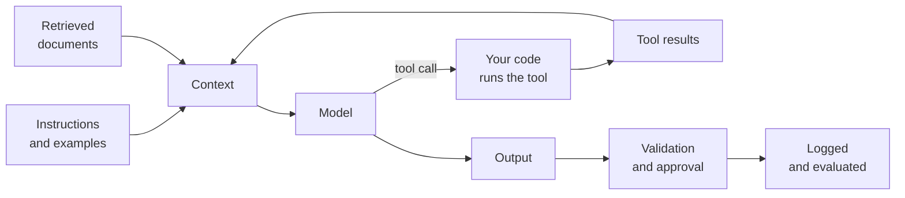

# Part 1: AI Chat

2026-09-20 · Chris Neale

## About this part

This is the first of nine parts in the practical AI module. The aims of the course, the layout every part follows and suggested reading routes are in [Course introduction](file/0a139f54-ef01). The format is the same as elsewhere: **In plain terms** opens each numbered section, deep dives are optional, and a glossary closes the part. Reading time is about 30 minutes.

This is where the course starts, because nearly everyone reading it already types into a chat window, and doing that well is the quickest thing to get better at. If you do not, the optional [intro to AI module](file/a7f20c15-9d3e) comes first and takes 45 minutes.

The module is about the system around the model. The same model behaves like two different products in a bare chat window and inside a well-built agent. Most of the gain from AI, and most of the disappointment, is decided here and not by the choice of model.

There is a second purpose running through the module. A model can produce in minutes what takes a person a day. That speed is lost if a person then inspects every step and every line by hand, because the whole system slows to reading pace. The engineering described later exists to replace human checkpoints with automatic ones wherever that is safe, so that people spend their attention on direction and on the risky few percent, and the AI runs at its own pace on the rest.

That diagram is the module. This part and [part 2](file/9f2c5e38-a7b4) are about meeting it as a user: the chat window, where someone else built everything but the message, and the AI inside the software you already have. [Parts 3](file/f3a91c20-6d4e) and [4](file/8d27b5e4-c019) cover the instructions and the files that extend an agent, and [part 5](file/1d8f42a6-b93e) what happens when one runs. [Part 6](file/52e0a7c9-b3f6) covers input that is not text. [Part 7](file/c9146f3b-27a8) covers tools and the protocol that connects them. [Part 8](file/0b8e5d17-f4c2) covers retrieved documents. [Part 9](file/7a3f2c68-91de) covers the controls and tests that make the result trustworthy, and ends with a checklist for reviewing any AI feature. The [AI in the organisation module](file/d6e2a95b-3f14) then applies all of it along the whole software lifecycle, across a team and up through an organisation.

It names products throughout, and those date quickly. The ideas under them have held steady for longer.

### Seven things to know about the model first

The module needs no knowledge of how a model works. It does lean on seven facts about how one behaves, and supplies a defence for each of the last six.

- **It knows two things.** What it absorbed in training, which is broad, fuzzy and stops at a date, and what is in front of it now, which is exact and limited. It knows nothing about you, your company or your code unless it is told.
- **It makes things up.** Where it lacks a fact it supplies a plausible one, in the same confident voice as the rest. This is called hallucination.
- **It answers differently each time.** The same request twice can give two different results.
- **It cannot tell an instruction from a document.** Any text it reads, from a web page, a ticket or a file, can steer it. This is called prompt injection.
- **It is out of date.** It suggests last year's versions and does not know what has changed since it was trained.
- **It agrees with you.** It was trained on what people liked, and people like being agreed with.
- **Its small errors add up.** A task of fifty steps, each done right 98 times in 100, comes out right about one time in three.

The [language models module](file/590c1ae1-8bf3) explains why each of these is so, and [its part 3](file/48a4ae01-75ae) sets the six failures out in full. You do not need the why to use what follows. It will make more sense of it afterwards.

### What part 1 gives you

Part 1 builds one idea: a chat window is a product, not a model. Someone chose which model answers, what standing instructions it carries, what it may look up and what happens to what you type. Knowing which of those you can change, and which you cannot, is most of the difference between getting a little from chat and getting a lot.

## 1. What the window actually is

**In plain terms.** A chat window looks like a plain box you type into. It is a product with a good deal built into it: a model someone chose, instructions you never see, a memory, a set of tools it may reach for, and a policy about what happens to your words. The box is the smallest part. **Who should read it:** everyone.

### What is in front of the model when you press send

Your message is never all the model sees. In a typical assistant the model receives, in order:

- **The product's own system prompt.** Written by the vendor. It sets the tone, the refusals, the format and the date. You cannot see or change it.
- **Your standing instructions,** if the product has them: a profile, custom instructions, or a project's brief.
- **Anything the product remembers** about you from earlier conversations, if memory is on.
- **The conversation so far,** in full, every turn.
- **Whatever it fetched:** search results, an attached file, a connected document.
- **Your message,** last.

[Part 3](file/f3a91c20-6d4e) calls this the layers of instruction and gives the full table. The reason to know it here is diagnostic. When an assistant behaves oddly, the useful question is which layer did that, and the answer is often a layer you forgot was there: a standing instruction written months ago, or a memory it formed on a bad day.

### The three shapes of chat

| | What it is | Suits |
| --- | --- | --- |
| A single conversation | One thread, nothing carried in | A question, a draft, a one-off |
| A project or space | A named brief, files and instructions that every conversation in it inherits | Work you come back to: a product, a client, a codebase |
| A custom assistant | A project you share, so colleagues start from your setup | A team procedure others should follow |

Most people use only the first and wonder why they repeat themselves. The second is where chat starts paying: a project that holds your style guide, your schema and your standing rules turns a good brief into a permanent one. It is the same idea as the instruction files in [part 3](file/f3a91c20-6d4e), a level up from the codebase.

### Memory, and why to look at it

Products now keep notes between conversations. It is convenient and it is a standing instruction you never wrote deliberately. A memory formed from one throwaway remark will shape answers for months. Read the memory list occasionally, delete what is wrong, and turn it off for work where you want the model to start clean each time.

## 2. Choosing the model and the mode

**In plain terms.** Most assistants now offer several models and several ways of running them: a fast one, a slower one that thinks first, one that searches the web, and one that goes away and writes a report. Picking the right one matters more than any wording in your message. Using the slow one for everything wastes time; using the fast one for everything gives shallow answers to hard questions. **Who should read it:** everyone.

### What the choices mean

- **Fast.** Answers immediately. Right for rewriting, summarising, formatting, simple questions, anything where you supply the material.
- **Thinking, or reasoning.** Works through the problem before answering, sometimes for a minute or more. [Part 2 of the language models module](file/5086e893-fa85) explains what it is doing. Right for maths, multi-step logic, debugging, planning, anything where being wrong is expensive. Wrong for a quick rewrite, where it costs a minute to gain nothing.
- **Search.** Answers from current sources and cites them. Right for anything after the model's training cutoff, and for anything you need to check.
- **Deep research.** Goes away for several minutes, reads many sources, comes back with a long, referenced report. Right for a literature scan or a market survey. Always check the citations; a long report with sixty references invites you not to.

### A rule of thumb

Ask for thinking when you could not do the task yourself in one pass. Ask for search whenever a fact matters and it is not in front of the model. Otherwise take the fast one.

### Which product

The mainstream choices in 2026 are ChatGPT, Claude, Gemini and Copilot, and the honest summary is that they are close on most work and differ on fit. Gemini suits an organisation living in Google Workspace, Copilot one living in Microsoft 365, since both can see your documents and mail with permission. Beyond that, benchmark tables move every few months and mean little for your work.

The reliable way to choose is the one [part 9](file/7a3f2c68-91de) describes for any AI feature: take twenty real tasks of your own, run them through two products, and read the results. That takes an afternoon and settles it for a year, in a way a league table cannot.

## 3. Getting good work out of it

**In plain terms.** The quality of the answer is set mostly by the quality of the request and the material you supply with it. Beyond that, the biggest wins are knowing when to start again rather than argue, and asking the model to criticise rather than confirm. **Who should read it:** everyone.

### The brief, again

[Part 2 of the intro module](file/4c8be1d6-27fa) covers this for someone new: the task, the situation, the material, the constraints, the shape of the answer, and permission to say "I don't know". [Part 3](file/f3a91c20-6d4e) turns the same idea into the standing instructions a team writes. What is worth adding here is the handful of habits that separate people who get a lot from chat from people who get a little.

- **Supply the material, always.** Describing your document to a model that could have read it is the commonest and costliest mistake.
- **Say who it is for.** "Summarise this" and "summarise this for a finance director who has five minutes" are different tasks.
- **Ask for the questions first.** "What would you need to know to do this well?" before "do this" is the single highest-return sentence in this part.
- **Start again rather than argue.** A misunderstanding stays in the conversation above and keeps colouring what follows. A fresh thread with a better opening beats four rounds of correction.
- **Do not lead the witness.** "Is this right?" invites yes. "What is wrong with this?" and "what would a sceptical reviewer say?" get you something worth having.
- **Ask for its uncertainty.** "What here are you least sure of?" is not a guarantee, and it is a usable pointer at what to check first.

### Long conversations go stale

Everything said stays in view, so a thread that has wandered through three topics carries all three into every answer. [Part 3 of the language models module](file/48a4ae01-75ae) explains why that costs quality as well as money. One task, one thread.

### Do not treat the output as finished

The reply is a draft by a fast, well-read colleague who has no stake in it and cannot tell you what they got wrong. Check in proportion to the consequences: facts, figures, quotations and references every time they matter, code by running it, and anything legal, medical or financial with someone qualified. That habit is the whole of [part 9](file/7a3f2c68-91de), applied by hand.

## 4. Chat at work

**In plain terms.** Everything you type goes to another company's computers. With an approved account under a contract that is usually fine; with a personal account it may not be, and personal accounts are how most of this happens. This is the part of chat that gets organisations into trouble, and it is entirely avoidable. **Who should read it:** everyone. Anyone who sets policy should read the figures.

### What the measurements show

Two 2026 reports put numbers on something most organisations suspect.

- Cyberhaven, watching real data movements rather than asking people, reported that **39.7% of data going into AI tools was sensitive**, and that a large share of use runs through personal accounts: about a third of ChatGPT use and a quarter of Gemini use, and more than half for some other products.
- Surveys of employees put the share using unapproved tools somewhere between two-thirds and four-fifths, with the spread telling you how much the question's wording matters. The same work reports executives believing they can see far more of this than they can.

Read those as direction and not as gospel: one vendor sells tools to stop this, and the surveys disagree with each other. The direction is not really in doubt.

### Why the account matters more than the app

A personal account is outside everything an organisation has arranged. It bypasses the single sign-on, the logging, the retention terms, the settings that keep your words out of training, and the ability to get data back or delete it. The same product on a work account, under a contract, is usually fine for ordinary work material. So the question is never "is ChatGPT allowed", it is "which account, under what terms".

### The short list

- Use the accounts your organisation has approved, signed in with your work identity.
- Never paste credentials, keys or tokens into any assistant.
- Personal data about customers, colleagues or candidates stays out unless the tool is cleared for it, wherever you are in the world.
- Unreleased figures, contracts, source code and security detail belong only in tools cleared for them.
- If you do not know what is approved, ask before you paste. That question takes a minute and has never once been the expensive part.
- What you send, publish or merge is yours, whoever drafted it.

[Part 3 of the AI in the organisation module](file/bbb9efdd-e221) covers the contracts, the law and the policy behind that list.

### Say what you used

A quiet habit worth starting: when AI did a material part of a piece of work, say so, in a line. It settles arguments later, it tells reviewers where to look hardest, and it makes the question of what helped answerable rather than a matter of feeling, which is the course's fourth idea.

## 5. When chat is the wrong tool

**In plain terms.** A chat window is a person typing. That is its strength and its ceiling. When the same job comes round every day, when it must run without you, when it needs your own systems, or when someone must be able to prove it worked, you have outgrown the window. The rest of this module is what comes next. **Who should read it:** everyone. This section is the map of the module.

| When you find yourself | You want | Where |
| --- | --- | --- |
| Typing the same standing instructions into every conversation | An instruction file, or a project | [Part 3](file/f3a91c20-6d4e) |
| Pasting the same procedure again and again | A skill, packaged so the AI can fetch it | [Part 4](file/8d27b5e4-c019) |
| Watching it work step by step and wishing it would get on with it | An agent: a brief, feedback, limits, and somewhere to run | [Part 5](file/1d8f42a6-b93e) |
| Screenshotting or describing things you could hand over | A model that takes the image, the document or the recording | [Part 6](file/52e0a7c9-b3f6) |
| Copying answers into another system by hand | Tools, and a protocol to connect them | [Part 7](file/c9146f3b-27a8) |
| Pasting the same documents to ask about them | Retrieval, so it looks them up itself | [Part 8](file/0b8e5d17-f4c2) |
| Unable to say how often it is right | Evals, and guardrails before it acts | [Part 9](file/7a3f2c68-91de) |
| Wondering whether any of it reached the customer | Measures across the whole lifecycle | [AI in the organisation](file/d6e2a95b-3f14) |

There is no shame in the left column. Most useful AI work starts there, and a good deal of it should stay there: a thoughtful person with a chat window solves a great many problems, and the right answer for a job done twice a year is to do it by hand in a window. The column matters when the job is done daily, by several people, or by nobody because there is no time.

### The whiteboard version

A chat window is a product wrapped round a model: someone else chose the model, the instructions, the memory and the terms, and you choose the message and the material. Pick the mode to fit the task, supply what it needs to know, start again rather than argue, and check what matters. Use the account your organisation approved. When you find yourself repeating yourself, you have outgrown the window, and the rest of this module is the way out.

## Say it two ways

| Idea | Technical version | Non-technical version |
| --- | --- | --- |
| The window is a product | An application wrapping a model with a system prompt, memory, tools and a data policy | The box is the small part. Someone chose the engine, the house rules and what happens to what you type |
| Project or space | A persistent context of instructions and files inherited by every conversation in it | A folder that remembers the brief, so you stop repeating yourself |
| Memory | Notes the product keeps between sessions and replays into the context | It writes things down about you. Worth reading now and then, because it shapes every answer |
| Thinking mode | Extra inference spent on reasoning before the answer is produced | We let it work the problem out first. Slower, and worth it when being wrong is expensive |
| Personal versus approved account | The same model under different contractual terms, retention, logging and training settings | Same tool, different paperwork. The paperwork is the bit that protects us |
| Outgrowing chat | Recurring, unattended or auditable work needs instructions, tools, retrieval and evals | When you do it every day, or it has to run without you, the window is no longer the right shape |

## Misconceptions to correct

### "The model is the product"

**True:** the model does the work, and a better model does better work.

**Misleading:** what you type into is an application with its own instructions, memory, tools and terms. Two products on the same model behave differently, and the same product changes under you when the vendor edits the parts you cannot see.

**What to say:** "We are choosing a product, not just a model. The instructions, the memory and the contract around it matter as much as the engine."

### "You have to word it just right"

**True:** how you ask makes a large difference, and the difference is bigger than most people expect.

**Misleading:** the difference comes from being clear and supplying the material, not from phrasing. Time spent hunting for magic words is better spent pasting in the document.

**What to say:** "There are no secret phrases. Say what you want, who it is for, and hand it what it needs to know."

### "It is only a chat, so nothing leaves the room"

**True:** most of what people type is unremarkable, and an approved account under a proper contract handles it safely.

**Misleading:** the words go to another company. Measured, about two in five interactions carry something sensitive, and a great deal of use runs through personal accounts that sit outside every protection an organisation has arranged.

**What to say:** "The question is not whether the tool is allowed. It is which account, under what terms, and we use the approved one."

## Glossary

Terms introduced in this part, in plain language and in alphabetical order. Terms from the intro module are defined there.

| Term | Meaning |
| --- | --- |
| Custom assistant | A project shared with others, so they start from the same setup |
| Deep research | A mode that reads many sources over several minutes and returns a referenced report |
| Memory | Notes a product keeps between conversations and shows the model again |
| Personal account | An account outside the organisation's contract, logging and retention terms |
| Project, or space | A named place whose brief, files and instructions every conversation in it inherits |
| Shadow AI | Use of AI tools an organisation has not approved and cannot see |
| System prompt | The vendor's own standing instructions, ahead of everything you type |
| Thinking mode | A model working through a problem before answering |

## Sources

The figures in section 4 come from these, read in September 2026. One is from a vendor selling tools to prevent what it measures, and the employee surveys disagree with one another, so they are given as direction and not as precise quantities.

- [2026 AI Adoption and Risk Report](https://www.cyberhaven.com/press-releases/cyberhaven-2026-ai-adoption-risk-report), Cyberhaven, February 2026, for the 39.7% of data movements carrying sensitive data and the share of use on personal accounts
- [The State of Shadow AI 2026](https://www.unseensecurity.ai/shadow-ai-report) and [the shadow agent gap](https://forkast.news/the-shadow-agent-gap-67-of-workers-use-unapproved-ai-while-enterprises-ship-governance-infrastructure/), for the range of employees reporting use of unapproved tools and the gap with what executives believe

The description of products, modes and projects in sections 1 to 3 rests on the drafter's general knowledge of the assistants as they stood in September 2026, and dates faster than anything else in this module.
