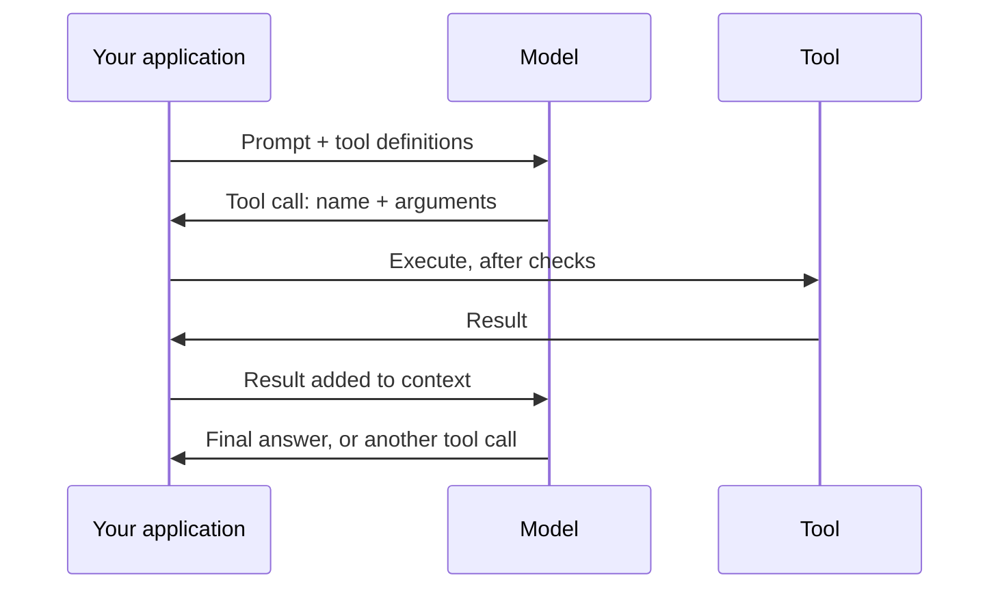

# Part 7: MCP Servers and Tool Use

2026-09-19 · Chris Neale

## About this part

This is the seventh of nine parts in the practical AI module. The aims of the guide, the layout every part follows and suggested reading routes are in [Introduction](file/0a139f54-ef01). The format is the same as elsewhere: **In plain terms** opens each numbered section, deep dives are optional, and a glossary closes the part. Reading time is about 25 minutes.

[Part 5](file/1d8f42a6-b93e) described an agent as a model in a loop, choosing actions. This part is about the actions. It explains how a model that only produces text comes to search, run code and change records, why your software stays in charge while it does, and how the Model Context Protocol lets one integration serve every AI application. It also covers what each connection costs, in context and in risk.

### What part 7 gives you

Part 7 builds one idea: the model asks, and your code acts. Every tool call passes through software you control, and that point is where permissions, checks, approvals and logs belong. A standard protocol makes connections cheap to build, which is good, and cheap to add without thought, which is not. Each one is a route for data and instructions to flow in and out.

## 1. Structured output

**In plain terms.** When a program, not a person, will read the AI's answer, you can require the answer to follow an exact format. The format is then guaranteed. The content is not, so it is checked like any other input. **Who should read it:** engineers. Others can move to section 2.

When code will consume the answer, ask for JSON that follows a schema. Part 1 of the language models module explains how the sampler can be constrained so that the syntax is guaranteed valid. Use this for extraction, classification and any hand-off to another system.

```json
{
  "invoice_number": "INV-20417",
  "total_pence": 1284000,
  "currency": "GBP",
  "due_date": null,
  "confidence_note": "Due date is smudged and could not be read"
}
```

Two cautions apply. The shape is guaranteed and the content is not, so validate values as you would any input. And give the model an honest way out: a field that allows "unknown" or null prevents it from being forced to invent a value. In the example, a schema that demanded a date would have received one.

Structured output is also how tools work, which is the next section. A tool call is a structured output whose schema is the tool's parameters.

## 2. Tool use

**In plain terms.** On its own, a model only produces text. Tools let it do things: search, read files, run code, query a database, call your APIs. The model never runs anything itself. It writes a request, your software carries it out and hands back the result. This is what turns a chatbot into something that can do work. It also means your software stays in charge of what is allowed. **Who should read it:** everyone can read the main text. Skip the deep dive.

### The tool-use loop



The model's part is limited to choosing a tool and writing its arguments. Your application decides whether to run it, runs it, and returns the result as more context. The loop repeats until the model answers without asking for a tool. This is the inner step of the agent loop from part 5.

### The description is a prompt

A tool is defined by a name, a description and a schema for its parameters. The model chooses among tools by reading those descriptions, so they deserve the same care as any prompt. Most tool-selection mistakes trace back to vague or overlapping descriptions. Part 4 made the same point about skills, and for the same reason.

Good tool design follows a few rules:

- Offer a small number of distinct tools. Ten clear tools beat forty overlapping ones.
- Return concise, relevant results. A tool that dumps 10,000 lines fills the context and buries the answer.
- Write helpful error messages. The model reads them and retries, so "date must be YYYY-MM-DD" gets a fix and "invalid input" gets a guess.
- Set limits and pagination on anything that can return a lot.
- Make actions safe to repeat where you can, because retries happen.
- Shape tools around tasks, not around your API. "Find the customer's open orders" serves a model better than three endpoints it must chain correctly.

### The control point

Because your code executes every call, that is where authorisation, validation, approval and logging belong. The model may ask for anything. The application decides what it gets. [Part 9](file/7a3f2c68-91de) builds on this.

### Built-in tools

Vendors offer ready-made tools alongside your own: web search, a sandbox for running code, file handling, and computer use, where the model operates a graphical interface through screenshots and clicks, as [part 6](file/52e0a7c9-b3f6) described. Some run on the vendor's servers, so the control point for those is a setting and not your code. Know which of your tools are which.

### Deep dive (optional): tool calls at the token level

Tool use is still next-token prediction. The tool definitions are serialised into the prompt in a vendor-specific format. During post-training, the model learned to emit a special marker followed by a tool name and JSON arguments when a tool would help.

The serving layer watches for that marker. When it appears, generation stops, the text is parsed into a structured tool-call object, and that is what your application receives. Your result goes back in as a specially marked turn, and generation resumes.

Three consequences follow. Tool definitions are tokens, so every tool costs context on every call. When a model requests several tools at once, it has simply written several call blocks in one turn. And tool results are ordinary tokens in the context, which makes them a route for prompt injection, as part 3 of the language models module warns. [Part 4 of the running AI locally module](file/b7d15e92-4c60) explains why small models find this format hard to keep to.

## 3. The Model Context Protocol

**In plain terms.** The Model Context Protocol (MCP) is a standard plug for connecting AI tools to other systems, a bit like USB for AI. A service such as your issue tracker, source host or an internal API is wrapped once as an "MCP server", and then any compatible AI application can use it. It saves building a separate integration for every tool. **Who should read it:** everyone can read the main text.

### What it is

MCP is an open protocol. Anthropic introduced it in late 2024, the other major vendors and developer tools adopted it during 2025, and it is now governed through the Agentic AI Foundation under the Linux Foundation, alongside the `AGENTS.md` format from [part 3](file/f3a91c20-6d4e). Three roles are defined. The host is the AI application. It runs a client for each connection. Each connected system is a server offering three kinds of thing:

- **Tools:** actions the model can request, such as "create ticket" or "run query"
- **Resources:** data the application can read, such as files or records
- **Prompts:** reusable templates for common tasks, offered to the user

In practice tools are what almost every server offers and what almost every host supports, and the other two are used far less.

### Local and remote

A server runs in one of two ways.

| | Local server | Remote server |
| --- | --- | --- |
| Where it runs | A process on your machine, started by the host | A service on the network |
| How the host talks to it | Standard input and output | HTTP |
| Who it acts as | You, with whatever your account can reach | Whoever signed in, through standard OAuth authorisation |
| Typical use | Files, a local database, developer tools | A vendor's product, a shared internal system |
| Main risk | It is a program you downloaded, running with your privileges | Tokens with more scope than the task needs |

Through 2025 most servers were local. The move since has been towards remote servers run by the vendor of the product they connect to, which puts authorisation and updates in the hands of the party best placed to manage them.

### What it buys you

Without a standard, connecting five AI tools to eight systems takes forty integrations. With one, it takes thirteen. There is a large catalogue of ready-made servers for common products. Writing one for an internal system is usually a thin wrapper over an API you already have, and takes a day or two.

### A protocol still moving

The specification is revised a few times a year, and the revision dated 28 July 2026 changed its foundations. Earlier versions opened each connection with a handshake and kept a session. The current one is stateless: every request carries its own protocol version and capabilities, a server describes itself through a single discovery call, and a server that needs to remember something across calls hands the client an explicit handle. That makes remote servers much easier to run at scale behind ordinary web infrastructure.

The same revision moved several ideas out of the core. Long-running work, interactive panels shown inside the conversation, and skills served over MCP are now optional extensions. Three features from the early design, in which a server could ask the host's model to generate text for it, or ask which folders it may see, or stream logs, are deprecated.

The lesson for a team is modest. Build on the official SDKs so that revisions are someone else's work, keep servers thin, and expect a server written in 2025 to need attention.

### Deep dive (optional): anatomy of an MCP exchange

MCP messages use JSON-RPC 2.0. Under the July 2026 revision, a typical exchange has three steps, and each request stands alone.

1. **Discovery.** The client may call `server/discover` to learn the server's identity, the protocol versions it speaks and what it offers. It calls `tools/list`, and the server returns each tool's name, description and a JSON Schema for its inputs, with a hint saying how long the list may be cached. The host inserts these into the model's tool definitions. The specification asks servers to return tools in a stable order, since a list that reshuffles would break the prompt caching from part 3 of the language models module.
2. **Invocation.** When the model emits a tool call, the client sends `tools/call` with the name and arguments. The server returns a result marked complete, holding content items such as text, images or links to resources, along with an error flag.
3. **Asking for more.** If the server needs something first, such as a confirmation from the user, it returns a result marked as needing input and says what it needs. The client gathers it and sends the original request again with the answers attached. Earlier versions had the server send a request of its own back up the connection, which a stateless design cannot do.

The model never talks to a server directly. The host application sits between them on every call. That makes the host the natural place for approval prompts, argument checks and audit logging, which is the control point from section 2 again. The specification says as much: hosts must obtain the user's consent before invoking a tool, and the protocol itself cannot enforce that. It is the host's job.

## 4. What a connection costs

**In plain terms.** Every connection has two costs. It takes up room in the AI's working memory, because the AI has to be told what each tool does. And it opens a door: information comes in that may contain instructions, and actions go out under someone's credentials. Both costs are manageable, and neither shows up on the day you click "connect". **Who should read it:** everyone. Anyone approving a connection should be able to ask these questions.

### Context

Every connected server's tool definitions are tokens. Part 3 of the language models module notes that a generous set can consume tens of thousands of tokens before any work starts, and a crowded list also makes the model choose worse.

Hosts have responded by loading definitions on demand. In Claude Code, for example, only tool names are loaded at the start, and the full description and schema of a tool are fetched when the model searches for it. That removes most of the standing cost. It does not remove the reason for restraint: enable the servers a task needs, and prefer a server with six well-made tools to one that mirrors every endpoint of an API.

### Security

The specification is direct about this. It says tools represent arbitrary code execution and must be treated with caution, and that descriptions of a tool's behaviour should be considered untrusted unless they come from a trusted server. The risks fall into four groups.

- **What comes back is untrusted.** A tool result is text from the outside world: an issue someone filed, a web page, an email. Part 3 of the language models module explains what that means for prompt injection. An agent that reads a poisoned ticket through one server and can act through another has been given both the instruction and the means.
- **The server itself may lie.** A tool's description is a prompt, and a malicious server can use it to instruct the model, for example to pass the contents of a file along with every call. This is called tool poisoning. A server can also change its descriptions after you approved it.
- **A local server is code you run.** Installing one from a public catalogue is the same act as installing any package, with the same supply-chain risk that part 4 described for skills. The specification's own guidance says a host offering one-click installation must show the exact command first.
- **Credentials are usually too broad.** A token that can read and write everything turns any of the problems above into a serious one. The specification's guidance forbids a server from passing a client's token through to another service, and recommends starting with minimal scopes and asking for more only when an operation needs them.

Sensible governance is straightforward:

- maintain an allow-list of approved servers, pinned to versions
- issue narrowly scoped credentials, read-only by default
- log every tool call
- treat write access to production systems as an exception that needs a case
- review the list of connected servers as you would a list of people with access

## 5. Tool, server, skill or command line

**In plain terms.** There are now several ways to give an AI a new ability, and they are not rivals. A tool is one action. An MCP server is a bundle of actions any AI application can plug into. A skill is knowledge of how to do a job. And an agent that can already type commands may need nothing more than the program you already use. **Who should read it:** engineers deciding how to connect something.

### Access and know-how

MCP gives an agent access to a system. It does not tell the agent how your team uses that system. The skills from part 4 do that: your release process, your incident template, which of the tracker's forty fields you actually fill in. Access and know-how are separate, and a useful integration needs both. A server for the database and a skill describing the schema and the queries that matter is a common and effective pair.

### Choosing

| Situation | Reach for | Why |
| --- | --- | --- |
| One application, one model, a few functions of your own | Tools defined directly in your code | No protocol needed for a private arrangement |
| A system that several AI applications should use, or that needs per-user sign-in | An MCP server | Build once, and authorisation is handled in a standard way |
| A coding agent with a shell, and a system with a good command-line program | The command line, and a skill saying how you use it | The agent already has the access. It costs no standing context, and the model knows common programs from training |
| A procedure, not a connection | A skill | There is nothing to connect |
| A product with no API at all | Computer use, from part 6, reluctantly | Slow and brittle, and sometimes the only way |

A pattern that has grown through 2026 is to let an agent with a code sandbox write small programs that call tools, in place of calling them one at a time through the model. A job that needs two hundred rows fetched, filtered and summed then moves the data through code, and only the answer enters the context. It is cheaper and less error-prone for bulk work. It needs a sandbox you trust, which part 9 covers.

### The whiteboard version

The model writes a request. Your software decides, acts and reports back. MCP makes the plug standard so that a system is wrapped once. Every plug costs context and opens a door, so connect what a task needs, give it the narrowest key that works, and keep a record of everything that passes through.

## Say it two ways

| Idea | Technical version | Non-technical version |
| --- | --- | --- |
| Structured output | Decoding constrained to a JSON Schema, guaranteeing syntax and not content | The AI must fill in our form. The form will be filled in properly. Whether the answers are right is a separate check |
| Tool use | The model emits a structured request, the application executes it and returns the result to the context | The AI asks our software to do something, such as run a search. Our software decides whether to do it and hands back the result |
| Tool definition | A name, a natural-language description and a parameter schema, placed in the context | The label on the button. The AI decides what to press by reading the labels, so they need to be clear |
| MCP | An open client-server protocol through which applications expose tools and data to models | A standard plug that connects AI tools to our systems, so we build each connection once |
| Local and remote servers | A subprocess speaking over standard I/O, or an HTTP service with OAuth authorisation | A helper program on your own computer, or a service you sign in to |
| Tool poisoning | Malicious instructions placed in a tool's description or results, which enter the context as trusted-looking text | A plug that whispers to the AI. We use plugs only from suppliers we trust, and limit what any one of them can reach |
| Control point | The host executes every call, so authorisation, validation, approval and logging sit there | The AI can ask for anything. Our software decides what it gets, and writes it down |

## Misconceptions to correct

### "The AI is running commands on our systems"

**True:** the effect is that things happen because the model decided they should.

**Misleading:** the model only writes a request. Software we control receives it, and can check it, refuse it, ask a person, or run it with limited permissions. If an agent can do damage, it is because that software was set up to allow it.

**What to say:** "The AI proposes and our software disposes. What it can reach, and what needs a person's approval, are settings we choose."

### "MCP is a standard, so an MCP server is safe to connect"

**True:** the protocol is open, widely adopted and governed by a neutral foundation, and its authorisation design follows current practice.

**Misleading:** the standard describes how to connect, not who is trustworthy. A server can be malicious or careless, what it returns can carry instructions, and the protocol's own text says it cannot enforce consent or safety. Those are the host's job and yours.

**What to say:** "A standard plug does not make every appliance safe. We approve servers like any supplier, give each the narrowest access that works, and log what it does."

### "The more tools we connect, the more capable the agent"

**True:** an agent can only act on systems it can reach.

**Misleading:** every tool takes context and adds a choice the model can get wrong. Accuracy falls as the list grows and overlaps, and each connection widens what an attacker can reach through the agent.

**What to say:** "We connect what the task needs. A short list of clear tools works better and is easier to defend than everything we own."

## Glossary

Terms introduced in this part, in plain language and in alphabetical order. Earlier terms are defined in parts 1 to 5 and in the glossaries of the language models module.

| Term | Meaning |
| --- | --- |
| Allow-list | A list of the only items permitted, such as approved servers or reachable network addresses |
| Client | The part of an AI application that holds one connection to one MCP server |
| Confused deputy | A program with authority that is tricked into using it on someone else's behalf |
| Host | The AI application that the user runs, which connects to servers and sits between them and the model |
| JSON-RPC | A simple standard for sending requests and responses as JSON. MCP is built on it |
| JSON Schema | A standard way to describe the required shape of a JSON document |
| MCP (Model Context Protocol) | An open standard for connecting AI applications to tools and data |
| MCP server | A wrapper around a system that exposes its actions and data through MCP |
| OAuth | The standard way for a person to grant a program limited access to their account without giving it their password |
| Scope | A named permission attached to a credential, such as read-only access to tickets |
| Stateless | A design in which each request carries everything needed to answer it, so the server keeps no session |
| Structured output | Model output constrained to a defined format, usually JSON matching a schema |
| Tool | A function the model can ask the application to run on its behalf |
| Tool definition | The name, description and parameter schema that tell the model what a tool does |
| Tool poisoning | Hiding instructions for the model in a tool's description or results |
| Tool search | Loading a tool's full definition only when the model looks for it, to save context |

## Sources

Protocol details in this part come from these documents, read in September 2026. The specification is revised several times a year. The account of tool poisoning, of the move to remote servers, and of agents calling tools from code rests on the drafter's general knowledge.

- [Model Context Protocol: specification](https://modelcontextprotocol.io/specification/latest), revision of 28 July 2026, for the roles, the three server features, the extensions, and the security principles quoted
- [Model Context Protocol: key changes](https://modelcontextprotocol.io/specification/2026-07-28/changelog), for the stateless design, the discovery call, results that ask for input, caching hints, stable tool order, and the deprecation of roots, sampling and logging
- [Model Context Protocol: security best practices](https://modelcontextprotocol.io/docs/tutorials/security/security_best_practices), for the confused deputy, token passthrough, local server compromise, consent before one-click installation, and scope minimisation
- [Claude Code: extend Claude Code](https://code.claude.com/docs/en/features-overview), for tool definitions loaded on demand, and for servers and skills as a pair
